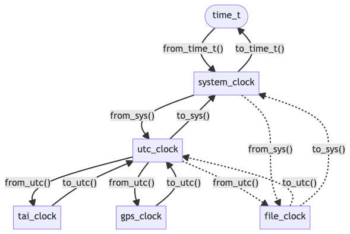

\clearpage

# はじめに

本書は、C++20で導入された新しいライブラリ機能についての紹介と解説を行うものです。コア言語機能と同様にC++20のライブラリ拡張もそこそこ大きな範囲に及んでおり、全般的に使用できるような機能（*vocabulary type* : 語彙型、と呼ばれます）だけではなく特定の用途において有用なものもあるなど、その全体像を理解するには多くの提案や規格文書を読む必要があるとともに、多様な前提知識も必要とします。そのため、ただ変更点を眺めていたりライブラリリファレンスを見ているだけでは、必ずしもその機能の意義や有用性を把握できず、C++20ライブラリの全体像を掴む事ができません。

本書は、C++20の新機能に興味はあるもののついて行けないという人や、ある程度C++20機能を知っているものの深入りできていないという人向けに、C++20で新しく導入されたライブラリ機能の内容や意義についての解説を試みるものです。

この本で取り上げるライブラリ機能は主に、新しく導入されたヘッダを中心とした大きな機能です。既存ライブラリの改善などの小さめの機能は後ほど刊行（予定）のライブラリ機能 2で紹介する予定です。

なお、本書ではC++17までのライブラリ機能に関しては前提知識として説明しません。また、C++20のコア言語機能に関しては拙著『C++20 コア言語機能』をご参照ください。

## サンプルコードのお約束

- そこで主題となっているライブラリ機能のためのヘッダのみを明示的にインクルードし、他のヘッダのインクルードは省略します。
- 主題と関係ないところを`...`で省略していることがあります。

\clearpage

# `<concepts>`
\clearpage
# `<ranges>`

## Rangeコンセプト
## Rangeアダプタ
## Rangeアルゴリズム
\clearpage
# `<format>`
\clearpage
# `<bit>`
\clearpage
# `<numbers>`
\clearpage
# `<span>`

`<span>`ヘッダでは、任意のメモリ範囲を所有せずに参照するのに便利な`std::span`クラスを提供します。

C++17まで、任意のメモリ範囲をコピーすることなく参照したいときはポインタと範囲サイズを渡す古式ゆかしいAPIが基本でした。

```cpp
// メモリ範囲をTのシーケンスとして利用する関数
void use_mem_seq(int* ptr, std::size_t len) {
  // メモリ範囲内要素の読み出し
  for (int i = 0; i < len; ++i) {
    int e = ptr[i];
    ...
  }
}
```

あるいはこの2つの引数を1つのクラスにまとめることもできます。しかしどちらにせよ、ポインタを直接扱う必要があり、他のメモリ連続なシーケンス（`std::vector`や配列、`std::string`などなど）からの変換とか各種インターフェース・・・などを考え出すとそこそこ大きな手間となります。ただ、このようなポインタと長さのペアによってメモリ範囲をやり取りするということはかなり頻繁に行われます。

`std::span<T>`はまさにこのための機能であり、ポインタとその長さをラップしたクラスに使いやすいインターフェースを揃えたものです。テンプレートパラメータ`T`には参照先メモリ領域にあるオブジェクトの型を指定します。

```cpp
#include <span>

// メモリ範囲をintのシーケンスとして利用する関数
void use_mem_seq(std::span<int> mem) {
  // メモリ範囲内要素の読み出し
  for (int e : mem) {
    ...
  }
}
```

`std::span`はポインタ1つとそのサイズだけを保持する軽量かつ単純な型であり、*Trivially Copyable*（`memcpy`でコピー可能）であることが規定されています。これらの性質から、基本的には関数に対して値渡しして利用します。`std::span<T>`はメモリ上で連続する`T`のシーケンスを所有せずに参照しており、`std::span`オブジェクトをコピーしても元の`T`のシーケンスはコピーされません。

`std::span`と`std::string_view`はやっていることはほとんど同じですが、文字列はメモリ上で連続して配置されている値以上の意味論を持っているため、`std::string_view`は文字列に特化するために別の型として定義されています。

```cpp
#include <span>

int main() {
  // 7要素の配列（\0含めて7文字）
  const char str[7] = "string";

  // 文字列として参照
  std::string_view sv{str};

  // バイト列として参照
  std::span<const char> sp{str};

  std::cout << sv.size() << "\n"; // 6
  std::cout << sp.size() << "\n"; // 7
}
```

このnull文字の扱いの他にも、インターフェースが文字列に特化（`std::string`互換）されている、文字列は基本的にリードオンリーなどの違いがあります。

## `const`性

`std::span`は参照先を所有していないので、`std::span`に対する`const`指定は意図通りになりません。

```cpp
#include <span>

// 読み込み専用spanのつもりでconstを付加
void use_mem_seq(const std::span<int> mem) {
  for (auto& e : mem) {
    e = 10; // ok、書き換えられる
  }
}
```

`std::span`に対する`const`指定の効果はせいぜい代入ができなくなるくらいのもので、その`const`は参照先の各要素にまで波及しません。別の言い方をすると、`std::span`は参照セマンティクスを持つように設計されています。

読み込み専用の`std::span`を表現するには、`std::span`そのものではなくその要素型に対して`const`を指定します。

```cpp
#include <span>

// 読み込み専用spanを受け取る
void use_mem_seq(std::span<const int> mem) {
  for (auto& e : mem) {
    e = 10; // ng、書き換え不可
  }
}
```

標準ライブラリの他のところ、例えば`std::vector`のように範囲を所有しているクラスにおいては、注意深い実装によってそれ自身に対する`const`が所有している要素にまで及ぶようになっており、このような`const`性の事を深い`const`（*deep const*）と呼びます。これに対して、`std::span`に対する`const`指定のようにそこで切れてしまう`const`性を浅い`const`（*shallow const*）と呼びます。

またこのことは、`std::string_view`(深い`const`を持つ)との違いの一つでもあります。

## 多様な変換

`std::span`は任意のメモリ範囲の参照を手軽にするために、かなり柔軟な変換によって構築することができます。

```cpp
#include <span>

// intのメモリ範囲を参照
void use_mem_seq(std::span<int> mem);

// charのメモリ範囲（単なるバイト列）を参照
void use_char_seq(std::span<const char> mem);

// intのメモリ範囲を読み込み専用で参照
void readonly(std::span<const int> mem);

int main() {
  // std::vector
  std::vector vec = {0, 1, 2, 3};
  use_mem_seq(vec);

  // std::array
  std::array<int, 5> arr = {5, 4, 3, 2, 1};
  use_mem_seq(arr);

  // 生配列
  int rawarr[] = {1, 2, 3};
  use_mem_seq(rawarr);

  // ポインタとサイズのペア
  std::unique_ptr<int[]> p{new int[4]{}};
  use_mem_seq({p.get(), 4});
  
  // 文字列
  std::string_view str = "string";
  use_char_seq(str);

  // 要素型の変換（non const -> const）
  std::span<int> rospan = vec;
  readonly(rospan);
}
```

このように柔軟な変換を用意している一方で、これを行う変換コンストラクタはかなり複雑な制約によってメモリ連続でないコンテナからの変換や危険な変換（`const`外しやサイズの異なる型への変換など）を許可しないようになっています。

## 静的な要素数

生配列や`std::array`などのようにコンパイル時に要素数が決まっているシーケンスや、あらかじめ入力シーケンスに一定の要素があることが確実に分かっているケースなどでは、`std::span`の要素数をコンパイル時に固定しておきたくなるでしょう。そのために、`std::span<T, N>`のように2つ目のテンプレート引数にサイズを指定して固定長にすることができます。以下、実行時に要素数が決まる`std::span<T>`を動的な`std::span`、固定長の`std::span<T, N>`を静的な`std::span`と呼んで区別します。

```cpp
#include <span>

// int型5個分のメモリを参照するspan
void use_mem_seq(std::span<int, 5> mem);

int main() {
  // std::array
  std::array<int, 5> arr = {5, 4, 3, 2, 1};
  use_mem_seq(arr);     // ok

  // 生配列
  int rawarr[] = {1, 2, 3, 4, 5};
  use_mem_seq(rawarr);  // ok

  // std::vector
  std::vector vec = {0, 1, 2, 3, 4};
  use_mem_seq(vec);     // ng

  std::span<int, 5> sp{vec.data(), vec.size()};
  use_mem_seq(sp);      // ok
}
```

静的な`std::span`では、生配列や`std::array`などのコンパイル時に要素数が決まる範囲からの変換はスムーズに行えますが、`std::vector`のように実行時にサイズが決まる可変長範囲からの変換は直接行うことができす、一度固定長`std::span<T, N>`を明示的に構築する必要があります。ただし、可変長範囲からの固定長`std::span<T, N>`構築時にはその領域に`N`要素が確実に存在していなければなりません。なお、`std::span<T> -> std::span<T, N>`への変換（動的から静的への変換）は制限されてる一方で、`std::span<T, N> -> std::span<T>`への変換（静的から動的への変換）はスムーズに行うことができます。

静的`std::span`には、長さにまつわる実行時計算が削減できる、`std::span`のサイズがポインタ1つ分になる（ことが期待できる）などのメリットがあります。

実装としては、`std::span<T>`と`std::span<T, N>`でクラスの定義は分かれておらず、動的な要素数を指定する場合は`N`に`std::dynamic_extent`という値がデフォルト値として指定されていて、これによってサイズが動的なのか静的なのかを区別しています。

```cpp
// std::spanの宣言例
namespace std {
  inline constexpr size_t dynamic_extent = numeric_limits<size_t>::max();

  template<class T, size_t N = dynamic_extent>
  class span;
}
```

## インターフェース

`std::span`は冒頭の例のようにイテレータインターフェースを備えている（`contiguous_range`コンセプトを満たす）ほか、シーケンスコンテナの備えるインターフェースも利用することができます。なお、`std::span`の備えるインターフェースの時間計算量は全て定数と指定されており、参照する長さによらず一定となります。

```cpp
#include <span>

void span_interface(std::span<int> sp) {
  // 先頭の要素を取得
  int& f = sp.front();

  // 末尾の要素を取得
  int& b = sp.back();

  // 添字アクセス
  // 範囲外参照は未定義動作
  int& s = sp[5];

  // 領域ポインタとサイズの取得
  int* p = sp.data();
  std::size_t len = sp.size();

  // 空かどうか取得（trueで空
  bool e = sp.empty();
}
```

`span`特有のインターフェースの1つに、参照領域のバイト単位の長さを求める`.size_bytes()`があります。

```cpp
#include <span>

void span_interface(std::span<std::int32_t, 4> sp) {
  // 要素数の取得
  std::size_t len = sp.size();
  // 参照先領域サイズの取得
  std::size_t byte_len = sp.size_bytes();

  std::cout << len << "\n";       // 4
  std::cout << byte_len << "\n";  // 16
}
```

これは例えば、`std::span`の参照する領域への、もしくはそこからの`memcpy`時に長さ計算を省略しつつ間違わないようにすることができます。

```cpp
#include <span>

// src -> dstへ全要素分コピーしたい
void span_memcpy(std::span<std::int32_t, 4> dst, std::span<const float, 4> src) {
  // やりがちな間違い（4バイトコピーされる）
  std::memcpy(dst.data(), src.data(), src.size());

  // 正しくバイト単位の長さを指定（16バイトコピーされる）
  std::memcpy(dst.data(), src.data(), src.size_bytes());
}
```

`span`からその部分範囲を取得するために、`.first()`、`.last()`、`.subspan()`の3つの関数が用意されています。

```cpp
#include <span>

int main() {
  std::array<int, 10> arr = {0, 1, 2, 3, 4, 5, 6, 7, 8, 9};
  std::span<int, 10> sp{arr};
  
  // 先頭からの部分spanを取得する
  // 例 : 先頭から4つの要素を参照するspanを取得
  std::span<int, 4> s1 = sp.first<4>();
  std::span<int> s2 = sp.first(4);
  // {0, 1, 2, 3}

  // 後ろからの部分spanを取得する
  // 例 : 後ろからから4つの要素を参照するspanを取得
  std::span<int, 4> s3 = sp.last<4>();
  std::span<int> s4 = sp.last(4);
  // {6, 7, 8, 9}

  // 任意の位置からの部分spanを取得する
  // 例 : 5番目の位置から4つの要素を参照するspanを取得
  std::span<int, 4> s5 = sp.subspan<5, 4>();
  std::span<int> s6 = sp.subspan(5, 4);
  // {5, 6, 7, 8}
}
```

`.first()`は元の`span`の先頭から指定された長さの範囲を、`.last()`は元の`span`の末尾から指定された分戻った長さの範囲を取得します。`.subspan()`には先頭からのオフセットと長さの2つの引数を渡して、先頭からオフセット値分進んだところから指定された長さの範囲を取得します。

3つの関数にはどれも、引数を非型テンプレートパラメータで受け取るものと関数引数で受け取るものの2種類が用意されています。これらの結果は全て`std::span`となり、非型テンプレートパラメータで要素数とオフセットを指定すると静的`span`が、関数引数で要素数とオフセットを指定すると動的`span`が得られます。上記の例では、静的と動的インターフェース2つの使用例それぞれで同じ部分範囲を取得しています。

なお当然ながら、これら部分範囲を取得するときには元々の範囲からはみ出た範囲を取得しないように注意する必要があります。

### バイト列へのキャスト

前述のように、`std::span`は従来のポインタとサイズを取るインターフェースを置き換えるためのものです。そういうインターフェースが使われていたところでよく見られるのは、バイト配列を受け取ってその配列からデータを読み出す、あるいはその配列へデータを書き込む処理です。そのような処理には例えば、通信やI/O、シリアライズなどがあり、`std::span`はバイト配列の参照として使用される頻度が高くなると予想されます。そのため、`std::span<T>`を`std::span<std::byte>`に変換するための関数、`std::as_bytes()`と`std::as_writable_bytes()`が用意されています。

```cpp
#include <span>

// 何かI/Oへの書き込みを行う関数
void write_io(std::span<const std::byte> data);

// 何かI/Oからの読み込みを行う関数
void read_io(std::span<std::byte> buffer);


int main() {
  // 送信
  std::array<int, 5> data = {1, 2, 3, 4, 5};
  write_io(std::as_bytes(std::span{data}));

  // 受信
  std::array<float, 4> response{};
  read_io(std::as_writable_bytes(std::span{response}));
}
```

どちらの関数も入力には任意の`std::span<T, N>`を取りますが、`std::as_bytes()`は読み込み専用バイト列としての`std::span<const std::byte>`を返し、`std::as_writable_bytes()`は書き込み可能なバイト列としての`std::span<std::byte>`を返します。

これらの関数に動的な`std::span<T>`が入力された場合は返される`span`も動的なものになり、静的な`std::span<T, N>`が入力された場合は返される`span`も静的なものになります。どちらの場合でも、得られた`span`の長さは入力の要素数を`N`として`sizeof(T) * N`となります。

```cpp
#include <span>

void write_io(std::span<const std::byte> data);
void read_io(std::span<std::byte> buffer);

struct send_data {
  std::int32_t n;
  std::int32_t m;
  std::int64_t l;
  const char s[4];
};

struct recieve_data {
  std::uint32_t n;
  float f;
  std::uint16_t m;
};

// 構造体をバイト列へシリアライズする例
// このようなことを行う場合、構造体のTrivially Copyable性に注意！
int main() {
  send_data data{ .n = 10, .m = 11, .l = 12, .s = "tes"};

  write_io(std::as_bytes(std::span<send_data, 1>(&data, 1)));

  recieve_data res{};

  read_io(std::as_writable_bytes(std::span<recieve_data, 1>(&res, 1)));
}
```

\clearpage
# `<source_location>`

`<source_location>`ヘッダでは、従来`__LINE__`や`__FILE__`などによって取得していたソースコード上位置情報を一括で取得する手段を提供するとともに、それをまとめて格納し持ち運ぶことができるようにする構造体`std::source_location`が提供されます。

まず、ソースコード位置情報を取得するには`std::source_location::current()`静的メンバ関数を使用します。

```cpp
#include <source_location>

void f() {
  // この場所のソースコード情報を取得
  auto sl = std::source_location::current();

  std::cout << "\n--- in f() ---\n\n";

  std::cout << sl.line() << "\n"            // 行番号
            << sl.column() << "\n"          // 列番号
            << sl.file_name() << "\n"       // ファイル名
            << sl.function_name() << "\n";  // 関数名
}

int main() {
  auto sl = std::source_location::current();

  std::cout << sl.line() << "\n"
            << sl.column() << "\n"
            << sl.file_name() << "\n"
            << sl.function_name() << "\n";
  
  f();
}
```

`std::source_location::current()`は`consteval`指定されているため、この関数の実行は必ずコンパイル時に完了します。そして、その戻り値として`current()`が呼ばれた場所のソースコード情報を保持した`std::source_location`オブジェクトが得られます。

このプログラムの出力は、例えば次のようになります（Wandbox GCCでの実行結果）。

```
17
42
prog.cc
int main()

--- in f() ---

6
42
prog.cc
void f()
```

`std::source_location`は4つのメンバ関数を持っており、`.line()`は行番号、`.column()`は列番号、`.file_name()`はそのソースファイル名、`.function_name()`は囲む最も内側の関数名、をそれぞれ取得します。`current()`がヘッダファイル内コードで呼び出されている場合、ヘッダファイル内におけるソースコード位置が取得され、`.file_name()`はヘッダファイル名を返します。つまり、`std::source_location`で得られるソースコード位置は`#include`の影響を受けません。

なお、この例の`.column()`は`std::source_location::current()`の`()`の位置が取得されていますが、この値は処理系定義とされているのでコンパイラや環境によって異なる可能性があります。

`std::source_location`オブジェクトはコピーやムーブを自由に行うことができるため、ある場所で取得した情報を別の場所に運ぶことが容易にできます。これは特に、クラスのメンバとして保持するときに便利です。

```cpp
#include <source_location>

class S {
  std::source_location m_loc;

public:

  S(std::source_location loc) : m_loc(loc) {}

  auto get_location() {
    return m_loc;
  }
};

void f(const S& s) const {

  auto sl = s.get_location();

  std::cout << sl.line() << "\n"
            << sl.column() << "\n"
            << sl.file_name() << "\n"
            << sl.function_name() << "\n";
}

int main() {
  S s{std::source_location::current()}; // ok

  f(s); // ok
}
```

この出力は例えば次のようになります

```
27
36
prog.cc
int main()
```

`std::source_location`オブジェクトは軽量でコピーが効率的なオブジェクトであると規定されているため、基本的にはコピーして持ち運ぶことができます。

## デフォルト引数での利用

実際に`std::source_location`を使ってみると、一々`std::source_location::current()`とするのは構文的にかなり重いことに気づくでしょう。また、この取得構文はどこでも同一であるため、`std::source_location`が必要となるところでは自動で取得してほしくもなります。このニーズを満たしてくれるのが関数のデフォルト引数で取得しておくという書き方です。

```cpp
#include <source_location>

// ログ出力関数
void log(std::string_view message, 
         std::source_location sl = std::source_location::current())
{
  std::cout << std::format("{:s}:{:d}:{:d} in {:s} : {:s}", sl.file_name(), sl.line(), sl.column(), sl.function_name(), message);
}

int main() {
  log("test");
}
```

出力例（godbolt MSVC 2019、一部改変）

```
example.cpp:13:3 in main : test
```

このように、デフォルト引数で使用した時でも書かれた場所ではなく呼ばれた場所の位置情報を取得してくれるため、`std::source_location::current()`をほぼ省略しながら利用することができます。そのため、`std::source_location`はもっぱらデフォルト引数で使用されるでしょう。

なお、関数のデフォルト引数は呼び出し時に省略可能という性質から必ず引数列の後ろに来なくてはなりません。この制約のため、可変長テンプレートではこの方法を取れないという問題があります。一応将来のC++に向けて可変長テンプレートの推論を調整してこの問題に対処しようとする動きはありますが、C++26以降になりそうです。

\clearpage
# `<coroutine>`

`<coroutine>`ヘッダは、C++20で言語機能として追加されたコルーチンを利用してコルーチンアプリケーションを実装するために必要な最小の機能を提供するものです。`generator`や`task`（`lazy`）のようなコルーチンアプリケーションはまだここにはなく、C++23以降に順次追加される予定です。

ここでは、型`T`の値のシーケンスを生成するコルーチンアプリケーション、`generator<T>`を作成しながら、これらの基本機能をどのように使用していくのかを見ていきます。

なお、この章の内容はコルーチンの言語仕様へのある程度の理解を前提として書かれています。『C++20 コア言語機能』本をお手元に用意するか、その他C++コルーチン解説を頭に入れてからご覧いただくと理解が捗るかと思います。

```cpp
// これを作る
template<std::movable T>
class generator {
  ...

  auto move_next() -> std::optional<T>;
};

// こうして
generator<int> make_range(int first, int last) {
  for (int i = first; i < last; ++i) {
    co_yield i;
  }
}

int main() {
  // こう使える
  auto coro = make_range(0, 10);

  auto opt = coro.move_next();
  std::cout << *opt << "\n";  // 0

  opt = coro.move_next();
  std::cout << *opt << "\n";  // 1

  opt = coro.move_next();
  std::cout << *opt << "\n";  // 2

  ...

  opt = coro.move_next();
  std::cout << *opt << "\n";  // 9

  opt = coro.move_next();
  
  std::cout << std::boolalpha << bool(opt); // false
}
```


本来はC++的なイテレータインターフェースを実装すべきですが、そちらはそちらで厳密にやりだすと複雑なので、今回はこの`move_next()`のような簡易なインターフェースによって値を取得することにします。

## コルーチントレイトとコルーチンハンドル

コルーチン制御において、コルーチン側での制御を担当するプロミス型は`std::coroutine_traits`によって取得されます。コルーチンの戻り値型を`R`、コルーチン引数型を`Args...`とすると、`std::coroutine_traits<R, Args...>::promise_type`から取得されます。デフォルトの`std::coroutine_traits`（プライマリテンプレート）は`R::promise_type`からそれを取得し、`R`と`Args`についてさらなるカスタマイズが必要となる場合は、`std::coroutine_traits<R, Args...>`を部分特殊化して`::promise_type`を提供することもできます。

```cpp
#include <coroutine>

template<std::movable T>
class generator {

  // promise型
  struct generator_promise {
    ...
  };

  ...

public:
  // ::promise_typeとして公開しておく
  // 今回のgenerator型ではこちらを採用
  using promise_type = generator_promise;
};

// もしくは、部分特殊化によって提供してもいい
template<typename T>
struct std::coroutine_traits<generator<T>, T, T> {
  using promise_type = ...;
};
```

コルーチン制御において、コルーチン呼び出し側で制御を担当するのがコルーチンハンドルで、それは`std::coroutine_handle`というクラスとして用意されています。とはいえ、コルーチンアプリケーションの利用においてはこのコルーチンハンドルを直接扱うことはなく、コルーチンハンドルはコルーチンの戻り値型`R`内部に隠蔽され、コルーチンハンドルは`R`の操作経由で利用されます。

```cpp
namespace std {
  template<class Promise = void>
  struct coroutine_handle;

  template<>
  struct coroutine_handle<void> {
    ...
  };

  template<class Promise>
  struct coroutine_handle {
    ...
  };
}
```

`std::coroutine_handle`は通常テンプレートパラメータにプロミス型を取りますが、場合によってはこの型依存が問題となることもあるので、`std::coroutine_handle<>`として型消去して使用することができます。`std::coroutine_handle<Promise>`から`std::coroutine_handle<>`の変換には暗黙変換が提供されます。

```cpp
#include <coroutine>

template<std::movable T>
class generator {

  struct generator_promise {
    ...
  };

  // コルーチンハンドルをメンバとして保持しておく
  // テンプレートパラメータにはpromise型を指定する
  std::coroutine_handle<generator_promise> m_hcoro;

  ...
};
```

コルーチンハンドルのメンバ関数にはコルーチンの再開と終了やその状態取得のためのものが用意されています。これを利用して呼び出し側からのコルーチン制御を行います。

### コルーチンハンドルとプロミスオブジェクトの初期化

この`generator`とコルーチンハンドル（の実体）、およびプロミス型のオブジェクトはコルーチン内部で生成されています。この生成というのは、コルーチンが言語仕様に従って通常の関数の様に書き換えられた結果として挿入されたコードによって行われています。

そこではまず、`std::coroutine_traits`によって取得されたプロミス型をもちいて、そのオブジェクトがコルーチン引数もしくはデフォルト構築よって構築されます。

次に、プロミス型の`.get_return_object()`によってコルーチンの戻り値型オブジェクト（ここでは`generator`オブジェクト）が取得されており、`.get_return_object()`はプロミス型を定義する際にカスタマイズすることができます。

```cpp
#include <coroutine>

template<std::movable T>
class generator {

  struct generator_promise {

    // コルーチン戻り値取得をカスタマイズする
    auto get_return_object() {
      // コルーチン戻り値（generatorオブジェクト）の生成
      return generator{...};
    }

    ...
  };

  ...
};
```

`std::coroutine_handle`のコンストラクタは無効なコルーチンを生成するためのものしか用意されておらず、有効なコルーチンハンドルは`std::coroutine_handle::from_promise()`によって、プロミス型オブジェクトから構築する必要があります。

`.get_return_object()`内ではプロミスオブジェクトは`*this`によって取得でき、`generator`型ではプロミスオブジェクトもしくはコルーチンハンドルから構築することによってコルーチンハンドルを受け取ります。

```cpp
#include <coroutine>

template<std::movable T>
class generator {
  // 前方宣言
  struct generator_promise;

  // 短縮のためのエイリアス
  using handle = std::coroutine_handle<generator_promise>;

  // プロミス型定義
  struct generator_promise {

    auto get_return_object() {
      // コルーチンハンドルからgeneratorオブジェクトを生成
      return generator{handle::from_promise(*this)};
    }

    ...
  };

  // コルーチンハンドル
  handle m_hcoro;

  // コルーチンハンドルを受け取るコンストラクタ
  explicit generator(handle hcoro)
    : m_hcoro(hcoro) {}

  ...
};
```

`std::coroutine_handle`は無効なコルーチンを生成するためにデフォルトコンストラクタおよび`nullptr`を取るコンストラクタを備えているため、`{}`とか`0`とかから変換して構築することができてしまい、それらから`generator`への変換すら行うことができます。コルーチンハンドルを受け取るコンストラクタは`explicit`にしたうえでプライベートで定義しておくとそのようなバグを踏みづらくなるでしょう。プライベートで定義したときでも、プライベートの内部クラス（ここでは`generator_promise`型）からは参照することができます。

また、ここでは不要なのでしていませんが、プロミスオブジェクトはコンストラクタでコルーチン引数を受け取るようにすることもでき、コルーチン引数をプロミスオブジェクト内に保存しておくことで`.get_return_object()`内でコルーチン引数をコルーチン戻り値型まで伝播させることができます。

### コルーチンの終了

コルーチンは通常の関数とは異なり一回の呼び出しで終了せずに、複数回の呼び出しにわたって状態を保持しています（これをコルーチンステートと呼びます）。コルーチンステートにはコルーチン引数やプロミスオブジェクトやコルーチンのローカル変数が保存されており、これらを適切に開放するにはコルーチンを終了させる必要があります。

コルーチンの終了は、コルーチンの実行が関数終端もしくは`co_return`に到達していて、最終サスペンドポイントで中断していなければ自動で終了しています。

どこかで中断中のコルーチンを終了させるのはコルーチン呼び出し側の責任であり、それはコルーチンハンドルの`.destroy()`によって行うことができます。コルーチンハンドルはコルーチン戻り値型`R`（ここでは`generator`）から操作されるため、通常は`R`のデストラクタで呼び出すようにしておきます。

```cpp
#include <coroutine>

template<std::movable T>
class generator {

  ...

  // コルーチンハンドル
  handle m_hcoro;

  ...

public:

  ...

  ~generator() {
    // コルーチンが有効ならば（終了していなければ）
    if (m_hcoro) {
      // コルーチンを終了させる
      m_hcoro.destroy();
    }
  }
};
```

コルーチンが有効かどうか、つまりコルーチンがまだ終了していない（どこかで中断中）かどうかはコルーチンハンドルの`bool`変換演算子から取得でき、`true`を返したときにまだコルーチンは終了していないことが分かります。従って、この例のようにコルーチンハンドルを`bool`変換して`true`が得られたら`.destroy()`する、のような手順でコルーチンの終了を行います。

コルーチン戻り値型の実装においては、そのデストラクタでこのような典型コードがよく見られるでしょう。また、他の関数からこのコードを呼び出すことでコルーチンを明示的に終了させる実装を行うこともできます。

### コルーチンで生成された値の取得

コルーチン内部で値の生成（`co_yield value;`）が行われると、その引数`value`はプロミス型のメンバ関数`.yield_value()`に渡されます。コルーチンアプリケーション作成者は、この関数によってコルーチン内部からの値の受け取りと呼び出し側への値の返却処理を自由に記述することができます。

```cpp
#include <coroutine>

template<std::movable T>
class generator {

  struct generator_promise {
    // 生成された値を保存
    T value;

    // co_yield時に呼ばれる関数
    auto yield_value(T v) {
      value = std::move(v);
      return ...;
    }

    ...
  };

  // コルーチンハンドル
  handle m_hcoro;

  ...
};

```

この`.yield_value()`は戻り値型として`awaitable`型と呼ばれる型のオブジェクトを返す必要があり、この戻り値型によって`co_yield`における中断を制御します。これについては後述します。

このように、コルーチンが生成した（`co_yield`した）値は（通常）プロミス型のオブジェクトに保存されており、コールチンハンドルからは`.promise()`によってそのプロミスオブジェクトへの参照を取得することができます。

```cpp
#include <coroutine>

template<std::movable T>
class generator {

  struct generator_promise {
    // 生成された値を保存
    T value;
    ...
  };

  // コルーチンハンドル
  handle m_hcoro;

  ...

public:

  // 値の取得をする関数
  auto move_next() -> std::optional<T> {
    
    ...

    // promiseオブジェクトの参照を取得
    auto& promise = m_hcoro.promise();
    // yieldされた値を取得
    return {std::move(promise.value)};
  }
};
```

### コルーチンの再開

コルーチンにおける値の生成ではその都度中断している可能性があり、その場合コルーチンを再開させてコルーチンの実行を進める必要があります。その際、コルーチンの再開前後ではコルーチンの状態をチェックしなければなりません。まずそもそもコルーチンが有効であるか（終了していないか）をチェックし、次に再開に伴って最終サスペンドポイントに到達していないか、をチェックします。

コルーチンが最終サスペンドポイントに到達しているかどうかは`.done()`によってチェックでき、`true`を返したら最終サスペンドポイントに到達していることを表します。コルーチンの再開は`.resume()`によって行い、この呼び出しによってコルーチンは中断地点から再開し、次の中断地点（`co_yield/co_await/co_return`、最終サスペンドポイント）まで処理が進行します。

```cpp
#include <coroutine>

template<std::movable T>
class generator {

  struct generator_promise {
    // 生成された値を保存
    T value;
    ...
  };

  // コルーチンハンドル
  handle m_hcoro;

  ...

public:

  // 値を取得する関数
  auto move_next() -> std::optional<T> {
    // コルーチン有効性をチェック
    if (!m_hcoro) return {};

    // コルーチンを再開
    // 次のco_yieldまで進む
    m_hcoro.resume();

    // 最終サスペンドポイントに到達していないことをチェック
    if (m_hcoro.done()) return {};

    // promiseオブジェクトの参照を取得
    auto& promise = m_hcoro.promise();
    // yieldされた値を取得
    return {std::move(promise.value)};
  }
};
```

今回の`generator`は初期サスペンドポイントで中断するようにしている（この実装はのちほど）ため、初回の`resume()`によって最初の`co_yield`まで進行します。その後最後の`co_yield`で中断されている状態で再開されると最終サスペンドポイントに到達し値を返さず中断します（この実装も後程）。そして、`.move_next()`は値が無い（範囲終端に到達した）場合は無効値を返してそれを通知します。

このため、この例の`.move_next()`においては値の取得前にコルーチン再開を行う必要があり、再開後は最終サスペンドポイントに到達していないことをチェックする必要があります。

このあたりの実装はどういうコルーチンアプリケーションを作るのかによって変化するので、都度きちんと考えなければなりません。最終サスペンドポイント到達やコルーチン終了チェックを怠れば、無限ループや未定義動作に繋がるため慎重な検討が必要です。

## `awaitable`型

コルーチン内部で`co_await`や`co_yield`を呼び出すことでコルーチンを中断して呼び出し側に値を返しつつ制御を戻すことができますが、この際の振る舞いをカスタマイズすることもできます。

コルーチン内部で中断を行う所では、必ずプロミス型のメンバ関数を介したカスタマイズポイントが用意されており、そのメンバ関数が返す型によって中断するかどうか及び中断時/再開時の振る舞いを制御することができます。例えば、先ほど`co_yield`で値を受け取るときに使った`.yield_value()`メンバ関数がその一例です。それらの関数から返され、中断時動作のカスタマイズを担う型のことを総称して`awaitable`型と呼びます。

`<coroutine>`ヘッダでは、中断/再開時に何もせず中断するかしないかのみを制御するとても基本的な2つの`awaitable`型が提供されます。

```cpp
namespace std {
  // 常に中断しないawaitable
  struct suspend_never {
    // コルーチンを中断するかしないかを指定する（trueを返すと中断する）
    constexpr bool await_ready() const noexcept { return true; }
    // 中断時（中断直前）に行う処理を指定
    constexpr void await_suspend(coroutine_handle<>) const noexcept {}
    // 再開時（再開直後）に行う処理を指定
    constexpr void await_resume() const noexcept {}
  };

  // 常に中断するawaitable
  struct suspend_always {
    constexpr bool await_ready() const noexcept { return false; }
    constexpr void await_suspend(coroutine_handle<>) const noexcept {}
    constexpr void await_resume() const noexcept {}
  };
}
```

`suspend_never`は中断可能な地点で常に中断することを指示し、`suspend_always`は中断可能な地点で常に中断しないことを指示します。どちらのクラスも、中断/再開時には何もしません。

`awaitable`型はこの3つのメンバ関数を備えた型として定義することで自作することができます。それぞれの関数は次の役割を持ちます

- `bool await_ready()` : コルーチンを中断するかどうかを`bool`値で指示する
    - `true`を返すと中断させ、`false`を返すと中断させない
- `auto await_suspend()` : コルーチンが中断する直前に、任意の処理を実行させる
    - 引数にコルーチンハンドルを取る
- `auto await_resume()` : コルーチンが再開した直後に、任意の処理を実行させる

`awaitable`を自作する場合、この3つのメンバ関数がこのシグネチャで呼び出し可能であるようなクラスとして定義しておく必要があります。その際、構築のされ方や関数の内部は自由にカスタマイズすることができます。

### Await式

`awaitable`型のオブジェクトはAwait式と呼ばれる式によって評価され、コルーチンの中断制御を行います。Await式は最終的には`co_await o`の形の式として実行され、この一行の式内部でコルーチンを中断し、`awaitable`の3つのメンバ関数によってそのカスタマイズを行います。

`co_await`演算子の直接使用をはじめとして、コルーチン内部ではこのAwait式を呼び出す方法（経路）がいくつか存在しています。それによって、Await式の引数である`o`の取得方法が少し異なります。ここでは、`o`が取得された後、Await式のメインの部分がどのように実行されるかを見ていきます。ここでの`o`は、とりあえず先ほどの2つの`awaitable`型のどちらかのオブジェクトと思っておくと良いかもしれません。

まず、`o`に対して使用可能な`co_await`演算子（`operator co_await`）が探索され、見つかった場合はその演算子を`o`に対して適用しその結果値を`e`として取得します。もし`co_await`演算子が見つからない場合、`e`として`o`をそのまま使用します。`co_await`演算子は単項演算子の一種として扱われていて、メンバのもの（`o.operator co_await()`）と非メンバのもの（`operator co_await(o)`）の2種類が考慮されます。

次に、`e.await_ready()`の戻り値を`bool`値`ready`として取得します。`ready`が`false`の時にコルーチンは中断状態となります。ここでの中断状態とは論理的な状態の変化であり、制御（実行地点）はまだコルーチン内です。

コルーチンが中断状態になった後、そのコルーチンのコルーチンハンドル`h`を用いて`e.await_suspend(h)`を実行し、その戻り値があれば`suspend`として取得します。`suspend`が取得可能である場合、その型は`bool`もしくはコルーチンハンドル`std::coroutine_handle<Z>`のどちらかである必要があります。そして、`suspend`の型によって次のどちらかの処理を実行します

- `suspend`が`bool`の時
    - `suspend == true`ならばコルーチンを中断する
    - `suspend == false`ならばコルーチンを再開する
- `suspend`が`std::coroutine_handle<Z>`の時
    - `suspend.resume()`を実行する
      - 別のコルーチンの再開（対称コルーチン）
- `suspend`がない（`e.await_suspend(h)`の戻り値型が`void`の）時
    - 何もしない

`e.await_suspend(h)`の実行と上記処理が完了した後でもコルーチンが中断状態であるならば、コルーチンは呼び出し元に制御を返し、ここで名実ともにコルーチンは中断されます。なおこの時、コルーチンの実行中のスコープはコルーチンステート内に維持されています。

`ready`が`true`の時は`e.await_suspend(h)`は実行されず、コルーチンは中断しません。その場合、あるいはコルーチンが再開された時、`e.await_resume()`を実行し、戻り値があればそれを返してAwait式の実行は完了します。すなわち、`e.await_resume()`の戻り値型が`void`ではない時、その戻り値がAwait式の実行結果となります。

先ほどの2つの`awaitable`型では、`.await_suspend(), .await_resume()`の2つは何もせず戻り値も返さないためAwait式においても何もせず、`.await_ready()`が`true/false`を返すことで中断するしないだけを制御しています。また、使用可能な`co_await`演算子も定義されていないため、これらの型のオブジェクトは直接Await式の引数となります。

### 初期/最終サスペンドポイント

コード上からは直接観測できないAwait式の実行点が初期サスペンドポイントと最終サスペンドポイントの2つです。この2地点はコルーチン本体の実行前後で、それぞれ1度づつ実行されています。

コルーチンで使用されているプロミス型オブジェクトを`p`とすると、初期サスペンドポイントでは`co_await p.initial_suspend()`の呼び出し、最終サスペンドポイントでは`co_await p.final_suspend()`の呼び出しによってAwait式が実行されています。Await式の引数`o`はプロミス型のメンバ関数`.initial_suspend()`および`.final_suspend()`の戻り値として取得され、`.initial_suspend()`、`.final_suspend()`の2つの関数はプロミス型実装を通して自由にカスタマイズできます。

この2地点でのAwait式は、コルーチン呼び出し直後と終了時にコルーチンを中断するかどうかを制御することが主な目的です。

今回の`generator`型では値の取りこぼしを防ぐために最初の`co_yield`の前で一度中断する必要があり、それを初期サスペンドポイントで行うことにします。また、最後に生成された値を取り出す必要性から最終サスペンドポイントでも同様に中断しておく必要があります。これは、最終サスペンドポイントで中断しない場合はコルーチン終了と共にプロミスオブジェクトを含めたコルーチンステートが破棄されるため、コルーチン戻り値型（`generator`）からのほとんどの操作が未定義動作となることを回避するためです。

```cpp
#include <coroutine>

template<std::movable T>
class generator {

  // promise型
  struct generator_promise {
    
    // 初期サスペンドポイントのカスタマイズ
    auto initial_suspend() {
      return std::suspend_always{}; // 常に中断する
    }

    // 最終サスペンドポイントのカスタマイズ
    auto final_suspend() noexcept {
      return std::suspend_always{}; // 常に中断する
    }

    ...

  };

  ...
};
```

このように、単純に中断するしないの制御には標準で用意されている2つの`awaitable`型を使用できます。この場合中断するしないと中断前後に何もしないということがより明確になります。もう少し細かい制御（条件付きの中断判定や中断再開時の処理指定など）を行うには、ここで自作の`awaitable`型を返すようにすればいいわけです。

### `co_await`

コルーチン内での`co_await`の呼び出しは、一番明示的なAwait式の実行地点です。

`co_await v`のように呼び出された時のAwait式の引数`o`は、プロミス型オブジェクトを`p`として`p.await_transform(v)`が使用可能ならばその戻り値として取得され、`p.await_transform`が見つからない場合は`v`がそのまま`o`として取得されます。

すなわち、ここでは`v`が`awaitable`ではない場合に`p.await_transform()`によってそれを`awaitable`に変換してからAwait式に渡せるようになっています。

今回の`generator`型では、`co_await`を明示的に使用する予定はないので何もする必要はありません。もし、`co_await`でも値を生成したい場合はプロミス型で`.await_transform()`を実装し、そこで受けとった値を保存するようにしておきます。

むしろコルーチンで`co_await`を使ってほしくない場合、プロミス型の`.await_transform()`を`delete`しておくことで、`co_await`利用を禁止することができます。

```cpp
#include <coroutine>

template<std::movable T>
class generator {

  struct generator_promise {

    // co_await禁止
    void await_transform() = delete;

    ...
  };

  // コルーチンハンドル
  handle m_hcoro;

  ...
};


generator<int> f() {
  co_yield 0; // ok
  co_await 1; // ng
}
```

なお、Await式における`co_await o`はこの`co_await`呼び出しとは異なるもので、再帰的に`co_await`呼び出しとして処理されることはありません。つまりは、`co_await`を直接書いたとき以外は`.await_transform()`は考慮されません。

### `co_yield`

コルーチン内での`co_yield v`の呼び出しは、プロミス型オブジェクトを`p`として`co_await p.yield_value(v)`のように書き換えられて実行されます。すなわち、`co_yield`によるAwait式の引数`o`はプロミス型のメンバ関数`.yield_value()`に`co_yield`の引数を渡して呼び出した結果として取得されます。

今回の`generator`型では、`co_yield`による値の生成時にはその都度中断しますが中断前後で他に何もしないので、`.yield_value()`は`std::suspend_always`を返すようにします。

```cpp
#include <coroutine>

template<std::movable T>
class generator {

  struct generator_promise {
    // 生成された値を保存
    T value;

    // co_yield時に呼ばれる関数
    auto yield_value(T v) {
      // 値を保存して中断
      value = std::move(v);
      return std::suspend_always{};
    }

    ...
  };

  // コルーチンハンドル
  handle m_hcoro;

  ...
};
```

前述のように、こうして保存された値はコルーチンハンドルの`.promise()`によって取得できるプロミスオブジェクトの参照経由で、コルーチン戻り値型（コルーチン呼び出し側）から取得することができます。

### `co_return`

`co_return`文そのものでは直接Await式が実行されるわけではありませんが、`co_return`は結果として最終サスペンドポイントに到達するため、そこでAwait式が実行されます。

ただし、`co_return`は最終サスペンドポイントの前にプロミス型で定義された`.return_void()/.return_value()`のどちらかを呼び出します。`co_return expr;`のように呼ばれて`expr`の結果が`void`ではないならば`.return_value()`が呼ばれ、`expr`の結果が`void`もしくは`co_return;`のように呼ばれたときは`.return_void()`が呼ばれます。どちらの場合もその実行後に最終サスペンドポイントに到達して、そこでAwait式が実行されます。

今回の`generator`型では、`co_return`を明示的に使用する予定はないので何もする必要はありません。

## `gengerator`型全景

プロミス型を含めて、これでコルーチンアプリケーション作成のために必要なことはおおよそ揃いました。ここまで小出しにしてきたため全体像が分かりづらかったので、完成した`generator`型の全体をここにまとめておきます。

```cpp
template<std::movable T>
class generator {
  // 前方宣言
  struct generator_promise;

  // 短縮のためのエイリアス
  using handle = std::coroutine_handle<generator_promise>;

  // プロミス型定義
  struct generator_promise {
    // 生成された値を保存
    T value;

    // コルーチン戻り値取得をカスタマイズする
    auto get_return_object() {
      // コルーチンハンドルからgeneratorオブジェクトを生成
      return generator{handle::from_promise(*this)};
    }

    // 初期サスペンドポイントのカスタマイズ
    auto initial_suspend() {
      return std::suspend_always{}; // 常に中断する
    }

    // 最終サスペンドポイントのカスタマイズ
    auto final_suspend() noexcept {
      return std::suspend_always{}; // 常に中断する
    }

    // co_yield時に呼ばれる関数
    auto yield_value(T v) {
      // 値を保存して中断
      value = std::move(v);
      return std::suspend_always{};
    }

    // コルーチン内での例外をハンドルする
    void unhandled_exception() { std::terminate(); }

    // co_await禁止
    void await_transform() = delete;

    // co_return;のカスタマイズ
    //void return_void();

    // co_return expr;のカスタマイズ
    //void return_value();
  };

  // コルーチンハンドル
  handle m_hcoro;

  // コルーチンハンドルを受け取るコンストラクタ
  explicit generator(handle hcoro)
    : m_hcoro(hcoro) {}

public:

  // プロミス型の公開
  using promise_type = generator_promise;

  // 値を取得する関数
  auto move_next() -> std::optional<T> {
    // コルーチン有効性をチェック
    if (!m_hcoro) return {};

    // コルーチンを再開
    // 次のco_yieldまで進む
    m_hcoro.resume();

    // 最終サスペンドポイントに到達していないことをチェック
    if (m_hcoro.done()) return {};

    // promiseオブジェクトの参照を取得
    auto& promise = m_hcoro.promise();
    // yieldされた値を取得
    return {std::move(promise.value)};
  }

  ~generator() {
    // コルーチンが有効ならば（終了していなければ）
    if (m_hcoro) {
      // コルーチンを終了させる
      m_hcoro.destroy();
    }
  }
};
```

この`generator`型は次のように使用します。

```cpp
generator<int> make_range(int first, int last) {
  for (int i = first; i < last; ++i) {
    co_yield i;
  }
}

int main() {
  auto gen = make_range(0, 10);

  std::optional<int> opt = gen.move_next();
  
  while (opt) {
    std::cout << *opt << ", ";
    opt = gen.move_next();
  }
  // 0, 1, 2, 3, 4, 5, 6, 7, 8, 9, 
}
```

### コルーチン内例外のハンドリング

完成した`generator`型の中で、一つだけ説明していなかったのがプロミス型の`.unhandled_exception()`です。これはコルーチン本体（ユーザーが書いたコード部分）で投げられる例外をハンドリングするための関数です。

初期サスペンドポイントや最終サスペンドポイント等の暗黙に生成されるコード部分での例外処理はコルーチン呼び出し元の責任ですが、コルーチン本体で発生した例外処理はコルーチン戻り値型作成者がまずハンドリングします。

```cpp
template<std::movable T>
class generator {

  struct generator_promise {
    
    ...

    // コルーチン内での例外をハンドルする
    void unhandled_exception() { std::terminate(); }
    
  };

  ...
};
```

多くの場合はこのように`std::terminate()`を呼び出してプログラムを終了させるので良いと思いますが、ハンドルして処理を継続したかったり、呼び出し側に再スローしたかったりする場合は`.unhandled_exception()`をカスタマイズすることができます。

```cpp
// 別のプロミス型実装
struct sample_promise {
  
  // コルーチン内での例外をハンドルする
  void unhandled_exception() { 
    try {
      // このようにして投げられている例外を取得できる
      std::rethrow_exception(std::current_exception());
    } catch (const std::exception& ex) {
      std::cout << ex.what() << "\n";
    } catch (...) {
      throw;
    }
  }
  
};
```

`unhandled_exception()`が正常に完了した場合、コルーチンは最終サスペンドポイントに到達します。

\clearpage

# `<stop_token>`と`std::jthread`

## `<stop_token>`

`<stop_token>`ヘッダでは、マルチスレッド処理における協調的な処理のキャンセル操作を扱うためのライブラリ機能を提供します。

### `std::stop_source/std::stop_token`

キャンセル操作のためには`std::stop_source/std::stop_token`の2つのクラスを利用し、基本的なキャンセル処理の流れは次のようになります

1. メインスレッドで、`std::stop_source`オブジェクトを初期化
2. メインスレッドで、`std::stop_source::get_token()`から`std::stop_token`を取得
3. 2で作った`std::stop_token`オブジェクトを処理スレッドへ受け渡す
4. 処理スレッド内では、`std::stop_token::stop_requested()`によってキャンセル要求をチェック（`true`が返って来た場合キャンセルされている）
5. 処理のキャンセルは、`std::stop_source::request_stop()`によって行う。

```cpp
#include <stop_token>

int main() {
  // 1. stop_sourceの初期化
  std::stop_source ss{};

  // 2. stop_tokenの取得
  // 3. stop_tokenの受け渡し
  auto f = std::async(std::launch::async, [st = ss.get_token()] {

    // 4. キャンセルされたかをチェック
    while(st.stop_requested() == false) {
      // 別スレッドで行う処理
      ...
    }

  });

  // 5. 処理のキャンセル
  ss.request_stop();
}
```

`std::stop_source/std::stop_token`のアイデアは`future`パターンと同じで、スレッド間の共有状態を用いてキャンセル要求を伝達するものです。そして、キャンセルされる側ではキャンセル要求をチェックしながら処理を実行する必要があります。

`<stop_token>`の提供するマルチスレッド処理のキャンセルとは、スレッドをいきなり中断するようなものではありません（これを非同期キャンセルと呼びます）。スレッドの非同期キャンセルのようなことはよくやりたくなりますが、RAIIと相性が悪くリソースリークの危険性があり、そのスレッドに関連する状態が不定となるなど、本質的に危険なのでやるべきではありません。面倒かもしれませんが協調的なキャンセルを常に行うべきで、そのためにこの`std::stop_source/std::stop_token`を利用することができます。

`std::stop_source/std::stop_token`オブジェクトの関連付けは1対1だけではなく多対多の構成をとることもできます。どちらもコピーとムーブが自由に行えるほか、`std::stop_source::get_token()`は呼び出しごとに同じ共有状態に参加する個別の`stop_token`オブジェクトを返します。`std::stop_source/std::stop_token`オブジェクトをコピーしても1つの共有状態に参加する`std::stop_source/std::stop_token`オブジェクトが増えるだけで、共有状態が別にコピーされるわけではありません。

これによって例えば、1つの`stop_source`から複数のスレッドの`stop_token`に対してキャンセルを行えたり、複数のスレッド（あるいは場所）に置いた`stop_source`からある一つのスレッドの`stop_token`に対してキャンセルをかける、等といったことが可能です。

```cpp
#include <stop_token>

int main() {
  std::stop_source ss{};

  std::thread th_array[5];

  for (auto& th : th_array) {
    // 1つのstop_sourceから複数のstop_tokenを取得する
    th = std::thread{[st = ss.get_token()] {
      while(st.stop_requested() == false) {
        // 別スレッドで行う処理
        ...
      }
    }};
  }

  // 複数のスレッドに対するキャンセル要求
  ss.request_stop();
  
  for (auto& th : th_array) {
    th.join();
  }
}
```

### `std::stop_callback`

`std::stop_source/std::stop_token`によるキャンセル処理において、キャンセル要求が発行されたときに何かしたくなることがあるかもしれません。それには、`std::stop_callback`を利用することができます。

`std::stop_callback`のオブジェクト初期化時に、対象の`stop_token`オブジェクトとコールバックを渡すことでコールバックの登録を行います。

```cpp
#include <stop_token>

int main() {
  
  std::stop_source ss{};
  auto st = ss.get_token();

  // 特定のstop_tokenに対して、コールバックを登録
  std::stop_callback sc{st, [] {
    // A キャンセル時コールバック処理
    ...
  }};

  auto f = std::async(std::launch::async, [st = std::move(st)] {

    while(st.stop_requested() == false) {
      // 別スレッドで行う処理
      ...
    }

    // B キャンセル後処理
    ...
  });

  // C キャンセル要求の発行
  ss.request_stop();  // コールバックはこの中で実行される

  // D
}
```

特定の`stop_token`に対して登録されたコールバックは、その`stop_token`に対してキャンセル要求を発行した所（`ss.request_stop()`内部、それを呼び出したスレッド）で実行されます。キャンセル要求を発行して（`st.stop_requested() == true`となって）からコールバックを実行する順序となり、コールバックと処理のキャンセル後処理は同時に実行される可能性があります。

上記のサンプルコードでは、`C -> A -> D`、`C -> B`の順序で処理が進行しますが、`A -> D`と`B`の処理の実行順序は不定です。

そうでなくとも、`stop_source::request_stop()`はどこから呼ばれるかわからないため、`std::stop_callback`に登録するコールバック処理はデータレースやデッドロック等を起こさないように気を付ける必要があります。

なお、既に停止要求が行われた後の`stop_token`に対してコールスタックを登録すると、その場ですぐ実行されます。

```cpp
// 1つ目のコールバック(A)
std::stop_callback sc{st, [] {
  ...
}};

ss.request_stop();  // Aが実行される

// 2つ目のコールバックの登録、即座に実行される
std::stop_callback sc{st, [] {
  ...
}};

ss.request_stop();  // 何もしない
```

`std::stop_callback`はコールバックの管理にRAIIを利用しており、登録したコールバックの解除はそのデストラクタで行われ、明示的に解除する手段は提供されていません。

## `std::jthread`

`std::jthread`はデストラクタで`join()`する`std::thread`です。これは`<thread>`に配置されます。

```cpp
#include <thread>

int main() {
  {
    std::jthread th{[] {
      // 別スレッドで行う処理
      ...
    }};

    // jthreadオブジェクトの破棄時（スコープを抜けるとき）
    // .join()を呼ぶことでスレッドの終了を待機する
  }
  {
    std::jthread th{[] {
      // 別スレッドで行う処理
      ...
    }};

    // スレッドを手放すこともできる
    th.detach();

    // この場合デストラクタでは何もしない
  }
}
```

`std::thread`は、デストラクタが呼ばれるまでの間に`join()`も`detach()`もされていない場合はデストラクタで`std::terminate()`が呼ばれてプログラムを終了させていました。`std::jthread`では、その場合でも自動で`join()`することでこのような振る舞いを避けるとともに、`join()`の呼び出しを省略することができるようになります。

`std::jthread`はデストラクタ（と後述のキャンセル操作サポート）以外の所では意味論も含めて`std::thread`と同一であり、`std::thread`の上位互換として利用することができます。

### 協調的キャンセル操作のサポート

`jthread`にはさらに、前述の`std::stop_source/std::stop_token`による協調的キャンセル機構のサポートが組み込まれています。

利用するにはまず、`jthread`に渡す処理の第一引数で`std::stop_token`を受け取るようにしたうえで、`std::jthread::get_stop_source(),std::jthread::get_stop_token()`メンバ関数によって`stop_source/stop_token`を取得して利用します。

```cpp
#include <thread>

int main() {
  // 渡す処理の1つ目の引数でstop_tokenを受ける
  // 追加の引数は2つ目以降で受け取る
  std::jthread th{[](std::stop_token st, int arg) {

    while(st.stop_requested() == false) {
      // 別スレッドで行う処理
      ...
    }
  }, 0);

  // jthreadに関連付けられたstop_tokenの取得
  auto st = th.get_stop_token();

  // コールバックの登録
  std::stop_callback sc{st, [] {
    ...
  }};

  // jthreadに関連付けられたstop_sourceの取得
  auto ss = th.get_stop_source();

  // キャンセル要求
  ss.stop_request();
}
```

`jthread`オブジェクトから`.get_stop_source()/.get_stop_token()`で`stop_source/stop_token`を取得した後は、`std::stop_source/std::stop_token`と同じように扱うことができます。

なお、`jthread`のデストラクタでは`join()`する前に関連付けられた`stop_token`に対してキャンセル要求を発行（`stop_request()`）しており、自動`join()`による意図しないフリーズの可能性を低減しています。

```cpp
// std::jthreadのデストラクタ実装例
class jthread {
  // スレッドに渡すstop_tokenを生成するstop_source
  stop_source ss_;

  ...

  ~jthread() {
    // joinもdetachもされていなければ
    if (this->joinable()) {
      // キャンセル要求を送ってから
      ss_.request_stop();
      // joinする
      this->join();
    }
  }
};
```

ただし、`stop_token`によるキャンセルをサポートするのはプログラマの責任です。`jthread`による利益を最大化するには、`jthread`で実行する処理では必ず`stop_token`を受け取りキャンセル要求をハンドルできるようにしておくことが推奨されます。

### 自動`join()`の理由

`jthread`はなぜデストラクタで自動`join()`するのでしょうか？そしてなぜ、わざわざ標準に追加されたのでしょうか？

このことは、`std::thread`のベースとなった`boost::thread`における問題に端を発しています。

```cpp
#include <boost/thread/thread.hpp>

// 例外を投げうる処理
void maybe_throw() noexcept(false);

int sample() {
  int a;

  boost::thread th{[&a] {
    
    ...

    // 参照するローカル変数を書き換える
    a = 10;

    ...
  }};

  maybe_throw();  // 例外を送出した場合

  th.join();
  return a;

  // boost::threadのデストラクタは自動detach()していた
}
```

このコードにおいて、`maybe_throw()`が例外を送出した場合、`th.join()`は呼ばれず`th`のデストラクタが呼ばれることになります。以前の`boost::thread`はデストラクタで`detach()`を呼んでいたためスレッドは切り離されてデストラクタの実行は完了し、この関数の実行は終了します。

この時問題となるのは、別スレッドの処理がローカル変数の参照を持っており、それを書き換えうることです。多くの処理系では、ローカル変数はスタック領域に配置されており、スタック領域は1つのスレッドの実行において使いまわされています。さらに、スタック領域には関数の戻り先アドレス等の情報も置かれています。

そのような処理系では、上記例のように関数が例外で終了した場合に呼び出し元ではその関数のスタック領域がほぼ確実に再利用されており、スレッドが参照するローカル変数（`a`）の領域には別のものが置かれている可能性が非常に高くなります。この領域に何かを書き込めばメモリの状態を破壊することになり、上記例の関数が例外で終了した場合は別スレッドで実行されている処理がまさにそれを行います。

スレッドと呼び出し元の処理の内容やタイミングによって何が書き換えられるのかは予測不可能であり、実行ごとに異なる結果が得られるなど発見が困難なバグの原因となり得ます。

`std::thread`はこの問題を回避（軽減）するために、デストラクタの実行までに`join()/detach()`のどちらかが呼ばれていなければ`std::terminate()`する、という設計を採用することで、この問題が起きた時は常にプログラムが終了するようにしています。

ところで、この問題の回避策としてはもう一つ、デストラクタで自動的に`join()`するという方法があります。`detach()`の時とは異なり、`join()`の場合はその関数が終了する前にスレッドの終了を待機するため、先程のようなメモリ破壊の問題は起こらず、例外安全性を提供することができます。

しかし、例外発生時というのは得てして意図的ではなく、スレッドの終了のための処理が実行済みであるとは限りません。すると、デストラクタによる自動`join()`は謎のフリーズ（スレッドが終了しないため）という別の問題を起こす可能性があります（`try-catch`で全体を囲うだけではこれを回避できません）。そのため、`std::thread`ではその方法は採用されず、メモリ破壊が起こりうる場合はプログラムを終了させるという安全側に倒した設計とされたようです。

デストラクタによる自動`join()`を採用できない理由は、スレッドで実行されている処理を`join()`の前にキャンセルさせることができない、あるいはその方法が無いことにあります。`std::jthread`では、`stop_token`による処理の協調的なキャンセル機構を組み込んでいることで`join()`の前に処理のキャンセルをかけることができ、フリーズの可能性を低減することができます。ただし、処理のキャンセルを行うのはプログラマの責任です。

\clearpage
# `<semaphore>`

セマフォは並行処理における複数スレッド間の同期を取るための仕組みで、おそらく最も単純かつ基本的なものです。

セマフォの実体はリソースの使用可能数を表示するカウンタであり、利用者（スレッド）が1増えるごとにカウンタを1減算していき、カウンタが0になったらリソースが使用可能でないことを表します。セマフォは、このようなカウンタを並行処理における同期のための意味論でラップし、カウンタを隠蔽すると共にインタフェースを制限することで並行処理における同期のために使いやすく（あるいはそれにしか使えないように）したものです。

`<semaphore>`で提供されるセマフォは`std::counting_semaphore<N>`という名前のクラステンプレートで、テンプレートパラメータ`N`にはリソースの使用可能数（当然正の整数）を指定します。

```cpp
#include <semaphore>

int main() {
  // 何か共有リソース
  auto shared_resource = ...;

  // セマフォの初期化、同時に2スレッドが使用可能とする
  std::counting_semaphore<2> cs{2};

  std::jthread th_array[5];
  for (auto& th : th_array) {
    // 複数スレッドが共有リソースを任意のタイミングで使用する
    th = std::jthread{[&shared_resource]{
      ...

      // リソースの使用を開始
      // カウンタを減算する、カウンタが0なら1以上になるまでブロック
      cs.acquire();

      // リソースの使用（読み書き）
      use_resource(shared_resource);

      // リソースの使用を終了
      // カウンタを加算する
      cs.release();

      ...
    }};
  }
}
```

`std::counting_semaphore<N>`の初期化においてはそのコンストラクタでセマフォ内部カウンタの初期値を指定します。これは通常`N`を指定しますが使い方によってはそれよりも小さい数や0を指定することもできます（大きい値や負の値を指定すると未定義動作となります）。

`std::counting_semaphore`のメンバ関数は非常に限定されており、後述の`try~`系インターフェースを除くと`acquire()/release()`の2つしか利用可能ではありません。`.acquire()`はリソースの使用開始前に呼び出してセマフォの値を1減算します。その際、セマフォの値が既に0ならば値が1以上になるまでその場で待機します。`.release()`はリソース使用終了後に呼び出してセマフォの値を1加算します。その際、セマフォの値が0から1になっていたら、`.acquire()`を呼び出して待機している他のスレッドのブロックを解除します。

### `std::binary_semaphore`

複数スレッド間で共有するリソースで同時に2つ以上のスレッドが変更をかけても平気なものというのは稀であり、同期のためにセマフォを採用してリソースの変更を行う場合、その利用可能数（テンプレートパラメータ`N`）は1であることがほとんどでしょう。そのため、`std::counting_semaphore<1>`の別名として`std::binary_semaphore`が用意されています。

```cpp
// counting_semaphoreとbinary_semaphoreの宣言例
namespace std {

  template<ptrdiff_t N>
  class counting_semaphore;

  using binary_semaphore = counting_semaphore<1>;
}
```

`std::binary_semaphore`は`N`の値が事前指定されている以外は`std::counting_semaphore`と全く同じように使用できます。

あるリソースにアクセス可能なスレッドを同時に1つに制限する（排他制御する）という観点からは`std::binary_semaphore`とミューテックス（`std::mutex`など）は同一視することができます。しかし、ミューテックスはロックを特定のスレッドが所有する（ロックを取得したスレッド以外からロック解除できない）のに対して、`std::binary_semaphore`（`std::counting_semaphore`）はスレッドに関係なくどこからでもカウンタ値の減算を行うことができます。セマフォとミューテックスの使い分けに迷ったら、そのような使い方をしたいかどうかを考えてみるといいかもしれません。

## `try_acquire`

`.acquire()`はセマフォ値が0なら0以上になるまでそのスレッドをブロックし待機します。場合によってはそのような振る舞いは望ましくなく、すぐにリターンした上で失敗したことを判別できたほうがいい場合もあります。そのために`try_acquire()/try_acquire_for()/try_acquire_until()`メンバ関数が用意されており、これらを用いれば必要以上の時間スレッドをブロックしてしまうのを回避できます。

```cpp
#include <semaphore>

using namespace std::chrono_literals;

template<typename T>
void try_acquire_example(std::counting_semaphore<3>& cs, T& shared_resource) {
  ...

  // セマフォ値が0ならすぐにリターン
  if (cs.try_acquire() == false) {
    // セマフォ値の減算に失敗（リソース利用権を得られなかった）
    ...
    return;
  }
  // trueを返したとき、セマフォ値の減算に成功（リソース使用権を獲得）

  ...

  // セマフォ値が0なら指定された時間待機
  if (cs.try_acquire_for(2s) == false) {
    // タイムアウトのため、セマフォ値の減算に失敗
    ...
    return;
  }
  // trueを返したとき、セマフォ値の減算に成功

  ...

  // セマフォ値が0なら指定された時間まで待機
  if (cs.try_acquire_until(std::chrono::steady_clock::now() + 10s) == false) {
    // タイムアウトのため、セマフォ値の減算に失敗
    ...
    return;
  }
  // trueを返したとき、セマフォ値の減算に成功

  ...
}
```

`.try_acquire()`はセマフォ値が0なら全く待機せずすぐにリターンし、`.try_acquire_for()`は指定した時間が過ぎるまで、`.try_acquire_until()`は指定した時間になるまでセマフォ値が0以上になるのを待機します。3つの関数は全て`bool`値を返し、`true`となる時はセマフォ値の減算に成功したことを、`false`となる時はセマフォ値の減算に失敗した（指定した期間内に0以上にならなかった）ことを表します。

\clearpage

# `<latch>`と`<barrier>`

`<latch>`（ラッチ）と`<barrier>`（バリア）はどちらも、セマフォと同様に並行処理における複数スレッド間の同期を取るための機能を提供します。

## `std::latch` - 一回の同期

ラッチの実体はある点に到達したスレッド数をカウントするカウンタであり、その点をスレッドが通過するごとにカウンタを減算していき、同期を取るスレッドはラッチのカウンタが0になるまで待機します。事前に指定した数のスレッドがその点を通過しカウンタが0になった時、待機しているスレッドを再開させることで同期を取ります。

C++におけるラッチは`std::latch`というクラスで実装されており、カウンタの初期値（想定する通過スレッド数）をコンストラクタで指定し、その減算は`.count_down()`、0になるまで待機するのは`.wait()`で行います。コンストラクタに与えるカウンタ初期値は当然正の整数でなければなりません。

```cpp
#include <latch>

// 複数スレッド立ち上げ時に、処理の開始を待ち合わせる例
int main() {

  // ラッチオブジェクト初期化、カウント数を指定
  std::latch start{1};

  // スレッドの立ち上げ
  std::jthread th_array[5];
  for (auto& th : th_array) {
    th = std::jthread{[&start]{
      // カウンタが0になるまで待機
      start.wait();

      ...
    }};
  }

  // カウンタを減算（1 -> 0）
  // .wait()によって待機しているスレッドの実行が開始される
  start.count_down();

  ...
}
```

複数スレッド間の同期を取る場合、この例とは逆に終了の同期や処理の進行のあるタイミングを揃えるなどの目的がメインだと思います。その場合、各スレッドではラッチを減算してから待機という手順を踏むため、これを一度で行うことができるメンバ関数`.arrive_and_wait()`が用意されています。

```cpp
#include <latch>

// データ並列処理において、処理の最小単位を担う関数
void kernel(std::latch& sync, int id, 
            std::span<const std::byte> input,
            std::span<int> temp,
            std::span<int> output)
{

  // 並列実行する処理
  for (auto b : input) {
    ...
  }

  // 途中結果を保存
  // idによって出力先が異なるためここで同期は不要
  temp[id] = ...;

  // 全カーネル（スレッド）の途中結果保存完了を待機する
  sync.arrive_and_wait(); // 全カーネルに渡る同期ポイント

  // 他スレッドの途中結果を使用する必要がある処理
  for (auto n : output) {
    ...
  }

  // 最終結果を出力
  output[id] = ...;
}


int main() {
  // 処理対象のデータ、画像とか行列とかの2次元データとする
  // vectorの要素数=行数
  std::vector<std::span<std::byte>> input_data = ...;
  // 結果出力先
  std::vector<int> result = ...;
  // 途中結果保存用バッファ
  std::vector<int> temp(input_data.size(), 0);
  // スレッドID
  int id = 0;

  // 処理対象のデータ数=立ち上げるスレッド数でラッチを初期化
  std::latch sync{input_data.size()};
  // 全スレッドの終了を待機するためのラッチ
  std::latch end{input_data.size()};

  // 入力データを行ごとに処理する
  for (auto span : input_data) {
    std::thread{[&sync, id, span, &temp, &result, &end]{
      // カーネルの実行
      kernel(sync, id, span, temp, result);

      // カーネルの完了通知
      end.count_down();
    }}.detach();
    ++id;
  }

  // 全スレッド処理完了を待機
  end.wait();

  // resultを使用する処理
  ...
}
```

`.arrive_and_wait()`は`.count_down()`してから`.wait()`するだけで他のことはせず、この2つを個別に呼び出した時と同じ効果となります。ただ、2つの処理が1つにまとまっていることで、`.arrive_and_wait()`の呼び出し地点はマルチスレッドコードにおける1つの同期ポイントとして見ることができ、同じラッチオブジェクトを使用するスレッドはその同期ポイントで待ち合わせを行うことを明確化できます。

なお、`std::latch`はカウンタを加算あるいは再設定する機能がない（コピーや`swap`も不可な）ため、`std::latch`による同期は一度だけ使用可能です。

カウンタを使って同期をとるという点はセマフォとラッチで共通しています。しかし、セマフォはカウンタ値が0になったときに待機し1以上になると再開しますが、ラッチはカウンタが0になるまで待機し0になったときに再開します。そして、セマフォは主に共有リソースの利用権管理に使用され、ラッチは複数スレッドの進行管理に使用されます。

## `std::barrier` - 複数回の同期

ラッチによる同期は1つの`std::latch`オブジェクトにつき一度だけしか行えませんが、複数スレッドで継続的に実行されている処理についてある点での同期を何度も行いたい場合もあるでしょう。そのために`std::barrier`が用意されており、`std::barrier`はラッチと同等の同期を複数回行うことができます。これは例えば、Fork-Joinモデルと呼ばれるタイプの並行処理の実装に使用できます。

```cpp
#include <barrier>

// 複数のスレッドで呼ばれる処理単位
void fork_proc(std::barrier<>& sync, 
               std::span<const std::byte> input,
               std::stop_token st)
{
  // キャンセルされるまで行われる連続処理
  // ループごとに全スレッドで同期しつつ実行される
  while(st.stop_requested() == false) {

    // メインの処理
    ...

    // 全スレッドはここで待ち合わせる（1度の処理の完了を同期する）
    // カウンタが0になった時、カウント値をリセットしてから再開する
    sync.arrive_and_wait();
  }
}


int main() {
  // 処理対象のデータ
  std::vector<std::span<std::byte>> input_data = ...;
  
  // 処理対象のデータ数=立ち上げるスレッド数でバリアを初期化
  std::barrier<> sync{input_data.size()};

  // キャンセル用stop_source
  std::stop_source ss;

  // 入力データを行ごとに処理する
  for (auto span : input_data) {
    std::thread{[&sync, span, &ss]{
      fork_proc(sync, span, ss.get_token());
    }}.detach();
  }

  ...

  // 処理の中断
  ss.request_stop();

  // 後処理
  ...
}
```

`std::barrier`の`.arrive_and_wait()`の呼び出しでは、ラッチの時と同様にカウンタ値を1つ減算してからカウンタが0になるのを待機しますが、カウンタが0になった時はカウンタ値をリセット（コンストラクタで指定された値に戻す）してから待機中のスレッドを再開します。これによって、1つの`std::barrier`オブジェクトは複数回同期に使用することができます。

Fork-Joinモデルのような並行処理を行う場合の同期ポイントでは何か同期が必要な処理を行いたいはずです。そしてそれはどこか1つのスレッドで全スレッドがその同期ポイントに到達してから実行する必要があるでしょう。これを行おうとすると、1つのスレッドを特別扱いするなど少し面倒になります。そこで、`std::barrier`はコンストラクタの第2引数でそのような処理（完了関数）を受けとり、カウンタが0になった時に実行させることができます。

```cpp
#include <barrier>

// 複数のスレッドで呼ばれる処理単位
template<typename CF>
void fork_proc(std::barrier<CF>& sync, 
               std::span<const std::byte> input,
               std::stop_token st)
{
  // キャンセルされるまで行われる連続処理
  // ループごとに全スレッドで同期しつつ実行される
  while(st.stop_requested() == false) {

    // メインの処理
    ...

    // 全スレッドはここで待ち合わせる（1度の処理の完了を同期する）
    // カウンタが0になった時、CFの処理を実行してからカウント値をリセットして再開する
    sync.arrive_and_wait();
  }
}


int main() {
  // 処理対象のデータ
  std::vector<std::span<std::byte>> input_data = ...;
  
  // 処理対象のデータ数=立ち上げるスレッド数でバリアを初期化
  // 同時に、同期ポイントで再開直前に実行する完了関数を指定
  std::barrier sync{input_data.size(), [&input_data] {
    // 同期ポイントで再開前に実行する必要のある処理
    // 例えば入力データの更新など
    for (auto span : input_data) {
      ...
    }
  }};

  // キャンセル用stop_source
  std::stop_source ss;

  // 入力データを行ごとに処理する
  for (auto span : input_data) {
    std::thread{[&sync, span, &ss]{
      fork_proc(sync, span, ss.get_token());
    }}.detach();
  }

  ...

  // 処理の中断
  ss.request_stop();

  // 後処理
  ...
}
```

このように`std::barrier`に渡した完了関数は同期ポイント（`.arrive_and_wait()`）の内部で、カウンタが0になったときに実行されます。同じバリアオブジェクトで待機しているスレッドのいずれかで実行され、この処理の完了後にカウンタをリセットして、待機しているスレッドが再開されます。つまり、完了関数は1つのスレッドだけで実行され、カウンタ0に到達->完了関数実行->カウンタのリセット->待機スレッドの再開、の順で実行されます。

`std::barrier`は完了関数を型消去することなく受け取るためにクラステンプレートとなっており、完了関数の型（ファンクタや関数型）をテンプレートパラメータにとっています。完了関数を渡さない（何もしない）場合は`std::barrier<>`のように指定し、完了関数を渡す場合でもクラステンプレートの実引数推定を利用することでテンプレートパラメータの指定を省略できます。なお、完了関数は引数なしで呼び出し可能なように定義されている必要があります。

### `arrive_and_drop()`

場合によっては、同期するスレッドグループの一部を何かしらの条件で早期に終了したい場合があるかもしれません。その場合は`.arrive_and_drop()`を使用することで、同期ポイントに到達したことと処理を停止する（同期するスレッドグループから離脱する）ことだけを通知して待機せずに次の処理に移ることができます。

```cpp
#include <barrier>

using namespace std::chrono_literals;

// 1ループごとに1つづつスレッドを減らしていく例
template<typename CF>
void and_then_there_were_none(std::barrier<CF>& sync, 
                              int id,
                              std::span<const bool> killed)
{
  while (true) {
    std::this_thread::sleep_for(1s);

    if (killed[id] == true) {
      // カウンタを減算するだけで待機しない
      // その際、カウンタの最大値（コンストラクタで指定した数）から1引く
      // ここでカウンタが0になった時も完了関数が実行される
      sync.arrive_and_drop();
      return;
    }

    // カウンタを減算し待機
    sync.arrive_and_wait();
  }
}


int main() {
  // スレッド数
  constexpr int N = 10;

  // スレッド終了フラグ
  int count = 0;
  bool killed[N]{};

  // バリアの初期化
  std::barrier sync{N, [&] {
    // 1度呼ばれるごとに順番にスレッドを終了させる
    killed[count] = true;
    ++count;
  }};

  // 全スレッド完了待機のためのラッチ
  std::latch end{N};

  // N個のスレッドを起動
  for (int id : std::views::iota(0, N)) {
    std::thread{[&sync, id, &end, &killed]{
      and_then_there_were_none(sync, id, killed);
      end.count_down();
    }}.detach();
  }

  // 全スレッド完了待機
  end.wait();
}
```

`.arrive_and_drop()`はカウンタ値の減算を行うとともに、`std::barrier`内部のカウンタ最大値（コンストラクタで渡された初期値であり、カウンタリセット時に指定する値）も1つ減算しておくことで、次のループの処理において同期ポイントに到達すべきスレッド数を1つ減らします。そして、`.arrive_and_drop()`の呼び出しはその場で待機せずすぐに完了します。`.arrive_and_drop()`呼び出し時にカウント値が0になった時でも完了関数は呼び出され、完了関数が終了してからカウント値の減算を行います。

\clearpage

# `<syncstream>`

並行処理において、並列に実行されている各スレッドそれぞれで思い思いに標準出力を行いたいときはよくありますが、C++においてこれは長年悩みの種でした。例えば何も考えずにいつも通りに出力すると、各スレッドからの出力がランダムにまぜこぜになってしまいます。 

```cpp
// スレッド毎に異なる種類の草を生やす
void grow_grass(std::string_view grass) {
  for ([[maybe_unused]] auto i : std::views::iota(0, 20)) {
    std::cout << grass;
  }

  std::cout << "\n";
}

int main() {
  std::jthread t1{[] {grow_grass("w");}};
  std::jthread t2{[] {grow_grass("v");}};
  std::jthread t3{[] {grow_grass("w");}};
  std::jthread t4{[] {grow_grass("W");}};
}
```

この実行結果は例えば次のようになります。

```
wwwwwwwwwwwwwwwwwwww
vvvvvvvvvvvvvvvvvvvv
WwWwwwwwWwWWWWWWWWwWWWWWWwwWWW
wwwwwwwwww
```

どのように混ざるかはほぼランダムであり、たまに意図通りに出力されることもあります。一応標準としては、このように複数のスレッドから同時に`std::cout`に出力を行った時でも、データが消えたり`std::cout`のストリームの状態が壊れたりしないことは保証しています。しかし、その出力順序については何も保証してくれません。

これを避けるためには`std::cout`に出力するところで同期を取る必要があります。C++20まではそのためにミューテックスによるロックを使用できましたが、出力1つにつき全スレッド間で同期を取る必要があるなどパフォーマンス面で使いづらく、かといって各スレッドに出力バッファを持っておいてそこに出力しておいてから最後にまとめて`std::cout`に出力、というのも実装が面倒でした。

C++20では、複数スレッドからの同期した標準出力のために`std::osyncstream`を利用できるようになります。`std::osyncstream`は`std::basic_osyncstream<charT, traits, Allocator>`の`char`特殊化のエイリアスであり、他にも`wchar_t`の特殊化である`std::wosyncstream`が用意されています。以降は、これらを代表して`std::osyncstream`で説明を行います。

```cpp
#include <syncstream>

void grow_grass(std::string_view grass) {

  // 出力したいストリーム（std::ostream）を用いて初期化する
  std::osyncstream out{std::cout};
  
  // このスレッド内でのout経由の出力は他のスレッドの出力と競合しない（混ざることはない）
  for ([[maybe_unused]] auto i : std::views::iota(0, 20)) {
    out << grass;
  }

  out << "\n";
}

// main()は先ほどと同じ
```

この出力は例えば次のようになります。

```
wwwwwwwwwwwwwwwwwwww
vvvvvvvvvvvvvvvvvvvv
WWWWWWWWWWWWWWWWWWWW
wwwwwwwwwwwwwwwwwwww
```

各行（各スレッド間）の順番は相変わらずランダムですが、行内（各スレッド内）の出力が混ざることはありません。

`std::osyncstream`は`std::ostream`でもあるため、`std::cout`と同じように扱って出力操作を行うことができます。

## `std::osyncstream`の振る舞いの詳細

`std::osyncstream`はコンストラクタで渡された出力ストリームオブジェクトをラップして、それに対する出力についてグローバルに同期を取ります。しかし、その同期の単位は1度の出力（`<<`）ごとではなく、1つの`std::osyncstream`オブジェクトごとになります。つまり、1つの`std::osyncstream`オブジェクトに対する出力はバッファリングされており、そのデストラクタの実行時にまとめてラップしているストリームに出力しており、グローバルな同期はこの時（デストラクタにおける出力時）に行われています。

```cpp
// osyncstreamによる同期化出力の例
{
  std::osyncstream bout(std::cout);

  bout << "Hello, ";      // #1
  bout << "World!";       // #2
  bout << std::endl;      // #3 ストリームのフラッシュが記録される
  bout << "and more!\n";  // #4
} // このスコープを抜けるとき、boutに出力された文字列がcoutへ転送され、coutはフラッシュされる。
```

この例の`#1`~`#4`の行では`std::cout`への出力はまだ行われておらず、標準出力には何も出力されていません。`std::endl`によるフラッシュも含めて、全ての出力は`std::osyncstream`の内部バッファに記録されているだけです。`std::osyncstream`オブジェクトが破棄されるとき、そのデストラクタにおいて内部バッファの内容が全て`std::cout`（コンストラクタで渡したストリーム）に転送され、その転送の際にだけ同期がとられます。この同期はグローバルに行われており、`std::osyncstream`の異なるオブジェクトの間でも確実に同期します（同時出力しない）。

これによって、各スレッドから任意のタイミングで出力を行なっているときでも、1度の出力毎に全スレッドで同期を取る必要がなくなり、パフォーマンスへの影響を最小化しています。

場合によってはこのような同期と出力のタイミングを制御したい、あるいはすぐに出力したいということがあるでしょう。その場合は`std::osyncstream`を右辺値で使用するか、`.emit()`メンバ関数を利用することができます。

```cpp
void example_temporary() { 
  // osyncstreamの一時オブジェクトに対して出力すると
  // この行の終わりでデストラクタが呼び出されすぐ出力される、ただしフラッシュはされない
  std::osyncstream{std::cout} << "Hello, " << "World!" << '\n';
}

void example_emit() {
  std::osyncstream bout{std::cout};

  bout << "Hello," << '\n';       // フラッシュされない
  bout.emit();                    // coutに文字列が転送される、フラッシュはされない
  bout << "World!" << std::endl;  // フラッシュを記録、フラッシュはされていない
  bout.emit();                    // coutに文字列が転送され、フラッシュされる
  bout << "Greetings." << '\n';   // フラッシュされない

} // boutの破棄時、残りの文字列がcoutに転送される、フラッシュはされない
```

実際のところ、ラップしているストリームへの出力を担っているのはこの`.emit()`であり、`std::osyncstream`のデストラクタでは`.emit()`を呼び出すことで出力を行なっています。そして、`.emit()`の呼び出しにおいては出力先ストリームのフラッシュを行わないため、厳密に即座に出力するためには`std::osyncstream`オブジェクトに対してあらかじめフラッシュを行なっておく（内部バッファにフラッシュを記録しておく）必要があります。

このような振る舞いのため、1つの`std::osyncstream`オブジェクトを複数のスレッドで共有して出力を行う場合には正しく同期しません。

```cpp
#include <syncstream>

// osyncstreamを複数のスレッドで共有すると正しく同期されない
std::osyncstream out{std::cout};

void grow_grass(std::string_view grass) {

  // outを使用するスレッド間で出力が混ざりうる
  for ([[maybe_unused]] auto i : std::views::iota(0, 20)) {
    out << grass;
  }

  out << "\n";
}
```

`std::cout`などの場合はこのように使用したときでも安全（データ競合を起こしてストリームの状態が壊れたりしない）ですが、`std::osyncstream`の場合はそのような保証はなく、このように使用してしまうと`std::osyncstream`の持つバッファの状態が壊れ、未定義動作の世界に突入するでしょう。すなわち、`std::osyncstream`自体はスレッドセーフではありません。

\clearpage

# `<chrono>`

C++20では、`<chrono>`はカレンダーとタイムゾーンを扱えるように大きく拡張されています。

以下、本文及びサンプルコードでは`std::chrono`を省略します。

## 新しい時計型

時計型とは時計を表現するための型のことで、これまでは`system_clock`、`steady_clock`、`high_resolution_clock`の3つの時計型がありました。ここに次の5つの新しい時計型が追加されます。

- `utc_clock` : UTC（協定世界時）時間を表す
- `tai_clock` : TAI（国際原子時）時間を表す
- `gps_clock` : GPS時間を表す
- `file_clock` : ファイル時間を表す
    - `std::filesystem::file_time_type`のための時計型
- `local_t` : ローカル時間を扱うためのダミーの時計型

C++20からは、`system_clock`の時間はUTC（かつ表現はUNIX時間）である事が規定されました（これは全ての実装がそうだったために標準でも規定することになったものです）。`system_clock`と`utc_clock`の違いはうるう秒のカウントの有無で、`system_clock`ではうるう秒がカウントされていません。

TAIは厳密に定義された秒に従って時間をカウントする最も正確な時計であり、UTCはそれに対して日常生活に適合するようにうるう秒などによって調整された時計です。`tai_clock`と`system_clock`はどちらもうるう秒をカウントしませんが、エポック等が異なるためその時刻も異なります。

`file_clock`は`<filesystem>`においてファイルの作成・更新日時を扱うための時計型で、UTC時間に従う時計ではありますがその詳細は未規定であり、タイムゾーンが異なるなど環境の影響を強く受けると思われます。

`local_t`はローカル時間を扱うための疑似的な時計型で、一切のメンバを持たない空の構造体として定義されています。これは他の時計型とは異なり、厳密には時計型ではありません。

任意の時計型を`Clock`とすると、`local_t`を除く全ての時計型で`Clock::now()`静的メンバ関数からその時計の指す現在の時刻が取得できます。

```cpp
#include <chrono>

template<typename C>
void print_time() {
  // 現在時刻を出力する
  std::cout << C::now() << "\n";
}

int main() {
  print_time<system_clock>();
  print_time<utc_clock>();
  print_time<tai_clock>();
  print_time<gps_clock>();
  print_time<file_clock>();
}
```

`Clock::now()`の返す値は時間軸上の一点を指す`time_point`型の値です。ただし、`time_point`型はクラステンプレートであり、時計型と時間間隔（精度）を表す型（`duration`型）によって特殊化されており、時計型毎に`Clock::now()`の戻り値は異なっています。それらの型にアクセスするために、各時計型の使用する`time_point`型のエイリアスが用意されています。

- `system_clock`
    - `sys_time` : システム時刻を表す`time_point`
      - `sys_seconds` : 秒単位のシステム時刻を表す
      - `sys_days` : 日単位のシステム時刻を表す
- `utc_clock`
    - `utc_time` : UTC時刻を表す`time_point`
      - `utc_seconds` : 秒単位のUTC時刻を表す
- `tai_clock`
    - `tai_time` : TAI時刻を表す`time_point`
      - `tai_seconds` : 秒単位のTAI時刻を表す
- `gps_clock`
    - `gps_time` : GPS時刻を表す`time_point`
      - `gps_seconds` : 秒単位のGPS時刻を表す
- `file_clock`
    - `file_time` : ファイル時刻を表す`time_point`
- `local_t`
    - `local_time` : ローカル時間を表す`time_point`
      - `local_seconds` : 秒単位のローカル時間を表す
      - `local_days` : 日単位のローカル時間を表す

`Clock::now()`の返す型は、時計型`xxx_clock`に対して`xxx_time`と命名されるエイリアステンプレートです（`system_clock`だけは`sys_time`と省略されます）。ただし、これらの`time_point`の精度（`duration`型）は未規定であり、おそらく秒単位よりも高い精度が使用されます。`xxx_seconds`などとなっているエイリアスは命名からわかるように、秒単位（あるいは日単位）の精度を持つ`xxx_time`の特殊化されたエイリアスです。

`local_t`型は、この`local_time`のための時計型としての役割しかなく、`local_time`の値はカレンダー機能などを通して取得できます。これらローカル時間に関しては、後でタイムゾーンのところで詳しく説明することにして、しばらく存在を忘れます。

各時計型の示す時刻というのは時計型の参照する時計によって異なっているため、基本的にはこれらの`time_point`型（エイリアス）の間には直接の互換性がありません。また、同じ時計型についての`time_point`の間でも、`duration`型が異なっていて変換によって端数が出うる場合（精度が低くなる方向の変換）は暗黙変換が提供されません。例えば、分->秒の変換は端数が出ませんが、秒->分の変換は端数が出ます。そのような変換には、`time_point_cast<D>()`によって明示的な変換を行う必要があります。

```cpp
#include <chrono>

// UTC時刻を秒単位で受けたい
void f(utc_seconds time);

int main() {
  // 秒単位よりも精度が高い時（例えばミリ秒単位）
  utc_time t = utc_clock::now();

  f(t); // ng、ミリ秒から秒への変換は端数が出うる
  f(time_point_cast<utc_seconds::duration>(t)); // ok
  f(time_point_cast<seconds>(t));               // ok
}
```

`time_point_cast<D>()`の`D`には変換先の`duration`型を指定する必要があり、`time_point`型及びそのエイリアスからは`::duration`メンバ型としてそれを取得する事ができます。あるいは、`seconds`や`milliseconds`などの`duration`型エイリアスを指定することもできます。

### 時計型間の時刻の変換

時計型の間でその時刻値を変換するには、時計型の静的メンバ関数`to_xxx()/from_xxx()`を利用します。`xxx`には変換先の時計の略称が入り、全ての時計型間で相互の直接変換が提供されているわけではありません。ただし、`steady_clock`と`high_resolution_clock`はこのようなメンバ関数を提供していません。

- `system_clock`
    - `to_time_t()/from_time_t()` : `time_t`型（Cライブラリの時刻表現型）と相互変換可能
- `utc_clock`
    - `to_sys()/from_sys()` : `system_clock`と相互変換可能
- `tai_clock`
    - `to_utc()/from_utc()` : `utc_clock`と相互変換可能
- `gps_clock`
    - `to_utc()/from_utc()` : `utc_clock`と相互変換可能
- `file_clock`
    - 次のどちらか
      - `to_utc()/from_utc()` : `utc_clock`と相互変換可能
      - `to_sys()/from_sys()` : `system_clock`と相互変換可能

`file_clock`がどういう経路で変換可能であるかは実装によって異なる可能性があり、少なくともどちらかの変換は提供されていることしか保証がありません。



（この画像は覚えなくていいです）

よく見ると`utc_clock`を介せば全ての時計型間で相互変換が可能そうですが、時計型間の変換を統一的かつシンプルに行うには何かしらのラッパが必要そうです。そのため、これら時計型間の変換を統一的に行うための`clock_cast<C>()`が用意されています。これを使っていれば時計型間の変換可能性とその方法などを意識せずに変換する事ができます。

```cpp
#include <chrono>

int main() {
  sys_time st = system_clock::now();
  utc_time ut = utc_clock::now();
  tai_time tt = tai_clock::now();
  gps_time gt = gps_clock::now();
  file_time ft = file_clock::now();

  // UTC -> System Time
  sys_time t1 = clock_cast<system_clock>(ut);

  // GPS Time -> TAI
  tai_time t2 = clock_cast<tai_clock>(gt);

  // File Tiem -> GPS Time
  gps_time t3 = clock_cast<gps_clock>(ft);

  // UTC -> File Tiem
  file_time t4 = clock_cast<file_clock>(ut);

  // TAI -> UTC
  utc_time t5 = clock_cast<utc_clock>(tt);
}
```

`clock_cast<C>()`の`C`には変換先の時計型を指定します。これは時計型を基準とした`time_point`値の変換なので、`clock_cast()`の入力と出力はどちらも`time_point`型の値です。なお、`time_t`は時計型でも`time_point`型でもないため`clock_cast()`で変換することはできず、`system_clock::from_time_t()`によって一度`sys_time`にしておく必要があります。

`clock_cast()`で行う変換は異なる時計型間の時刻型（`time_point`型）の変換であり、それに対して`time_point_cast()`の行う変換は、同じ時計型についての時刻型の間での、精度の変換（特に分解能が落ちる方向の変換）です。どちらも同じ`time_point`型間の変換ではありますが、役割が異なるので使い分けを覚えておく必要があります。

### `time_point/duration`の出力サポート

C++17までは、`<chrono>`に用意されている時間関連の型は標準ストリームに直接出力できず、`duration`の値は`.count()`によって整数値を取得してから出力するしかなく、`time_point`の値は一度`time_t`に変換してから出力するか、`.time_since_epoch()`で`duration`にしてから`.count()`を出力する必要がありました。また、`time_t`を経由しない方法では単なる整数値としてしか出力されず、自分でフォーマットを整える必要がありました。

最初の例でさらっと使っていましたが、C++20からは`time_point/duration`の値を標準ストリームに直接出力する事ができるようになります。しかも、最低限ながらフォーマットされて出力されます。

```cpp
#include <chrono>

// time_point型の出力
template<typename C>
void print_time() {
  std::cout << C::now() << "\n";
}

int main() {
  print_time<system_clock>();
  print_time<utc_clock>();
  print_time<tai_clock>();
  print_time<gps_clock>();
  print_time<file_clock>();
}
```

この出力は例えば次のようになります

```
2022-06-09 15:50:24.1013040
2022-06-09 15:50:24.1055415
2022-06-09 15:51:01.1419987
2022-06-09 15:50:42.1423285
2022-06-09 15:50:24.1426693
```

正確には、`time_point`型に直接`<<`が提供されるのではなく、`sys_time`や`utc_time`などの時計型に関連づけられたエイリアス毎に`<<`が用意されます。とはいえ、`Clock::now()`で取得した結果を出力する分には困ることはないでしょう。

`duration`型については直接`<<`が提供されるため、基本的にはあらゆる`duration`値が出力可能になります。

```cpp
#include <chrono>

int main() {
  std::cout << system_clock::now().time_since_epoch() << "\n";
  std::cout << 1s << "\n";
  std::cout << 1s + 500ms << "\n";
  std::cout << 1000us << "\n";
  std::cout << 10ns << "\n";
}
```

この出力は例えば次のようになります

```
16547482878527625[1/10000000]s
1s
1500ms
1000us
10ns
```

このように、`duration`型の出力ではその精度に応じたサフィックスが付加されます。精度があらかじめ定められた単位（基本的には10^3ごと）で表せない場合、一番上の例のように有理数値で示されます。

### うるう秒の処理

`utc_clock`で取得できる時刻にはうるう秒が含まれています。遠い過去や未来の時刻を計算する場合など、うるう秒が何秒（何回）挿入されているのかを取得したくなる事もあるでしょう。`get_leap_second_info()`によって、`utc_time`の値からうるう秒の秒数を取得できます。

```cpp
#include <chrono>

void now() {
  utc_time ut = utc_clock::now();

  // 戻り値はutがちょうどうるう秒であるか否かとうるう秒の秒数
  auto [is_leap_sec, count] = get_leap_second_info(ut);
  // is_leap_sec : false
  // count : 27 [s]
}

void leap() {
  // UTC時刻で2017年1月1日を取得（本書執筆時点で最後にうるう秒が追加された時）
  sys_days ymd = 2017y/1/1; // ???
  auto ut = clock_cast<utc_clock>(ymd) + 0h + 0min - 1s;

  auto [is_leap_sec, count] = get_leap_second_info(ut);
  // is_leap_sec : true
  // count : 27 [s]
}
```

`get_leap_second_info()`の戻り値が2つのメンバを持つ集成体型で、1つ目のメンバ（`is_leap_sec`）はその時刻がうるう秒であるかどうかを`bool`値で返し、2つ目のメンバはその時刻までに加算されているうるう秒の秒数を（`seconds`型で）返します。1つ目のメンバ（`is_leap_sec`）を用いると閏秒の検出ができるわけですが、これが`true`となるケースは非常に稀です。

`leap()`では本書執筆時点（2022年6月くらい）で最後にうるう秒が追加されたときの時刻を求めて、それを`get_leap_second_info()`に渡しています。2017年1月1日0時0分0秒を2回カウントすることでうるう秒は挿入されており、上記のように時刻を作ると非うるう秒の方（2回目）の2017年1月1日0時0分0秒が得られます。そのため、その1秒前（これも2017年1月1日0時0分0秒）がうるう秒になります。

なお、ここでやっている`2017y/1/1`のような日付の作り方は、次の節の主題であるカレンダー機能を使用しています。

## カレンダー

カレンダー、すなわち任意の日付を表現するために、カレンダーリテラル（年 : `y`, 日 : `d`）と`/`による結合が用意されています。

これらのリテラルは`h, min, s`などの`duration`を生成するリテラルと同様にライブラリ定義のユーザー定義リテラルであり、`std::chrono::chrono_literals`を`using namespace`しておくことによっても使用可能になります。

```cpp
#include <chrono>

int main() {
  // 時間単位としての日、年
  auto niti = 7d;    // 7日
  auto nen = 2022y;  // 2022年

  // 日付
  auto ym = 1179y/9;        // 1179年9月
  auto ymd = 1181y/3/27;    // 1181年3月27日
  auto ymdr = 25d/4/1185;   // 1185年4月25日
  auto ymdr2 = 1/25d/1214;  // 1214年1月25日
}
```

これらのリテラルは整数値に対して作用して、リテラルの結果として得られる値は`y`なら年`d`なら日の単位による時間を表す値であって、まだ日付ではありません。整数`n`に対する`y, d`リテラルの結果は、`n`年間や`n`日間を表しています。ただ、これは`duration`型（時間間隔を表す型）ではなく、それに素直に変換できるわけでもありません。

日付を作るには、年（と月）と日の値を`/`で結合して表現します。`/`で結合する値はどれかが`y, d`リテラルによる値である必要がありますが、全部がそうである必要はありません。よく使いそうなのは`yyyy/mm/dd`の形式で、この場合は年の値だけ`y`リテラルがあればよいでしょう。それ以外では、`dd/mm/yyyy`や`mm/dd/yyyy`等の順番でも結合することができますが、この場合は順番が曖昧になりやすいのと演算子の結合順序によって意図通りにならない可能性があるので`y`と`d`は両方つけておいた方がよいかもしれません。

```cpp
#include <chrono>

int main() {
  // どこが日でどこが年かはっきりさせておく
  auto ymdr = 25d/4/1185y;   // 1185年4月25日
  auto ymdr2 = 1/25d/1214y;  // 1214年1月25日

  // 意図通りにならない例（コンパイルエラーは出ない
  auto ng1 = 1181/3/27d; // 1181/3 -> int が先に計算される
  // これはコンパイルエラー
  auto ng2 = 25/4/1185y;
}
```

`/`は左結合なので、3つ以上連なっているときは左側のものから計算されます。その場合、一番左側の`/`のオペランドのどちらかが`y, d`リテラルを含むようにしておかないとそれは普通の整数演算となりカレンダー計算とは異なるため、そのような結果と`y, d`リテラルを結合してもおそらく意図しない値になってしまいます。`d`リテラルの場合は`mm/dd`の形の結合をサポートするために整数値との結合ができるのでこうしたエラーが起こりえます。`y`リテラルの場合は`mm/yyyy`のような結合は考慮されていないため、そのような結合は常にコンパイルエラーとなります。

月は時間単位としてしっかりしたものではない（1月の日数が固定ではない）ためか月のリテラルは用意されていませんが、その代わりに月を表すカレンダー定数が用意されています。そして、この値は日/年の値と`/`によって結合することができます。

|定数|意味|
|---|---|
|`January`|1月|
|`February`|2月|
|`March`|3月|
|`April`|4月|
|`May`|5月|
|`June`|6月|
|`July`|7月|
|`August`|8月|
|`September`|9月|
|`October`|10月|
|`November`|11月|
|`December`|12月|

```cpp
#include <chrono>

int main() {
  auto m = January;            // 1月
  auto md = July/18;           // 7月18日
  auto ym = 2022y/August;      // 2022年8月
  auto ymd = 2023y/January/1;  // 2023年1月1日
}
```

注意点として、これら月の定数と年を結合する際には年の値に`y`リテラルが必須です。これは、`dd/mm`の形の結合時に左辺に数字がくる場合に日と年の区別が曖昧になってしまうためで、その混同を防ぐためにコンパイルエラーとして警告されます。この場合、同様に`dd/mm`の`dd`の値にも`d`リテラルが必要です。

```cpp
int main() {
  auto md = July/18;          // 7月18日
  auto dm = 18d/July;         // 7月18日
  auto dm2 = 18/July;         // ng
  auto ym = 2022/August;      // ng
  auto ymd = 2023/January/1;  // ng
}
```

カレンダー定数にはもう一つ、週の曜日を表すものも用意されています。

|定数|意味|
|---|---|
|`Sunday`|日曜日|
|`Monday`|月曜日|
|`Tuesday`|火曜日|
|`Wednesday`|水曜日|
|`Thursday`|木曜日|
|`Friday`|金曜日|
|`Saturday`|土曜日|

これらは直接他の日付と結合できません（1月に同じ曜日が4回はあるため）ので、これ単体で使用することはあまりなさそうです。その代わり、月の`n`回目の曜日の日付を指定して取得する`weekday_indexed`クラスとそれを簡易取得するための`operator[]`が用意されています。

```cpp
#include <chrono>

int main() {
  auto sea = July/weekday_indexed{Monday, 3}; // 7月の第3月曜
  auto keiro = September/Monday[3];           // 9月の第3月曜
  auto sports = 2022y/October/Monday[2];      // 2022年10月の第2月曜
  auto seizin = 2023y/1/Monday[2];            // 2023年1月の第2月曜
}
```

月のカレンダー定数に対しての`[n]`は「ある月の`n`回目のその曜日」を表す`weekday_indexed`型の値を返します。あるいは、`weekday_indexed`型のコンストラクタに曜日定数と`n`を渡して構築することもできます。なお、`n`は`[1, 5]`の範囲の整数値である必要があり、ある月の最初の週の曜日は`n = 1`になります。

`weekday_indexed`型の値はまだ特定の日付を表す値ではなく、月および年と結合してもまだ日付にはなりません。月及び年と結合したうえで`sys_days`（日単位のシステム時刻）に変換することで日付としての値を取得できます。なお、この変換は暗黙変換が用意されています。

```cpp
#include <chrono>

int main() {
  sys_days sea = 2020y/July/weekday_indexed{Monday, 3}; // 7月の第3月曜
  sys_days keiro = 2021y/September/Monday[3];           // 9月の第3月曜
  sys_days sports = 2022y/October/Monday[2];      // 2022年10月の第2月曜
  sys_days seizin = 2023y/1/Monday[2];            // 2023年1月の第2月曜
  
  std::cout << sea << "\n";
  std::cout << keiro << "\n";
  std::cout << sports << "\n";
  std::cout << seizin << "\n";
}
```

この出力は次のようになります

```
2020-07-20
2021-09-20
2022-10-10
2023-01-09
```

注意ですが、`yyyy/mm/Monday[n]`のように結合する時に`yyyy`の値を`y`リテラルを用いない普通の数字にしてしまってもコンパイルエラーは出ませんが、意図しない値になります。これは、月リテラルが存在せず、かつ`weekday_indexed`型の値は月を指定する整数値と結合できるために起きています。やはり、`y, d`リテラルはなるべく省略しないほうが良いでしょう。

```cpp
// 有効ではない値になる
auto seizin = 2023/1/Monday[2]; // 2023/1 -> int が先に計算される
```

### 最後の日を表す定数

2月の最終日やある月の最後の日曜日などの日単位の最後（上限）が必ずしもはっきりしていない日付を指定したいとき、`last`定数を用いると文脈に応じた最後の日という形で指定することができます。

```cpp
#include <chrono>

int main() {
  // 全て12月の最終月曜日を表す
  auto lw1 = December/Monday[last];
  auto lw2 = Monday[last]/December;
  auto lw3 = 12/Monday[last];
  auto lw4 = Monday[last]/12;

  // 全て2022年12月の最終金曜日を表す
  auto pf1 = 2022y/December/Friday[last];
  auto pf2 = 2022y/12/Friday[last];
  auto pf3 = Friday[last]/12/2022y;
  auto pf4 = 12/Friday[last]/2022y;

  // 全て2月の最終日を表す
  auto ld1 = February/last; 
  auto ld2 = last/2;     
  auto ld3 = last/2;
  auto ld4 = 2/last;

  // 全て2024年2月の最終日を表す
  auto ld5 = 2024y/February/last;
  auto ld6 = 2024y/2/last;
  auto ld7 = last/2/2024y;
  auto ld7 = 2/last/2024y;
}
```

この`last`という値は日単位を表す値であるので、日を指定する値（`d`リテラル）として結合を行うことができます。

年単位は現在のところ終わりがなく、月単位の最後は12月で固定なので、`last`によって指定できる最後というのは常に日単位になります。また、最初の日というのは常に`1`によって指定可能であるため、`first`のような定数は用意されていません。

`last`による日付についても`weekday_indexed`と同様に、月及び年と結合したうえで`sys_days`に変換することで日付の値を取得できます。

```cpp
#include <chrono>

int main() {
  std::cout << sys_days{2022y/December/Friday[last]} << "\n";
  std::cout << sys_days{2023y/February/last} << "\n";
  std::cout << sys_days{2024y/February/last} << "\n";
}
```

この出力は次のようになります。

```
2022-12-30
2023-02-28
2024-02-29
```

### カレンダー型

ここまで紹介してきたカレンダー型とカレンダー定数による日付の表現について、その結果の値にのみ着目して型については触れないできました。これらの値は、その生成のされ方によって細かく型付けされており、それによって日付の表現と構文との対応を厳密に管理するとともに、日付形式に沿った結合の制御を行っています。

まず、`y, d`リテラルやカレンダー定数から生成される、単一の期間単位を表す値は次のような型によって表現されています。

|生成方法|型名|
|---|---|
|`d`リテラル|`day`|
|`y`リテラル|`year`|
|曜日定数|`weekday`|
|曜日定数`[n]`|`weekday_indexed`|
|月定数|`month`|  

そして、これらの値及び整数値の間で`/`によって結合したときも、その結合の仕方（引数型）によって細かく異なる中間結果の型が生成されます。

|型名|意味|生成される例|
|---|---|---|
|`weekday_last`|最後の曜日|`Monday[last]`|
|`month_day`|月 + 日|`September/11d`|
|`month_day_last`|月 + 最後の日|`February/last`|
|`month_weekday`|月 + `n`回目の曜日|`October/Monday[2]`|
|`month_weekday_last`|月 + 最後の曜日|`October/Monday[last]`|
|`year_month`|年 + 月|`2021y/11`|

1度の`/`の結合だけでは完全な日付とはなっておらず、これらの中間表現の値が生成されています。欠けている情報とさらに結合させることで完全な日付を表す値になります。

|型名|意味|生成される例|
|---|---|---|
|`year_month_day`|年月日|`1181y/3/27`|
|`year_month_day_last`|年月とその月の最終日|`2022y/12/last`|
|`year_month_weekday`|年月とその月の`n`回目の曜日|`2022y/October/Monday[2]`|
|`year_month_weekday_last`|年月とその月の最後の曜日|`2022y/October/Monday[last]`|

この4つの型は、年月日の単位が全て揃って完成された日付を表す型で、特定の日付の情報を保持しています。そのため、この4つの型は`sys_days`へと暗黙変換することができます（他のカレンダー型はできません）。

```cpp
#include <chrono>

int main() {
  // 日付型 -> sys_days
  sys_days t1 = 1181y/3/27;     // year_month_day
  sys_days t2 = 2022y/12/last;  // year_month_day_last
  sys_days t3 = 2022y/October/Monday[2];    // year_month_weekday
  sys_days t4 = 2022y/October/Monday[last]; // year_month_weekday_last
}
```

また、中間表現あるいは完全な日付を表すカレンダー型では、一貫した操作によってその一部分の値（`/`による結合前のそれぞれの値）の取得を行うことができます。

|関数名|戻り値型|意味|
|---|---|---|
|`.weekday()`|`weekday`|曜日の部分の値を取得|
|`.weekday_indexed()`|`weekday_indexed`|`n`回目の曜日の部分の値を取得|
|`.weekday_last()`|`weekday_last`|月の最後の曜日の部分の値を取得|
|`.month_day_last()`|`month_day_last`|月の最後の日の部分の値を取得|
|`.day()`|`day`|日の部分の値を取得|
|`.month()`|`month`|月の部分の値を取得|
|`.year()`|`year`|年の部分の値を取得|

```cpp
void obs_ymd(year_month_day ymd) {
  year y  = ymd.year(); 
  month m = ymd.month(); 
  day d   = ymd.day();

  weekday w = ymd.weekday();  // ng、曜日情報を持たない
}

void obs_ymdl(year_month_day_last ymd) {
  year y  = ymd.year(); 
  month m = ymd.month(); 
  day d   = ymd.day();
  month_day_last mdl = ymd.month_day_last();

  weekday w = ymd.weekday();  // ng、曜日情報を持たない
}

void obs_ymw(year_month_weekday ymd) {
  year y    = ymd.year(); 
  month m   = ymd.month(); 
  day d     = ymd.day();
  weekday w = ymd.weekday();
  weekday_indexed wi = ymd.weekday_indexed();

  month_day_last mdl = ymd.month_day_last();  // ng、最後の日の情報を持たない
}

void obs_ymwl(year_month_weekday_last ymd) {
  year y    = ymd.year(); 
  month m   = ymd.month(); 
  day d     = ymd.day();
  weekday w = ymd.weekday();
  weekday_last wl = ymd.weekday_last();

  month_day_last mdl = ymd.month_day_last();  // ng、最後の日の情報を持たない
}
```

これらの関数は、カレンダー型の保持する情報によって用意されていない場合もありますが、用意されている場合は同じ名前で取得できます。どのような情報を保持しているか（どの関数が使用可能か）は、その型名から把握することができます。

これらの操作も含めて、カレンダー型とその操作はほぼ`constexpr`対応されているため定数式でも使用可能です。また、動的な日付を表現したい場合はこれらカレンダー型（特に`year, month, day`型）のコンストラクタに月や日を表す整数値を渡して構築することで実行時の値として取得でき、以降は`/`を同じように使用することができます。

### 日付形式と`/`

`/`による日付の表現は複雑に見えますが、基本的には3種類の日付形式に沿った結合しかサポートしていません。

|`/`の結合順|日付形式|
|---|---|
|`yyyy/mm/dd`|年月日|
|`mm/dd/yyyy`|月日年|
|`dd/mm/yyyy`|日月年|

`yyyy`は年単位を表す値、`mm`は月単位を指定する値、`dd`は日単位を表す値です。これ以外の形式（日年月とか年を最後2桁で表示とか）はサポートしておらず、これに該当しない結合は基本的にはできないようになっています。

`yyyy`の部分には整数値もしくは`year`型の値（`y`リテラル）のみが使用可能で、`mm`の部分には整数値もしく`month`型の値（月定数）のみが使用可能です。一方、`dd`の部分の値には整数値と`day`の値（`d`リテラル）の他に`weekday, weekday_indexed`の値（曜日定数と曜日定数`[n]`）及び`weekday_last`の値（曜日定数`[last]`）と`last`も使用することができます。

また、結合に使用する`/`は言語組み込みの演算子ではなく演算子オーバーロードによるものです。従って、`/`は通常と同じく左結合であり、左側と真ん中の引数(年月日なら`yyyy, mm`)の両方が単なる整数値（`int`型）だと使用される`/`は整数演算を行ってしまうため、カレンダーを表現するものではなくなってしまいます。

これは、年が右側に来る形式（月日年と日月年）だと、年の値の左辺に整数値が来ないことがわかる（`month_day`や`month_weekday`とその`last`版だけを受ければいい）ためコンパイルエラーとなりますが、年月日形式では日の値は整数値を左辺に取れる（月日年と日月年の形式では、月の値と結合する必要があることから）ため、コンパイルエラーとなりません。

```cpp
template<typename Day>
  requires std::same_as<Day, day> or
           std::same_as<Day, last_spec> or
           std::same_as<Day, weekday_indexed> or
           std::same_as<Day, weekday_last>
void amb(Day dd) {
  // エラーにはならないが意図通りでない 
  auto date1 = 2022/01/dd;  // ok、有効ではない未規定の値
  auto date2 = 2022/01/13;  // ok、整数演算(155)

  // yyyy/mmとdd/mmの混同を防ぐためにエラーとなる
  auto date3 = 2022/August/1;   // ng
  auto date4 = 1/August/2022y;  // ng
}
```

これらのことから、数値によって年を指定するには常に`y`リテラルによって行うことが推奨されます（それによって、`date1~3`は意図通りになる）。また、日を指定する場合もなるべく`d`リテラルを使ったほうが良いでしょう（それによって、`date4`が意図通りになる）。というか、ほとんどの場合に単なる整数値を指定すべきではないかもしれません。

### 時刻との結合

`year_month_day`などの完全な日付を表す型の値でもその精度は日単位で、時刻の情報を持っていません。カレンダー型は時刻を扱うものではなく、`time_point`や`duration`の値と直接的な結合を行えません。日付に時刻の情報も含めるには`time_point`型の値に変換したうえで、`h, min, s`リテラルなどを用いて時刻を追加する必要があります。

日付を表すカレンダー型から`time_point`へは、前述のように`sys_days`へ変換することができます。`sys_days`の値は`system_clock`のタイムポイント値であり、ここからは`clock_cast`によって`utc_clock`等別の時計型の`time_point`へと変換することができます。

一度`time_point`値を得てしまえば、そこに`+`や`-`によって`duration`値を足し引きすることができます。そしてその結果は必要な精度を指定された`time_point`の値になります。

```cpp
#include <chrono>

int main() {
  // 日付をシステム時刻に変換
  sys_days date = 2022y/August/13d;

  // システム時刻をUTC時刻に変換
  auto t0 = clock_cast<utc_clock>(date);

  // 時間を追加
  auto t1 = t0 + 10h;

  // 分を追加
  auto t2 = t1 + 30min;

  // 秒を追加
  auto t3 = t2 + 30s;
  
  // ミリ秒を追加
  auto t4 = t3 + 150ms;
  
  std::cout << date << "\n";
  std::cout << t0 << "\n";
  std::cout << t1 << "\n";
  std::cout << t2 << "\n";
  std::cout << t3 << "\n";
  std::cout << t4 << "\n";
}
```
出力例
```
2022-08-13
2022-08-13 00:00:00
2022-08-13 10:00:00
2022-08-13 10:30:00
2022-08-13 10:30:30
2022-08-13 10:30:30.150
```

`sys_days`はすでに日単位の`time_point`なので、システム時刻で十分な場合は`clock_cast`の必要はありません。

### 時刻計算とカレンダー計算

C++20からは、日週月年の単位の`duration`型エイリアス、`days, weeks, years, months`が用意されており、これを`time_point`値に足し引きすることで時刻を進める/戻す操作を行えます。ただし、これらの値を生成するためのリテラルは用意されていないため、コンストラクタに数値を渡して構築する必要があります。

```cpp
#include <chrono>

int main() {
  sys_days date = 2022y/August/13d;

  std::cout << date + days{1} << "\n";
  std::cout << date - weeks{2} << "\n";
  std::cout << date + years{5} << "\n";
  std::cout << date + months{6} << "\n";
}
```
出力例
```
2022-08-14
2022-07-30
2027-08-13 05:06:00
2023-02-11 14:54:36
```

ただしこれは時刻計算であり、この年月の扱いはカレンダー的な扱いではなくあくまで時間間隔としてのもので、`years`の精度は364.2425[日]×24[時間]×3600[秒]であり、`months`はそれを12で割った精度を持ちます。したがって、カレンダー型の扱う日付のように暦に沿ったものではなく、年月の1間隔はより小さい単位の端数を含んでいます。

暦の上での日付計算を行う場合は、カレンダー型の値に対してこれらの`duration`値を足し引きすることで行います。このカレンダー計算においては整数値を使用することができず、一部のカレンダー型（主に中間表現の型）ではカレンダー計算を行うことができません。使用できる演算子は`+ - += -=`（全て2項演算）の4つで、型によって足し引きできる値が制限されています。

|カレンダー型＼`duration`型|`days`|`months`|`years`|整数型|
|---|---|---|---|---|
|`day`|⭕️|❌|❌|❌|
|`month`|❌|⭕️|❌|❌|
|`year`|❌|❌|⭕️|❌|
|`year_month`|❌|⭕️|⭕️|❌|
|`year_month_day`|❌|⭕️|⭕️|❌|
|`year_month_day_last`|❌|⭕️|⭕️|❌|
|`year_month_weekday`|❌|⭕️|⭕️|❌|
|`year_month_weekday_last`|❌|⭕️|⭕️|❌|

この表の⭕️になってるところでは、その行要素（カレンダー型）と列要素（`duration`型）の間で`+ - += -=`によるカレンダー計算を行うことができることを表します。ただし、`+= -=`の2つは左辺にカレンダー型、右辺に`duration`型がこなければなりません。

```cpp
#include <chrono>

int main() {
  1d + days{5};          // +5日
  January + months{5};   // +5ヶ月
  2019y + years{4};      // +4年
  2022y/8/1d - years{2}; // -2年

  // 計算できない例
  1d + 1;   // day + int
  1d + 1d;  // day + day
  December + 1;       // month + int
  January + December; // month + month
  2022y + 1;  // year + int
  2022y + 1y; // year + year
  2022y/1/31d + 1;        // year_month_day + int
  2022y/1/31d + days{7};  // year_month_day + days
}
```

カレンダー型`day`に対して`duration`型`days`のように末尾に`s`がつく命名になっており、カレンダー計算に使用できるのは`duration`型の値であって、カレンダー型同士の間で足し引きすることはできません。

また、`day, month, year`の3つの型はインクリメント/デクリメントによっても日付を進める/戻すことができます。

```cpp
#include <chrono>

int main() {
  day   dd = 1d;
  month mm = January;
  year  yy = 2022y;

  ++dd; // 2日
  --mm; // 12月
  ++yy; // 2023年
}
```

このカレンダー計算においては、計算結果が不正な日付となることがあります。そうなった時でも例外を投げたりはせず、カレンダー型は不正な日付の値を保持します。その後、`sys_days`（時刻）への変換の際に暦に従った日付への調整が行われます。

```cpp
#include <chrono>

int main() {
  auto ymd1 = 2021y/1/31d;
  auto ymd2 = ymd1 + months{1};

  std::cout << ymd2 << "\n";
  std::cout << sys_days{ymd2} << "\n";
}
```
出力例
```
2021-02-31 is not a valid date
2021-03-03
```

## タイムゾーン

時間を扱う上で、日付と時刻に続いて重要な要素がタイムゾーンです。タイムゾーンは、ある地域の時間がUTCを基準として何時間進んでいる/遅れているかを表すものです。例えば、日本標準時はUTC+9のタイムゾーンに属しています。

ログ出力などに使用する分にはUTCやシステム時刻で事足りますが、何かしら時刻を扱うアプリケーションを作成する場合は地域のローカル時間を使用するシーンが多くあるでしょう。その場合、UTC時刻とタイムゾーン情報によって地域のローカル時間を計算することができ、C++20 `<chrono>`ライブラリにおいてもタイムゾーンによる地域のローカル時間の取り扱いがサポートされています。

現在の（そのシステムローカルの）タイムゾーン情報を取得するには、`current_zone()`を使用します。この戻り値型は`time_zone`オブジェクトへの`const`ポインタです。

```cpp
#include <chrono>

int main() {
  // ローカルタイムゾーンの情報を取得
  const time_zone* tz = current_zone();

  // タイムゾーン名を出力
  std::cout << tz->name() << "\n";

  auto now = system_clock::now();

  // ローカルタイムゾーンの時刻へ変換
  local_time to_jst = tz->to_local(now);
  // ローカル時刻からシステム時刻へ変換
  sys_time from_local = tz->to_sys(to_jst);

  std::cout << now << "\n";
  std::cout << to_jst << "\n";
  std::cout << from_local << "\n";
}
```
出力例
```
Asia/Tokyo
2022-06-16 16:44:15.8155567
2022-06-17 01:44:15.8155567
2022-06-16 16:44:15.8155567
```

`current_zone()`で得られるのは、そのシステムのタイムゾーン設定を参照しているグローバルな`time_zone`オブジェクトへのポインタで、`time_zone`のオブジェクトは自分で構築することはできません。

`time_zone`オブジェクトからは、`.name()`によってそのタイムゾーンの名前文字列（*地域/地名*の形式）を取得でき、`.to_local()`によってシステム時刻にタイムゾーンを適用したローカル時間へ、`.to_sys()`でその逆の変換を行えます。

現在のシステムローカルのタイムゾーンだけではなく、任意の地域のタイムゾーンを取得するために`locate_zone()`が用意されています。引数にタイムゾーン名（*地域/地名*の形式）を指定し、戻り値は`time_zone`オブジェクトへのポインタです。引数に指定する名前とは、`time_zone::name()`で得られるものと同じものです。

```cpp
#include <chrono>

int main() {
  const time_zone* jst = locate_zone("Asia/Tokyo");       // 日本標準時
  const time_zone* edt = locate_zone("America/New_York"); // 東海岸時間

  auto now = system_clock::now();

  std::cout << now << "\n";
  std::cout << jst->to_local(now) << "\n";
  std::cout << edt->to_local(now) << "\n";
}
```
```
2022-06-16 17:16:00.3730206
2022-06-17 02:16:00.3730206
2022-06-16 13:16:00.3730206
```

タイムゾーンは地域名ではなく標準時名を指定することによっても取得できます。

```cpp
#include <chrono>

int main() {
  const time_zone* jst = locate_zone("JST");  // 日本標準時
  const time_zone* gmt = locate_zone("GMT");  // グリニッジ標準時
  const time_zone* utc = locate_zone("UTC");  // 協定世界時

  auto now = system_clock::now();

  std::cout << now << "\n";
  std::cout << jst->to_local(now) << "\n";
  std::cout << gmt->to_local(now) << "\n";
  std::cout << utc->to_local(now) << "\n";
}
```
```
2022-06-16 17:18:01.2464961
2022-06-17 02:18:01.2464961
2022-06-16 17:18:01.2464961
2022-06-16 17:18:01.2464961
```

これらのタイムゾーン名の表記は、IANA Time Zone Databaseで定義されているものです。

### ローカル時間

ここにきて、これまで見ないふりをしていたローカル時間（`local_time`型）が出てきました。このローカル時間とは、システムローカルあるいは地域のローカルタイムゾーンにおける時間のこと**ではありません**。

`<chrono>`におけるローカル時間とは、時計型に依存せずエポックやその意味論が任意の時間を表すものです。`sys_time`や`tai_time`などが、参照する時計もその値（時刻）の意味もコンパイル時に確定されている時間表現であるのに対して、ローカル時間（`local_time`）はユーザーがその意味を実行時に自由に決めることのできる時間表現であるといえます。

例えば、システム時刻（UTC）にタイムゾーンを適用した結果とはすでにUTCではなく、`time_point`によってそれを表現しようとするとタイムゾーン毎に時計型と`time_point`エイリアスの定義を行わなければならなくなります。そこで、`local_time`を用いることで、システム時刻に任意のタイムゾーンを適用した時刻というものを自由に表すことができ、これは実行時に意味論を決められるローカル時間の有効な活用例になっています。

ダミーの時計型`local_t`はローカル時間のための`time_point`エイリアステンプレートである`local_time`の時計型のテンプレート引数を埋めるためのもので、それ以外の役割はありません。ローカル時間の扱いで使うのは、`local_time`型（エイリアステンプレート）とその精度指定されたエイリアス、`local_seconds`と`local_days`です。

ローカル時間には時計型がなく、時計型の`now()`のような現在時刻を取得する方法はありません。先ほど見たように`time_zone::to_local()`によってシステム時刻から変換して取得するほか、完全な日付を表すカレンダー型（`sys_days`への変換が可能な4つ）から`local_days`へ変換することで取得することができます。ただし、日付型から`local_days`への変換は明示的な変換であり暗黙変換ではありません。

```cpp
#include <chrono>

int main() {
  const time_zone* jst = locate_zone("JST");
  auto now = system_clock::now();

  // システム時刻にタイムゾーンを適用した結果
  local_time to_jst = jst->to_local(now);

  // 日付型からの変換（explicit）
  auto date = local_days{2022y/August/13d};

  // local_daysに時刻を追加
  local_seconds time = date + 16h + 0min + 0s;
}
```

前述のように、ローカル時間（`local_time`）は任意の時間を表現するためのものであり、タイムゾーン変換に特化したものではありません。したがって、システム時刻にタイムゾーンを適用してローカル時間に変換すると、結果の`local_time`値からはタイムゾーンの情報が失われています。

### `zoned_time`

`time_zone::to_local()`はタイムゾーンを適用した結果を簡易に受け取るためのもので、タイムゾーン情報を保持しておくことができません。また、`time_point`型もタイムゾーンを受け取れるようにはなっていません。タイムゾーンを考慮した時刻の表現のためには`time_point`値とタイムゾーン情報のペアが必要で、`<chrono>`ではそのための型として`zoned_time`を用意しています。

`zoned_time`はそのコンストラクタでタイムゾーンの指定あるいは`time_zone`オブジェクトのポインタとシステム時刻（`sys_time`、UTC時刻）を受け取って保持することで、そのタイムゾーンにおける時間軸上の一点（つまり`time_point`）を表現します。タイムゾーンを特に指定しない場合はUTCがデフォルトのタイムゾーンとして使用されます。

```cpp
#include <chrono>

int main() {
  // UTC時刻
  auto now = system_clock::now();

  zoned_time zt1{now};                      // UTCタイムゾーンの時刻
  zoned_time zt2{current_zone(), now};      // その環境のタイムゾーンの時刻
  zoned_time zt3{"Asia/Tokyo", now};        // JSTの時刻
  zoned_time zt3{"America/New_York", now};  // 東海岸時間の時刻
  zoned_time zt3{"GMT", now};               // グリニッジ標準時の時刻
}
```

あるいはローカル時間（`local_time`）から構築することもでき、この場合は指定したタイムゾーンによって（指定したタイムゾーンにおける時刻を示すとみなして）システム時間に変換されて保持されます。

```cpp
#include <chrono>

int main() {
  // 2022年8月13日16時0分0秒、ローカル時刻（時計やタイムゾーンが指定されていない）
  local_time lt = local_days{2022y/August/13d} + 16h + 0min + 0s;

  zoned_time zt1{lt};                      // UTC時刻として変換
  zoned_time zt2{current_zone(), lt};      // その環境のタイムゾーンを用いて変換
  zoned_time zt3{"Asia/Tokyo", lt};        // JST時刻として変換
  zoned_time zt3{"America/New_York", lt};  // 東海岸時間の時刻として変換
  zoned_time zt3{"GMT", lt};               // グリニッジ標準時の時刻として変換
}
```

`zoned_time`オブジェクトは暗黙変換あるいは変換関数（`.get_local_time()`/`.get_sys_time()`）によってローカル時間（`local_time`）とシステム時間（`sys_time`）に変換することができます。

```cpp
#include <chrono>

int main() {
  auto now = system_clock::now();
  zoned_time zt{current_zone(), now};

  // 暗黙変換
  std::cout << sys_time{zt} << "\n";
  std::cout << local_time{zt} << "\n";

  // 変換関数
  std::cout << zt.get_sys_time() << "\n";
  std::cout << zt.get_local_time() << "\n";
}
```
```
2022-06-19 17:51:59.6055270
2022-06-20 02:51:59.6055270
2022-06-19 17:51:59.6055270
2022-06-20 02:51:59.6055270
```

また、C++20からの他の`chrono`関連型と同様に、直接`<<`によってストリームに出力することができます。この場合は、コンストラクタで指定されたタイムゾーンを用いてローカル時間に変換するとともに、タイムゾーン名を添えて出力します。

```cpp
#include <chrono>

int main() {
  // UTC時刻
  auto now = system_clock::now();

  std::cout << zoned_time{now} << "\n";
  std::cout << zoned_time{current_zone(), now} << "\n";
  std::cout << zoned_time{"Asia/Tokyo", now} << "\n";
  std::cout << zoned_time{"America/New_York", now} << "\n";
  std::cout << zoned_time{"GMT", now} << "\n";
}
```
```
2022-06-19 17:52:45.1730584 UTC
2022-06-20 02:52:45.1730584 JST
2022-06-20 02:52:45.1730584 JST
2022-06-19 13:52:45.1730584 GMT-4
2022-06-19 17:52:45.1730584 GMT
```

また、`.get_time_zone()`によって保持している`time_zone`オブジェクトのポインタを取得できます。

```cpp
#include <chrono>

int main() {
  // UTC時刻
  auto now = system_clock::now();

  zoned_time zt1{now};                      // UTCタイムゾーンの時刻
  zoned_time zt2{current_zone(), now};      // その環境のタイムゾーンの時刻

  std::cout << zt1.get_time_zone()->name() << "\n";
  std::cout << zt2.get_time_zone()->name() << "\n";
}
```
```
Etc/UTC
Asia/Tokyo
```

ただし、`zoned_time`は`time_point`とは異なり時刻計算を行うことはできず、ほぼシステム時刻をタイムゾーンとともに持っておいて手軽に出力することしかできません。

### 夏時間

夏時間（サマータイム）を導入する地域では、夏時間の開始時に時計が1時間進められ、夏時間終了時に時計が1時間戻されます。これによって、これらのタイムゾーンではUTCへの変換時に存在しない時刻を指してしまったり、変換先が曖昧になることがあります。

```cpp
#include <chrono>

// 存在しない日付時刻からの変換
void nonexist() noexcept(false) {
  const time_zone* edt = locate_zone("America/New_York"); // 東海岸時間

  // アメリカでは、3月第2週目の日曜2時から夏時間開始
  local_time lt = local_days{2022y/March/Sunday[2]} + 2h + 30min;

  // 夏時間開始日の2時〜3時の間の時刻は存在しない
  sys_time = edt->to_sys(lt);  // nonexistent_local_time例外
  // zoned_timeも同様
  zoned_time zt{edt, lt};      // nonexistent_local_time例外
}

// 曖昧な日付時刻への変換
void ambiguous() noexcept(false) {
  const time_zone* edt = locate_zone("America/New_York"); // 東海岸時間

  // アメリカでは、11月第1週目の日曜2時で夏時間終了
  local_time lt = local_days{2022y/November/Sunday[1]} + 1 h + 30min;

  // 夏時間終了日の1時〜2時の間の時刻は、一意のUTC時刻に定まらない
  sys_time st = edt->to_sys(lt);  // ambiguous_local_time例外
  // zoned_timeも同様
  zoned_time zt{edt, lt};         // ambiguous_local_time例外
}
```

例えばアメリカでは、毎年3月の第2日曜の2時から11月の第2日日曜の2時までの期間が夏時間で、問題となるのはこの開始と終了のタイミングです。

夏時間開始時には、その地域の標準時が1時間進められます。アメリカの場合、毎年3月の第2日曜の1時59分59秒の1秒後は、3時0分0秒になります。従って、夏時間開始日のアメリカのタイムゾーンでは、2時から2時59分59秒の間の時刻が存在しません。しかし、カレンダーと時刻の計算によってそのような時刻をローカル時間上で作り出すことはでき、そのような時刻からUTCへ夏時間のタイムゾーンによって変換しようとすると、存在しない時刻からの変換を行うことになり、この場合は`nonexistent_local_time`例外が投げられます。

夏時間終了時には、その地域の標準時が1時間戻されます。アメリカの場合、毎年11月の第1日曜の1時59分59秒の1秒後は、1時0分0秒になります。従って、夏時間終了日のアメリカのタイムゾーンでは、1時から1時59分59秒が2回繰り返され、その間の時刻は2つ存在します。そのような時刻を指すローカル時間値からUTCへ夏時間のタイムゾーンによって変換しようとすると変換先が2つあり曖昧となるため、この場合は`ambiguous_local_time`例外が投げられます。曖昧な場合とは例えばアメリカニューヨークの場合、EDT（東部夏時間）はUTC-4、EST（東部標準時）はUTC-5なので、11月の第2日曜（夏時間終了日）の1時30分の変換先はUTC 5時30分（夏時間中のEDT 1時30分）とUTC 6時30分（夏時間後のEST 1時30分）の2つとなります。

厄介なことに、夏時間は導入している国によって開始日や開始時間が異なっており、さらにある特定の地域ではUTCとのズレが30分だったりします。タイムゾーンを考慮することによって、UTCの時刻から地域のローカル時刻への変換は（夏時間に関わらず）常に一意的に行えますが、逆の変換はこのような問題が起こります。

ところで、曖昧となる変換（`ambiguous_local_time`例外）は曖昧さを解消できれば例外を投げる必要はないはずで、その解消ために`choose`という列挙型とそれを受け取るインターフェースが用意されています。この列挙型は`choose::earliest`（早い方の時刻を選択）と`choose::latest`（遅い方の時刻を選択）の2つの値が定義されていて、この値を変換時に指定することで変換先を1つに指定することができます。

```cpp
// 曖昧な日付時刻への変換
void ambiguous() noexcept {
  const time_zone* edt = locate_zone("America/New_York"); // 東海岸時間

  // アメリカでは、11月第1週目の日曜2時で夏時間終了
  local_time lt = local_days{2022y/November/Sunday[1]} + 1h + 30min;

  // 変換先を指定して変換、例外は投げられない
  sys_time t1 = edt->to_sys(lt, choose::earliest);
  sys_time t2 = edt->to_sys(lt, choose::latest);

  std::cout << t1 << "\n";
  std::cout << t2 << "\n";

  // zoned_timeも同様
  zoned_time zt1{edt, lt, choose::earliest};
  zoned_time zt2{edt, lt, choose::latest};

  std::cout << zt1.get_sys_time() << "\n";
  std::cout << zt2.get_sys_time() << "\n";
}
```
```
2022-11-06 05:30:00
2022-11-06 06:30:00
2022-11-06 05:30:00
2022-11-06 06:30:00
```

そして、このインターフェースは存在しない時刻からの変換（`nonexistent_local_time`例外）時にも例外を投げずに変換させることができ、この場合は常に夏時刻の開始時（アメリカの場合は3時ちょうど）に変換されるようです。

```cpp
// 存在しない日付時刻からの変換
void nonexist() noexcept {
  const time_zone* edt = locate_zone("America/New_York"); // 東海岸時間

  // アメリカでは、3月第2週目の日曜2時から夏時間開始
  local_time lt = local_days{2022y/March/Sunday[2]} + 2h + 30min;

  // 例外は投げられない（変換先は1つ）
  sys_time t1 = edt->to_sys(lt, choose::earliest);
  sys_time t2 = edt->to_sys(lt, choose::latest);

  std::cout << t1 << "\n";
  std::cout << t2 << "\n";

  // zoned_timeも同様
  zoned_time zt1{edt, lt, choose::earliest};
  zoned_time zt2{edt, lt, choose::latest};

  std::cout << zt1.get_sys_time() << "\n";
  std::cout << zt2.get_sys_time() << "\n";
}
```
```
2022-03-13 07:00:00
2022-03-13 07:00:00
2022-03-13 07:00:00
2022-03-13 07:00:00
```

## `std::format`

`<chrono>`関連の値はほぼストリーム出力が可能となっているとともに、`std::format`によってフォーマット指定しながらの文字列への変換をサポートしています。


## 日付時刻文字列のパース

文字列で表されている日付時刻をストリームからパースすることができます。パースに当たっては、`parse()`というマニピュレータにフォーマット指定と解析後の保存先を渡して、その結果に対して`>>`します。

```cpp
#include <chrono>

int main() {
  std::stringstream strm{};
  // パース対象文字列
  strm << "2022-04-01T12:01:45";

  // 秒単位システム時刻で受け取る
  sys_seconds st;

  // パース
  strm >> parse("%Y-%m-%dT%H:%M:%S", st);

  // エラーチェック
  if (strm) {
    std::cout << st << "\n";
  }
}
```

ここではサンプルコード表示のために入力ストリームに`std::stringstream`を使用していますが、`std::cin`のほか任意の`istream`を同じように使用することができます。

`parse()`の1つ目の引数にはパースするフォーマット指定文字列を渡し、2つ目の引数には結果を受け取る`time_point`値（の参照）を渡します。結果の受け取りは、`sys_time`等の`time_point`特殊化において行うことができるほか、一部のカレンダー型でも受け取ることができます。

```cpp
#include <chrono>

int main() {
  std::stringstream strm{};
  strm << "2022-04-01T12:01:45";

  // 年月日で受け取る
  year_month_day ymd;
  strm >> parse("%Y-%m-%dT", ymd);  // ok

  if (strm) {
    std::cout << ymd << "\n";
  }
}
```

`parse()`の結果受け取りに使える型の一覧

- `duration`
- `sys_time`
- `utc_time`
- `tai_time`
- `gps_time`
- `file_time`
- `local_time`
- `year`
- `month`
- `day`
- `weekday`
- `month_day`
- `year_month`
- `year_month_day`

注意ですが、ここまで`sys_time`などの`time_point`特殊化をさも完結した型名のように使用していましたが、これら6つは正確には精度（`duration`型）指定が必要なエイリアステンプレートです。従って、上記サンプルのようにデフォルト初期化で書こうとするとテンプレートパラメータが埋まっていないとしてエラーになるでしょう。これまでそこを無視してこられたのは、エイリアステンプレートでのクラステンプレートの実引数推定（C++20言語機能）の恩恵によるものです。

パースのエラーは、入力文字列から指定されたフォーマットで日付時刻を読み取れなかった場合と、日付時刻を読み取れたものの指定された出力先に出力できなかった場合に発生します。エラーが起きた時は入力のストリームに`std::ios_base::iostate::failbit`がセットされるため、ストリームオブジェクトの`opreator bool()`によってエラーの有無をチェックできます。しかし、どうしてエラーが起きたのかは知ることができません・・・

### 基本のフォーマット指定

パースのためのフォーマット指定はPOSIX標準にある関数`strptime()`で用いられるフォーマットをベースとしたものです。これは、先程の`std::format`による出力時フォーマット指定と同様の構文であり、意味もある程度対応しています。

|フォーマット指定|意味|受理する例|
|---|---|---|
|`%C`|世紀|`21`|
|`%Y`|年|`2022`|
|`%y`|年の後ろ2桁（`%C`からのオフセット）|`99`（=1999年）|
|`%m`|月|`06`|
|`%d`, `%e`|日|`28`|
|`%H`|時（24時間時計）|`23`|
|`%I`|時（12時間時計）|`11`|
|`%M`|分|`15`|
|`%S`|秒（ミリ秒）|`59`, `59.285`|

すべての場合において、日付時刻の指定は10進整数のみが考慮されます。

これらの基本的なフォーマット指定だけを見ていてもわかりますが、大文字と小文字の間違いは大きな意味の違いを招きますので気をつけましょう。

`%y`は年の末尾2桁で年を読み取るもので、デフォルトだと`[69, 99]`が`[1969, 1999]`年に、`[00, 68]`が`[2000, 2068]`年にマッピングされます。この時、`%C`によって世紀を指定するとその世紀からのオフセット（経過年）を読み取るようになります。

```cpp
#include <chrono>

int main() {
  std::stringstream strm{};

  // 後ろ2桁による年
  strm << "99";
  year y;
  strm >> parse("%y", y);
  if (strm) std::cout << y << "\n";

  // ストリームクリア
  std::exchange(strm, {});

  // 世紀とそこからの経過年
  strm << "18世紀99年";
  strm >> parse("%C世紀%y年", y);
  if (strm) std::cout << y << "\n";
}
```
MSVC 2019の出力例
```
1999
1899
```

ただどうやら、`%C`と`%y`を同時に指定した時は`%C × 100 + %y`の値になり、直感と1世紀ずれます。すなわち、ここでの世紀とは年の上位2桁の数のことです。

`%S`の指定は整数値による秒のみと、小数点以下を含めたミリ秒単位の両方を受理します。

```cpp
#include <chrono>

int main() {
  std::stringstream strm{};

  // 秒のパース
  strm << "23";
  seconds s;
  strm >> parse("%S", s);
  if (strm) std::cout << s << "\n";

  // ストリームクリア
  std::exchange(strm, {});

  // ミリ秒単位も含めてのパース
  strm << "23.333";
  milliseconds ms;
  strm >> parse("%S", ms);
  if (strm) std::cout << ms << "\n";
}
```
```
23s
23333ms
```

全ての指定において、`N`を先頭に付加することで、パース対象の文字数を調整することができます。`N`を指定しない場合のデフォルトは`%Y`（年）は4桁、`%S`（秒）はミリ秒指定の場合は入力次第、それ以外の指定では全て2桁です。

|フォーマット指定|意味|
|---|---|
|`%NC`|`N`桁の世紀|
|`%NY`|`N`桁の年|
|`%Ny`|`N`桁の年の後ろ2桁|
|`%Nm`|`N`桁の月|
|`%Nd`, `%Ne`|`N`桁の日|
|`%NH`|`N`桁の時（24時間時計）|
|`%NI`|`N`桁の時（12時間時計）|
|`%NM`|`N`桁の分|
|`%NS`|`N`桁の秒（ミリ秒）|

```cpp
#include <chrono>

int main() {
  std::stringstream strm{};
  strm << "025000年005月0023日";

  year_month_day ymd;
  strm >> parse("%6Y年%3m月%4d日", ymd);

  if (strm) std::cout << ymd << "\n";
}
```
```
25000-05-23
```

`N`の数値はそのフォーマットでパースする際に読み込む文字列長の最大値であり、これは基本的に先頭にいくつか`0`がついてる場合にそれを何桁まで許容するかの指定です。例えば`%Ny`を使用する場合、年の下`N`桁から年をパースしてくれるようにはなりません。

### 複合フォーマット指定

時分秒の表記は、ISO 8601のようにある程度決まったパターンがあります。そのため、そのような固定パターンを読み取るための複合的なフォーマット指定が用意されています。

|フォーマット指定|等価な指定|受理する例|
|---|---|---|
|`%F`|`%Y-%m-%d`|`2019-05-29`|
|`%NF`|`%NY-%m-%d`|`2019-05-29`|
|`%D`|`%m/%d/%y`|`05/29/2019`|
|`%T`|`%H:%M:%S`|`17:44:31`|
|`%R`|`%H:%M`|`17:44`|

```cpp
#include <chrono>

int main() {
  std::stringstream strm{};
  strm << "2022-04-01T12:01:45";

  // 秒単位システム時刻で受け取る
  sys_seconds st;
  strm >> parse("%FT%T", st);

  if (strm) std::cout << st << "\n";
}
```
```
2022-04-01 12:01:45
```

### タイムゾーンの指定

文字列化されている日付時刻にはタイムゾーン情報が付加されていることもあるため、タイムゾーン情報を指定するフォーマットも用意されています。

|フォーマット指定|意味|受理する例|
|---|---|---|
|`%Z`|タイムゾーンの略称|`JST`|
|`%z`|UTCからのオフセット|`+0900`|
|`%Ez`, `%OZ`|`%z`の改良コマンド|`+9`, `-04:30`|

`%Z`でパースしたタイムゾーンの略称は`parse()`の追加の引数に`std::string`オブジェクトの参照を渡して受け取る事ができ、`%z`でパースしたUTCからのオフセットは`minutes`オブジェクトの参照を渡して受け取る事ができます。

```cpp
#include <chrono>

int main() {
  std::stringstream strm{};
  strm << "2022-04-01T12:01:45 JST +0900";

  sys_seconds st;
  // タイムゾーン名を受け取る
  std::string tz_name;
  // UTCからのオフセットを受け取る
  minutes offset;

  strm >> parse("%FT%T %Z %z", st, tz_name, offset);

  if (strm) {
    std::cout << st << "\n";
    std::cout << tz_name << "\n";
    std::cout << offset << "\n";
  }
}
```
```
2022-04-01 03:01:45
JST
540min
```

UTCからのオフセット（`%z`）のパースに成功した場合、パースされた時刻からオフセット分引かれて（UTC時刻に直して）から第2引数（`st`、日付時刻受け取り変数）に出力されます。

`%Z`/`%z`の結果は同時に受け取るほか、どちらか片方だけを受け取ることもできます。

```cpp
// タイムゾーン名のみ受け取る
strm >> parse("%FT%T %Z %z"s, st, tz_name);

// オフセットのみ受け取る
strm >> parse("%FT%T %Z %z"s, st, offset);
```

`%Ez`/`%OZ`の改良コマンドは、UTCからのオフセットについて異なるフォーマットをパースするものです。`%z`の場合は`[+|-]hh[mm]`（`[]`内は省略可能とする）の形式の文字列をUTCオフセットとしてパースしますが、`%Ez`/`%OZ`の場合は`[+|-]h[h][:mm]`の形式の文字列をUTCオフセットとしてパースします。

すなわち、改良コマンドの場合は時間は1桁でもよく（先頭の0を省略可）、分の2桁との間には`:`が必須となります。

```cpp
#include <chrono>

int main() {
  std::stringstream strm{};
  // チャタム諸島標準時（CHADT）
  strm << "2022-04-01T12:45:30 CHADT +12:45";

  sys_seconds st;
  // タイムゾーン名を受け取る
  std::string tz_name;
  // UTCからのオフセットを受け取る
  minutes offset;

  strm >> parse("%FT%T %Z %Ez", st, tz_name, offset);

  if (strm) {
    std::cout << st << "\n";
    std::cout << tz_name << "\n";
    std::cout << offset << "\n";
  }
}
```
```
2022-04-01 00:00:30
CHADT
765min
```

### ロケール依存フォーマット指定

年や日、時分などの基本単位を指定するフォーマット指定では、頭に`O`または`E`を付加することでロケール依存のフォーマット指定になります。ロケール依存フォーマットにおいては、パース時にその時点の（ストリームに指定された）ロケールによって定義されている数値等の代替表現を考慮するようになります。

|フォーマット指定|意味|例（日本語ロケール）|
|---|---|---|
|`%EC`|期間（時代）名|`平成`|
|`%EY`|年の代替表現|??|
|`%Oy`|年の後ろ2桁の代替表現|??|
|`%Ey`|`%EC`からのオフセット|`14`|
|`%Om`|月|`12`|
|`%Od`, `%Oe`|日|`6`|
|`%OH`|時（24時間時計）|`22`|
|`%OI`|時（12時間時計）|`9`|
|`%OM`|分|`35`|
|`%OS`|秒|`15`|
|`%A`, `%a`|曜日名|`日`, `日曜日`|
|`%B`, `%b`|月名|`April`, `4月`|
|`%p`|午前・午後|`AM`, `PM`|

`%EY`や`%Om`、`%Od`などではロケール定義の数値の代替表現というものが追加で読み取り可能となります。ただし、これが何を指すのかはよく分かりません。例えば、日本語ロケールにおいて全角数字や漢数字、丸数字などを読み取れるものではないようで、半角アラビア数字以外の何を読み取るためのものなのかは不明です。

```cpp
#include <chrono>

int main() {
  std::stringstream strm{};
  strm.imbue(std::locale{"ja-JP"});

  strm << "2022年6月21日 火曜日 11時11分11秒";

  sys_seconds st;
  strm >> parse("%EY年%B%Od日 %a %OH時%OM分%OS秒", st);

  if (strm) std::cout << st << "\n";
  
  // ストリームクリア
  std::exchange(strm, {});
  strm.imbue(std::locale{"ja-JP"});
  
  // 曜日短縮名前と12時間時計+午後指定
  strm << "2022年6月21日 火 PM 11時11分11秒";
  strm >> parse("%Y年%B%d日 %a %p %OI時%M分%S秒", st);

  if (strm) std::cout << st << "\n";
}
```
```
2022-06-21 11:11:11
2022-06-21 23:11:11
```

曜日指定（`%A`/`%a`）は完全名（金曜日）と短縮名（金）の両方が使用でき、午前午後の指定（`%p`）は12時間時計での時刻（`%I`/`%OI`）と共に使用しないと意味を持ちません。

このロケール依存フォーマット指定についても、組み合わせた複合フォーマット指定が用意されています。

|複合フォーマット|意味|
|---|---|
|`%c`|日付と時刻|
|`%Ec`|日付と時刻の代替表現|
|`%r`|午前午後指定を含む12時間時計による時刻|
|`%x`|日付|
|`%X`|時刻|
|`%Ex`|日付（`%x`）の代替表現|
|`%EX`|時刻（`%X`）の代替表現|

これらロケール依存フォーマット指定においては、使用されるロケールで代替表現が定義されていない場合があり、その場合は対応するロケール非依存フォーマット指定（`O`/`E`を取り除いたもの）と同等の意味になります。その際、`%r`は対応するロケール非依存フォーマットがないためパースに失敗します。

### 週/曜日番号フォーマット指定

年内の何周目や何日目といった番号で日付を指定することがあるようで、それをパースするためのフォーマットが用意されています。

|フォーマット指定|意味|受理する例|
|---|---|---|
|`%U`|週番号|`15`|
|`%W`|週番号|`15`|
|`%w`|曜日番号|`6`（=土曜日）|
|`%j`|元旦からの日単位オフセット|`364`|
|`%NU`|`N`桁の週番号|`15`|
|`%NW`|`N`桁の週番号|`15`|
|`%Nw`|`N`桁の曜日番号|`6`|
|`%Nj`|`N`桁の元旦からの日単位オフセット|`364`|
|`%OU`|ロケール依存週番号|`15`|
|`%OW`|ロケール依存週番号|`15`|
|`%Ow`|ロケール依存曜日番号|`6`|

週番号とは1年の最初の週を1としてその年の何週目かを指定するもので、曜日番号とは日曜を0として0〜6の数字でその週の曜日を指定するものです。

`%U`と`%W`の違いは基準となる最初の週をどう取るかにあります。`%U`は年内最初の日曜日を起点としてその週が`01`になり、`%W`は年内最初の月曜日を起点としてその週が`01`になります。どちらの場合もそれより前の週は`00`です。つまりは、1週間の始まりが日曜なのか月曜なのかの違いです。

年と`%U`/`%W`をパースしただけでは日の単位が定まっていないためまだ完全な日付になっていません。追加で、（その週の）曜日番号をパースすることで完全な日付となります。

```cpp
#include <chrono>

int main() {
  std::stringstream strm{};

  strm << "2018年36週目3";

  year_month_day ymd;

  strm >> parse("%Y年%U週目%w", ymd);
  if (strm) std::cout << ymd << "\n";

  strm.seekg(0);
  
  strm >> parse("%Y年%W週目%w", ymd);
  if (strm) std::cout << ymd << "\n";
  
  // ストリームクリア
  std::exchange(strm, {});
  
  strm << "2022年182日目";

  strm >> parse("%Y年%j日目", ymd);
  if (strm) std::cout << ymd << "\n";
}
```
```
2018-09-12
2018-09-05
2022-07-01
```

2018年は元旦が月曜日なので、`%U`と`%W`で読み取った週番号からの日付は1週間ずれています。

### ISO 8601ベースフォーマット

ISO 8601は日付と時刻の表記についての国際標準規格で、そこでは前項の週番号などの少し異なる定義があります。そのため、それを読み取るためのフォーマット指定が用意されています。

|フォーマット指定|意味|例|
|---|---|---|
|`%G`|ISOベース年|`2022`|
|`%g`|ISOベース年の末尾2桁|`22`|
|`%V`|ISO週番号|`1`|
|`%u`|ISO曜日番号|`7`（=日曜日）|
|`%NG`|`N`桁のISOベース年|`2022`|
|`%Ng`|ISOベース年の末尾`N`桁|`22`|
|`%NV`|`N`桁のISO週番号|`1`|
|`%Nu`|`N`桁のISO曜日番号|`7`|
|`%Ou`|ロケール依存ISO曜日番号|`7`|

ISO 8601の週番号（`%V`）は、年内最初の木曜日を起点としてその週が`01`になり、それより前の日は前年の最終週となります（週番号`00`はない）。そして、ISO 8601において週は月曜始まりです。その結果、それより前の金土日曜日がグレゴリオ暦では新年初週であるにもかかわらず前年最終週として扱われたり、年内最初の木曜日と同週の月火水曜日がグレゴリオ暦では前年最終週なのに新年初週として扱われる、といったことが起きます。

ISOベース年（`%G`/`%g`）とはこの週の規定に沿った年であり、ISO曜日番号（`%u`）は月曜日が1で日曜日が7となる、1〜7の数字です。

```cpp
#include <chrono>

int main() {
  std::stringstream strm{};

  // 2022年最初の土曜日
  strm << "2022-W1-6";

  year_month_day ymd;

  strm >> parse("%G-W%V-%u", ymd);
  if (strm) std::cout << ymd << "\n";
  
  std::exchange(strm, {});

  // 2021年最後の土曜日
  strm << "2021-W52-6";

  strm >> parse("%G-W%V-%u", ymd);
  if (strm) std::cout << ymd << "\n";

  std::exchange(strm, {});
  
  // 2022年最初の土曜日
  strm << "2022年0週目6";

  strm >> parse("%Y年%W週目%w", ymd);
  if (strm) std::cout << ymd << "\n";

  std::exchange(strm, {});
  
  // 2021年最後の土曜日
  strm << "2021年52週目6";

  strm >> parse("%Y年%W週目%w", ymd);
  if (strm) std::cout << ymd << "\n";
}
```
```
2022-01-08
2022-01-01
2022-01-01
2021-12-25
```

### その他

日付時刻以外のところに関して、特殊な意味を持つフォーマット指定（と文字）が用意されています。

|フォーマット指定|意味|
|---|---|
|`%%`|`%`のエスケープ|
|`%n`|1個のホワイトスペース|
|`%t`|0/1個のホワイトスペース|
|` `（ホワイトスペース）|0個以上のホワイトスペース|

実のところ、フォーマット文字列中のホワイトスペースは0以上の任意個数のホワイトスペースを受理する特殊なフォーマット指定となっています。ホワイトスペースの個数を厳密に制御したい場合は`%n`や`%t`を使用すると良いでしょう。

\clearpage

# `<compare>`

`<compare>`では、三方比較演算子（`<=>`）の戻り値型となる比較カテゴリ型と三方比較にまつわるコンセプト、およびその周辺のユーティリティが提供されます。

このヘッダは、`<=>`を用いるときには明示的にインクルード（もしくは`import`）しなければなりません。

```cpp
//#include <compare>

int main () {
  int a = 1;
  int b = 2;

  auto cmp = a <=> b; // ng、戻り値型が定義されていない
}
```

変なオーバーロードを除いて、`<=>`による比較の戻り値型は比較カテゴリ型と呼ばれるライブラリ定義の型であり、それがこのヘッダに定義されています。`<=>`を使用した時に自動でインクルードされたりはしないので、明示的にインクルードする必要があります。

標準で定義されている比較カテゴリ型は3種類あり、それぞれ数学的な順序関係を表現しています。

|比較カテゴリ型名|対応する順序関係|
|---|---|
|`std::strong_ordering`|全順序|
|`std::weak_ordering`|弱順序|
|`std::partial_ordering`|半順序|

`<=>`による比較の実装においては、返す比較カテゴリ型に対応した順序関係を満たしているようにしておかなければなりません。

比較カテゴリ型では、その静的メンバ定数からその型の値（そのカテゴリにおける比較結果を表す値）を取得することができます。

|静的メンバ定数|意味|使用可能な型|
|---|---|---|
|`less`|`a < b`|3つとも|
|`greater`|`a > b`|3つとも|
|`equivalent`|`a == b`（同値）|3つとも|
|`equal`|`a == b`（等値）|`strong_ordering`のみ|
|`unorderd`|比較不能|`partial_ordering`のみ|

これらの定数からは、`a <=> b`という比較の結果を表す、その名前に応じた値が取得できます。

```cpp
#include <compare>

void ord(std::strong_ordering);   // 1
void ord(std::weak_ordering);     // 2
void ord(std::partial_ordering);  // 3

int main() {
  ord(std::strong_ordering::less);  // 1が呼ばれる
  ord(std::weak_ordering::less);    // 2が呼ばれる
  ord(std::partial_ordering::less); // 3が呼ばれる

  auto er1 = std::weak_ordering::equal;      //ng
  auto er2 = std::strong_ordering::unorderd; //ng
}
```

比較カテゴリ型の値から比較結果を取得するには`0`との比較を行いますが、この操作は必ずしも見て何をしているか分かりやすいものではありません。そこで、`<=>`による比較結果を取得するための名前付き比較関数が用意されています。

```cpp
#include <compare>

template<typename T>
void comp_test(T a, T b) {
  auto cmp = a <=> b;

  std::cout << "== : " << std::is_eq(cmp)   << "\n";
  std::cout << "!= : " << std::is_neq(cmp)  << "\n";
  std::cout << "<  : " << std::is_lt(cmp)   << "\n";
  std::cout << "<= : " << std::is_lteq(cmp) << "\n";
  std::cout << ">  : " << std::is_gt(cmp)   << "\n";
  std::cout << ">= : " << std::is_gteq(cmp) << "\n";
}

int main() {
  std::cout << std::boolalpha;

  comp_test(17, 20);
}
```

この出力はつぎのようになります

```
== : false
!= : true
<  : true
<= : true
>  : false
>= : false
```

これらの名前付き比較関数を用いると、`<=>`による比較の結果から何を（どの比較としての結果を）取得したいかを明確にすることができ、コードの可読性を向上させることができます。

ところで、この例での`comp_test`のように、（関数）テンプレート内でテンプレートパラメータ型の値について三方比較を行う場合、C++20以降はコンセプトによって制約したくなるでしょう。

通常の比較のためには、`<concepts>`ヘッダに同値比較（`std::equality_compareble`）と順序付け比較（`std::totally_ordered`）とその`_with`付きのコンセプトが用意されていました。`<compare>`ヘッダにはこれらと同様に、三方比較のためのコンセプトが用意されます。

```cpp
// <=>による比較が可能な型Tを受けいれる、1
template<std::three_way_comparable T>
void comp_test(T a, T b) {
  auto cmp = a <=> b;

  ...
}

// 異なる型同士で<=>による比較が可能な型T, Uを受けいれる、2
template<typename T, std::three_way_comparable_with<T> U>
void comp_test(T a, U b) {
  auto cmp = a <=> b;

  ...
}

int main() {
  comp_test(17, 20);      // ok、1が呼ばれる
  comp_test(17u, 20ull);  // ok、2が呼ばれる
  comp_test(17, 20.0);    // ok、2が呼ばれる
  comp_test(17.0f, 20.0); // ok、2が呼ばれる
  
  comp_test(17u, 20);          // ng、符号の異なる整数型の比較  
  comp_test(nullptr, nullptr); // ng、比較が定義されていない
}
```

`std::three_way_comparable`は1つの型`T`が`<=>`による比較が可能であることを表し、`std::three_way_comparable_with`は異なる型`T`と`U`の間で`<=>`による比較が可能であることを表します。命名規則は`std::equality_compareble`などと同様になっています。

また、この2つのコンセプトは追加の引数として比較カテゴリ型を取ることができ、`<=>`の比較が特定の比較カテゴリ型を返すことも含めて制約できます。

```cpp
// <=>の比較が全順序の上で行われる型Tを受けいれる
template<std::three_way_comparable<std::strong_ordering> T>
void comp_test(T a, T b) {
  auto cmp = a <=> b;

  ...
}

// <=>の比較が全順序の上で行われる型T, Uを受けいれる
template<typename T, 
         std::three_way_comparable_with<T, std::strong_ordering> U>
void comp_test2(T a, U b) {
  auto cmp = a <=> b;

  ...
}

int main() {
  comp_test(17, 20);     // ok
  comp_test(17.0, 20.0); // ng、結果はpartial_ordering
  
  comp_test2(17u, 20ull);  // ok
  comp_test2(17, 20.0);    // ng、結果はpartial_ordering
}
```

## 比較関数オブジェクト

\clearpage
# `<version>`

`<version>`ヘッダでは、C++標準ライブラリのバージョンに関わる情報を提供します。

\clearpage
# 謝辞

本書を執筆するに当たっては以下のサイトをとても参照しました。サイト管理者及び編集者・執筆者の方々に厚く御礼申し上げます。

- cpprefjp(https://cpprefjp.github.io/ : ライセンスはCC-BY 3.0)
- cppreference(https://ja.cppreference.com/w/cpp : ライセンスはCC-BY-SA 3.0)
- C++マルチスレッド一巡り(https://zenn.dev/yohhoy/books/cpp-stdlib-multithreading)
- std::threadデストラクタ動作検討の歴史(https://zenn.dev/yohhoy/scraps/393bce83b4f3f0)
- threadの利用と例外安全（その1）(https://yohhoy.hatenadiary.jp/entry/20120209/p1)
- std::jthread and cooperative cancellation with stop token  
  (https://www.nextptr.com/tutorial/ta1588653702/stdjthread-and-cooperative-cancellation-with-stop-token)
- 可変長テンプレートでもstd::source_locationを使いたい！  
  (https://in-neuro.hatenablog.com/entry/2021/12/15/000033)
- 🕒時刻計算と📅カレンダー計算は違うよ。全然違うよ。  
  (https://qiita.com/yohhoy/items/d1f9004c66cc6ff15774)
- Date and Time - The GNU C Library  
  (https://www.gnu.org/software/libc/manual/html_node/Low_002dLevel-Time-String-Parsing.html)
- ISO 8601 - Wikipedia  
  (https://ja.wikipedia.org/wiki/ISO_8601)