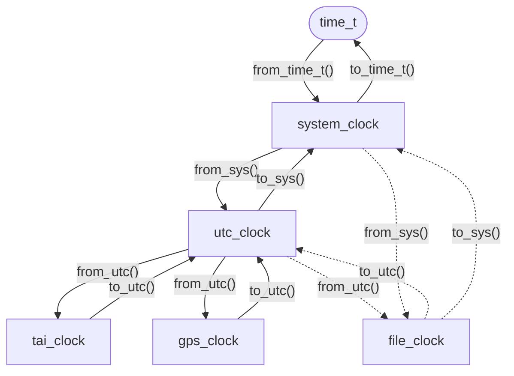

# 時計型の変換関係

```mermaid
flowchart
    id1([time_t]) -- "from_time_t()" --> system_clock
    system_clock -- "to_time_t()" --> id1([time_t])
    system_clock -- "from_sys()" --> utc_clock
    utc_clock -- "to_sys()" --> system_clock
    utc_clock -- "from_utc()" --> tai_clock
    tai_clock -- "to_utc()" --> utc_clock
    utc_clock -- "from_utc()" --> gps_clock
    gps_clock -- "to_utc()" --> utc_clock
    utc_clock -."from_utc()".-> file_clock
    file_clock -."to_utc()".-> utc_clock
    system_clock -."from_sys()".-> file_clock
    file_clock -."to_sys()".-> system_clock
```