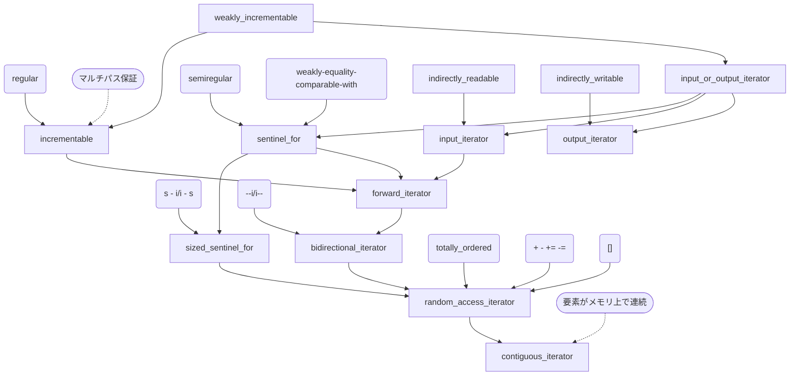

# イテレータコンセプト依存関係

```mermaid
graph TD
    weakly_incrementable --> incrementable
    id1(regular) --> incrementable
    id10(["マルチパス保証"]) -.-> incrementable
    weakly_incrementable --> input_or_output_iterator
    input_or_output_iterator --> sentinel_for
    id2(semiregular) --> sentinel_for
    id3(weakly-equality-comparable-with) --> sentinel_for
    sentinel_for --> sized_sentinel_for
    id4("s - i/i - s") --> sized_sentinel_for
    input_or_output_iterator --> input_iterator
    indirectly_readable --> input_iterator
    input_or_output_iterator --> output_iterator
    indirectly_writable --> output_iterator
    input_iterator --> forward_iterator
    incrementable --> forward_iterator
    sentinel_for --> forward_iterator
    forward_iterator --> bidirectional_iterator
    id5("--i/i--") --> bidirectional_iterator
    bidirectional_iterator --> random_access_iterator
    sized_sentinel_for --> random_access_iterator
    id6(totally_ordered) --> random_access_iterator
    id7("+ - += -=") --> random_access_iterator
    id8("[]") --> random_access_iterator
    random_access_iterator --> contiguous_iterator
    id9(["要素がメモリ上で連続"]) -.-> contiguous_iterator
```