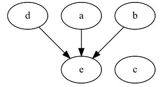

\clearpage

# はじめに

## 本書の内容について

　本書はC++20のモジュール仕様について規格書の文面から読み取ることのできる理論的な部分を解説しています。従って、規格書では触れられていないビルドについてや`.dll, .lib, .so, .a`などの特殊な翻訳単位については触れていません。また、どう使うかよりはどういうものかのような理論的な側面を追求しているので、必ずしも実使用に当たって参考になるものではないかもしれません。

　本書執筆時点では完全にモジュールを実装した処理系は存在していないため、本書の内容は実装に裏打ちされたものではなく、あくまで規格書から読み取った理論的なものにとどまります。その解釈にはおそらくいくつか間違いがあるかと思われます、ご了承ください。

　また、紙面の都合から下記の知っておいた方が良いと思われるトピックについては解説していません。分からない単語や概念に出くわしたら適宜調べてみることをお勧めします。

- 宣言と定義
- 翻訳単位
- ヘッダファイルと`#include`
- 分割コンパイル
- リンケージ
- 翻訳単位越え
- テンプレートのインスタンス化
- One Difinition Rule (ODR)
- 3種類の名前探索
- `inline`

　なお、本書の内容は私が以前に公開したブログ記事に加筆訂正を行ったものです。もしかしたら記述やサンプルコードに見覚えがあるかもしれません・・・

## モジュールとは？

　モジュールとは、簡単に言えば従来のヘッダファイルとそのインクルードによるライブラリの導入を置き換えるシステムです。外部ライブラリの導入をモジュールのインポートによって行い、自作ライブラリでは公開したい宣言だけをエクスポートすることによって、ライブラリを使用・作成します。多くの他言語は既に持っているもので、より効率的なプログラムの分割・結合を可能にする仕組みです。

```cpp
// C++20のHello Worldの例
import <iostream>;

int main() {
  std::cout << "Hello World!" << std::endl;
}
```

　現在（C++17までの）のC++にはこのような仕組みはなく、ライブラリの使用・配布はもっぱらビルド済みバイナリとヘッダーファイルの組み合わせや、ヘッダオンリーライブラリによって行われています。それらライブラリの使用時は、ライブラリの指定するヘッダーファイルを使用したい翻訳単位でインクルードすることによってライブラリのインターフェースにアクセスできるようにします。

　しかし、インクルードはC言語より引き継いだ古式ゆかしいシステムで、その実態はファイルのコピーアンドペーストであり、それにはいくつかの問題があります。

- 公開するものとしないものを選べない
    - 特に、マクロは名前空間を持たないので、一方的にばら撒かれる
- 翻訳単位ごとに同じヘッダをインクルードしていると、無駄にビルド時間が増大する
    - ヘッダオンリーライブラリにおいて顕著
- 思わぬ多重定義によるODR違反を引き起こしやすい
- ヘッダファイルと実装が別れている場合、それらが一致せずに未定義動作に陥る可能性がある

　もちろんインクルードにもメリットや便利なところもあるのですが、ライブラリの作成・配布という観点からは適切な仕組みであるとは言えません。他の言語はより高級なライブラリ管理のシステム（モジュールシステムだけではなく、パッケージマネージャも含めて）を持っており、C++にも渇望された結果、C++20にてモジュールが導入されるに至りました。上記で挙げたような問題はモジュールにおいては起こらないか、軽減されています。

　なお、これはライブラリのためだけの仕組みではなく、1つのプログラムを作成する際にその役割や領域毎にプログラムを分割するといった、従来ヘッダファイルとソースファイル（`.h`と`.cpp`）によって行われてきたことを置き換える仕組みでもあります。

\clearpage

# 言葉の前方宣言

　モジュールの説明ではどうしてもいくつか特有の言葉を導入しなければならず、しかもそれが前後しがちなので、事前に簡単かつ順番に言葉を定義しておきます。

一部の言葉は後で詳細に説明されます。

### モジュール宣言（*module decralation*）

　ある翻訳単位をモジュールを記述するものとして表明する宣言文。`export module module_name;`もしくは`module module_name;`のような宣言。

### モジュール単位（*module unit*）

　モジュール宣言を含む翻訳単位。

### モジュール名（*module name*）

　モジュール宣言において指定した名前。1つの名前を複数のモジュール単位で共有できる。

### ヘッダーユニット（*header unit*）

　従来のヘッダファイルを仮想的に1つのモジュール単位として扱う仕組み、もしくはその場合のモジュール単位のこと。指定されたヘッダファイル1つで1つの翻訳単位をなす。

### 名前付きモジュール（*named module*）

　同じモジュール名を持つモジュール単位の集まり。単に名前付きモジュールと言う場合はある1つのモジュールを指す。なお、その場合にヘッダーユニットは名前付きモジュールに含まない（モジュール宣言によってモジュールとなるわけではないため）。

### エンティティ

　変数、関数、クラス型、列挙型、テンプレートなど、C++コード上で名前を持つことができ何かしらの意味論を持つものの総称。本書では主に、名前空間スコープに宣言できるものを対象にしている。

### エクスポート（`export`）

　あるモジュールのエンティティを、そのモジュール外部から使用できるようにするために、`export`キーワードを付加した宣言を行うこと。

### モジュールのインターフェース

　ある名前付きモジュールにおいて、モジュール宣言に`export`を含むモジュール単位でエクスポートされている宣言の集合。

### グローバルモジュールフラグメント

　あるモジュール単位において、モジュール宣言より前に`module;`というマーカーを置いた時、そこからモジュール宣言の直前までの領域の事。そこはモジュールには含まれない。

　グローバルモジュールフラグメントには直接的にはプリプロセッサディレクティブしか現れてはならない。

### グローバルモジュール

　グローバルモジュールフラグメントやヘッダーユニットと全てのモジュール単位ではない翻訳単位の集合。これらは合わせて1つの巨大なモジュールを成す。

### モジュール単位の本文（*module unit purview*）

　モジュール宣言から始まりその翻訳単位の終わり（実質的にそのファイル末尾）までの部分に書かれている文字列。名前付きモジュールの本文とは、名前付きモジュールを構成する個々のモジュール単位の本文の集合。

　モジュール宣言から始まるため、グローバルモジュールフラグメントは名前付きモジュールの本文には含まれない。グローバルモジュールの本文とは、グローバルモジュールに現れている宣言全てのこと（グローバルモジュールフラグメントはそこに含まれる）。

### モジュールに属する（*attached*）

　名前付きモジュールの本文内に書かれた宣言は全て、そのモジュールに属している。

　そうでないもの（グローバルモジュールフラグメント内宣言等）は、グローバルモジュールに属している。

### 可視（*visible*）

　名前探索においてエンティティの名前が見つかる場合、その名前は名前探索において可視であるという。

### 意味論的な性質（*semantic property*）

　あるエンティティの宣言もしくは翻訳単位の、C++コードとしての機能や性質のこと。宣言等は、意味論的な性質を利用可能となって初めてC++コード上で意味を持つ。

### 到達可能（*reachable*）

　あるソースコード上の一点から、ある宣言・翻訳単位等の意味論的な性質を利用可能であるとき、その点からはそのような宣言・翻訳単位等は到達可能であるという。

　あるいは、ある点からある宣言等へ到達可能であるとき、その宣言等の意味論的な性質を利用可能となる。

### インポート（`import`）

　ある翻訳単位でモジュールを利用するために`import`宣言を行うこと。モジュールをインポートすることによってその翻訳単位内からは、そのモジュールのインターフェースに含まれる宣言が全て到達可能になり、`export`されている宣言が可視になる。

### 再エクスポート（`export import`）

　モジュール内部において、他のモジュールをインポートすると同時にエクスポートすること。`export import module_name;`という宣言によって行われる。あるモジュール`A`で再エクスポートされているモジュールは、`A`内でインポートしたことになると同時に、`A`をインポートした翻訳単位でもインポートしたことになる。

### インターフェース依存関係（*interface dependency*）

　ある翻訳単位があるモジュールをインポートしているとき、その翻訳単位はそのモジュールにインターフェース依存関係を持つ。

　インターフェース依存関係は推移的な関係であり、その結果自分自身にインターフェース依存関係を持つ（依存関係が循環する）とコンパイルエラーとなる。

### プライベートモジュールフラグメント（*private module fragment*）

　1つのファイルでモジュールを構成しそのファイル内で公開するインターフェースと隠蔽する実装を分離する仕組み。`module:private;`というマーカーが置かれた行を境に、その後に書かれたものはモジュール外から一切参照できない。

\clearpage

# モジュール単位（*module unit*）

## モジュールのインターフェースと実装（*interface and implementation*）

　あるファイルをモジュールとして宣言するには、__モジュール宣言（*module decralation*）__ をファイル先頭で一度だけ行います。モジュール宣言を行うことでそのファイルは1つの __モジュール単位（*module unit*）__ かつ1つの翻訳単位となります。

```cpp
// 2つの形式のモジュール宣言の例
export module Module.Name;
module Module.Name;
```

　通常の多くのC++コードがヘッダファイル（宣言 : `.h/.hpp`）とソースファイル（定義 : `.cpp`）に分割される様に、モジュールにおいても宣言と定義を別のファイル（別々のモジュール単位）に分割して実装します。その時、それらのモジュール単位はそれぞれ __モジュールインターフェース単位（*module interface unit*）__ と __モジュール実装単位（*module implementation unit*）__ と呼びます。


```cpp
///mymodule.cpp

// （プライマリ）モジュールインターフェース単位の宣言
export module MyModule;

// export宣言、宣言をモジュール外部に公開する
export int f(int n);
```
```cpp
///mymodule_impl.cpp

// モジュール実装単位の宣言
module MyModule;
// ここではプライマリモジュールインターフェース単位内のものが見えている
// モジュール外部からはこの中のものは可視でも到達可能でもない

// exportされたf()の再宣言・定義
int f(int n) {
  return n;
}
```
（この様なコードブロックの分割がファイル分割に対応していると思ってください）

　まず、`export module`の形のモジュール宣言によってインターフェース単位を宣言します。このインターフェース単位は __プライマリモジュールインターフェース単位（*primary module interface unit*）__ と呼ばれ、モジュールには必ず __唯一つだけ__ 含まれていなければなりません。

　インターフェース単位では、外部に公開したい（=外部からの参照を許可したい）宣言をエクスポート宣言（`export 宣言;`）によって宣言します。これによってその宣言はモジュールの外部から参照する事ができるようになります。例にあるように、エクスポート宣言は必ずしも定義を伴わなくても構いません。

　次に、`export`の付かないモジュール宣言によってモジュール実装単位を宣言します。実装単位では、インターフェース単位で宣言されたものの定義を記述します。この時、何もせずとも実装単位からは同じ名前のプライマリインターフェース単位に書かれたものが見えています。

　このように、インターフェース単位にはモジュールのインターフェース、すなわち外部に公開する宣言を、実装単位にはそれら宣言の実装や内部詳細を、それぞれ書く事を想定しています。このような分割は、ちょうどヘッダファイルとソースファイルの分割に対応していることが分かるでしょう。


　そして、このモジュールを利用するには次のようにします。

```cpp
///main.cpp（非モジュール）

// モジュール"MyModule"のインポート宣言、exportされているものを取り込む
import MyModule;

int main() {
  int n = f(10);  // ok、n = 10
}
```

　モジュールのインターフェースでは公開したい宣言をエクスポート宣言によって外部へ公開し、モジュールを利用する側ではインポート宣言（`import モジュール名;`）によってモジュールからエクスポートされている宣言を取り込みます。

　この時、インポートされるのはモジュールのインターフェース単位のみであり、実装単位はインポートされず、インポートした側からは一切観測できません。モジュール実装単位は定義を外部から隠蔽するために利用します（これもソースファイルと同様です）。

### モジュール名

　モジュール宣言において`module`キーワードの後に指定するのがモジュール名で、好きな名前を付けることができます。ただし、モジュール名に使用できるのはアルファベットと数字と`_`（と、ユニバーサルキャラクタ名（=ユニコード文字））だけです。また、`.`（ドット）をモジュール名の区切りとして使用できます。

\clearpage

モジュール名に使えるの文字の一覧
```EBNF
a b c d e f g h i j k l m
n o p q r s t u v w x y z
A B C D E F G H I J K L M
N O P Q R S T U V W X Y Z _

0 1 2 3 4 5 6 7 8 9

universal-character-name（省略）
```

　ただし、`std`から始まる全てのモジュール名と予約語を含むようなモジュール名は、C++標準によって予約された名前であるため使用してはいけません。

```cpp
// ダメなモジュール名の例
export module std;            // stdから始まる
export module std99.mymodule; // stdから始まる
export module my__module; // 予約語が含まれている
export module _Mymodule;  // 予約語が含まれている
export module new.module; // キーワードが含まれている
export module My+module;  // 記号が含まれている
```

　なお、モジュール名はファイル名との対応がなくても構いません。しかし、分かりやすさのためにもなるべく対応を取っておくと良いでしょう。

### モジュール実装単位とインポート

　モジュール実装単位とインターフェース単位は通常同じ名前を持ちます。すると、実装単位においてインターフェース単位をインポートしようとすると自分自身をインポートすることになってしまいます。いかなるモジュールも自分自身をインポートすることはできないのでそれをしようとするとエラーになります。

　しかし、モジュール実装単位は対応するプライマリモジュールインターフェース単位を暗黙的にインポートしているため、何もせずともそのまま対応するプライマリインターフェース単位に書かれた宣言を参照できます。

　このため、モジュール実装単位そのものはエクスポートもインポートもできず、実装単位では`export`宣言が出来ません。

## パーティション（*partition*）

　さらに、モジュールを複数のファイルに分けて構成する事ができます。これは例えば、自作のライブラリを1つのモジュールとして提供したいが、その内部の実装においては整理のためにも複数のファイルに分けたい、という際に役立ちます。

　その様にモジュール内部で分割したファイルはこれもまたモジュール単位となり、 __モジュールパーテイション（*module partition*）__ と呼ばれます。モジュールのパーティションを作るには、モジュール宣言においてモジュール名の後に`:`で区切ってパーティション名を指定します。なお、ここで指定するモジュール名はファイル分割しようとしているモジュール名を指定します。異なるモジュール名を指定すると別のモジュールのパーティションだと認識されます。

```cpp
// モジュールパーティションの宣言例
export module Mymodule:IfPart;
module Mymodule:ImplPart;
```

　そして、モジュールパーティションもまたインターフェースと実装に分割する事ができ、分割後のモジュール単位はそれぞれ __モジュールインターフェースパーティション（*module interface partition*）__、__モジュール実装パーティション（*module implementation partition*）__ と呼ばれ、それぞれモジュールインターフェース単位とモジュール実装単位でもあります。

```cpp
///mymodule_part.cpp

// モジュールインターフェースパーティションの宣言
export module MyModule:InterfacePart;

export double g(double v);
```
```cpp
///mymodule_part_impl.cpp

// モジュール実装パーティションの宣言
module MyModule:ImplPart;
// import宣言、インターフェースパーティションMyModule:InterfacePartを取り込む
import :InterfacePart;

double g_impl(double v) {
  return v + v;
}

// パーティション":InterfacePart"内のg()の再宣言・定義
double g(double v) {
  return g_impl(v);
}
```
```cpp
///mymodule.cpp

// （プライマリ）モジュールインターフェース単位の宣言
export module MyModule;
// インターフェースパーティション":InterfacePart"の再エクスポート
export import :InterfacePart;

export int f(int n);
```
```cpp
///mymodule_impl.cpp

// モジュール実装単位の宣言
module MyModule;

int f(int n) {
  return n;
}
```

　モジュールパーティションの宣言はモジュール宣言とほぼ同様ですが、モジュール名の後に`:`で区切ってパーティション名を指定します（`:`がモジュールパーティションである証です）。そして、モジュールパーティションをインポート/エクスポートするときは`:`を含めたそのパーティション名だけを指定します。モジュール名を含めてしまうとコンパイルエラーになるので注意です。

　プライマリモジュールインターフェース単位はモジュールに一つしか作ることができませんが、インターフェースパーティションはいくつでも作ることができます。ただし、同じモジュール内で複数のパーティションが同じ名前を持つことは出来ません。そのため、インターフェースパーティションと実装パーティションでは異なる名前を付ける必要があり、あるパーティションは使用する別のパーティションを明示的にインポートする必要があります。

　このようにモジュールをパーティションへ分割しても、使用する側はそれを気にする必要はありません。

```cpp
///main.cpp
import MyModule;
// これはできないし、必要ない
//import MyModule:InterfacePart;

int main() {
  // 共に使用可能
  int    n = f(10);
  double v = g(1.0);

  // ng! 呼び出し不可能
  int m = g_impl(10);
}
```

　モジュールのパーティションへの分割はモジュールの外からは観測することができないため、そのモジュールの外からパーティションを指定してインポートする事は出来ません。そのため、モジュールインターフェースパーティションはプライマリモジュールインターフェース単位から必ず再エクスポートされなければなりません（忘れてもエラーにはならないでしょう・・・）。

### パーティションとインターフェース・実装

　モジュールパーティションであったとしても、それ以前にインターフェース単位か実装単位のどちらかであるはずで、モジュール単位はパーティションかどうかとは関係なく、実装単位は実装単位のインターフェース単位はインターフェース単位のルールに従います。

　モジュール実装単位では`export`宣言を行うことができず、実装単位を再エクスポート（`export import`）することもできません。実装単位にあるものはどこかのインターフェースで予め対応する宣言をエクスポートしておかない限り、モジュール外部からはアクセス不可能です。

　ただし、インターフェースパーティションはプライマリとなることがないので複数のインターフェースが存在でき、実装単位がインポート出来ないのに対して実装パーティションは同じモジュール内からならばインポートすることが可能です。これらの点は非パーティションのモジュール単位とは異なります。

　また、モジュールパーティションを（同じモジュール内で）インポートした際は通常のインポートとは異なり、エクスポートされていない宣言も含めてそのパーティションのすべての宣言が利用可能になります。


## インターフェース？実装単位？？パーティション？？？

　そろそろ用語がこんがらがってきて何が何だか分からなくなってきたところでしょう・・・

　一応、ここまでに登場したモジュールは全部で4種類です。インターフェースか実装か？パーティションか否か？という2つの軸から分類でき、モジュール宣言に`export`が含まれていればインターフェース、モジュール名に`:`が含まれていればパーティション、というように見分けることができます。

モジュールの名称についての関係性

||インターフェース単位|実装単位|
|:---|:---:|:---:|
|非パーティション|プライマリモジュールインターフェース単位|モジュール実装単位|
|パーティション|モジュールインターフェースパーティション|モジュール実装パーティション|

\clearpage

各モジュール種別と対応するモジュール宣言

|モジュール種別|モジュール宣言例|
|:---|:---|
|プライマリモジュールインターフェース単位|`export module M;`|
|モジュール実装単位|`module M;`|
|モジュールインターフェースパーティション|`export module M:IfPart;`|
|モジュール実装パーティション|`module M:ImplPart;`|

## プライベートモジュールフラグメント（*private module fragment* : 単一ファイルのモジュール）

　モジュールを構成するにはプライマリインターフェース単位と実装単位の2つが通常必要です。しかし、ヘッダオンリーライブラリのように1ファイルで構成したくなることもあるでしょう。実はプライマリインターフェース単位だけでモジュールを構成することは可能ですが、ODR違反を起こしやすくなってしまったり実装の隠蔽が完全でなくなってしまったりするためあまりお勧めされません。

```cpp
///mymodule.cpp
// Mymoduleのプライマリモジュールインターフェース単位の宣言
// かつMymoduleの唯一のモジュール単位
export module Mymodule;

int f_impl(int n) {
  return n * n;
}

export int f(int n) {
  return f_impl(n);
}
```
```cpp
///main.cpp
import MyModule;

// モジュールの中身を知らずに定義してしまった、ODR違反！
int f_impl(int n) {
  return n + n;
}

int main() {
  int n = f(10);
  int m = f_impl(10);  // おそらくコンパイルエラー
}
```

　このような問題を避けつつモジュールを1ファイルで構成するために、プライベートモジュールフラグメントというものが用意されています。利用するには、プライマリインターフェース単位だけでモジュールを構成し、その途中で`module : private;`というマーカーを置きます。そこから先がプライベートモジュールフラグメントとなり、その中のものは実装単位と同じくモジュール外部から観測不可能です。

```cpp
///mymodule.cpp
export module Mymodule;

// f()の宣言のエクスポート
export int f(int n);

module : private; // プライベートモジュールフラグメントの開始

// f_impl()の宣言・定義はモジュール外から見えない
int f_impl(int n) {
  return n * n;
}

// エクスポートされている宣言の再宣言は外部リンケージを持っている
int f(int n) {
  return f_impl(n);
}
```
```cpp
///main.cpp
import MyModule;

// ok、ODR違反とはならない
int f_impl(int n) {
  return n + n;
}

int main() {
  int n = f(10);      // ok
  int m = f_impl(10); // ok
}
```

　この様に、プライベートモジュールフラグメントを利用することで宣言と定義を適切に分離・隠蔽しつつ1ファイルでモジュールを構成することができます。

　別の見方をすると、プライベートモジュールフラグメントでは1つのファイルでインターフェース単位と実装単位（あるいはヘッダファイルとソースファイル）を分けて書いていると見ることもできます。

```cpp
export module Mymodule;

...
// ここまでインターフェース単位（従来の.hに相当）
module : private;
// ここから実装単位（従来の.cppに相当）
...
```

　ただし、プライベートモジュールフラグメントを使用する場合はモジュールはただ一つの翻訳単位（ファイル）で構成しなければなりません。2つ以上の翻訳単位からなるモジュールでプライベートモジュールフラグメントを使用した場合は未定義動作です。

## モジュールファイル形式

　ヘッダーやソースファイルがそうである様に、モジュールのソースファイルの拡張子は規定されていません。テキストファイルであり、コンパイラがそれと認識すればその拡張子は自由です。

　現在の所、MSVCでは`.ixx`、clangでは`.cppm`が使われているようですが、両コンパイラ共にそれ以外のファイルでもモジュールとして利用することができます（なお、どちらもまだ*experimental*な実装です）。

\clearpage

# 可視・到達可能（*Visible and Reachable*）

　__可視（*visible*）__ と __到達可能（*reachable*）__ はモジュール内の宣言や定義の参照についての2つの重要な概念です。

- 可視（*Visible*）
  - ある宣言は（3種類いずれかの）名前探索において見つかる（候補に上がる）時、そのコンテキストにおいて可視となる
- 到達可能（*Reachable*）
  - ある宣言は（名前探索とは無関係に）その宣言の持つ意味論的な性質が利用可能である時、そのコンテキストにおいて到達可能となる
  - あるいは、宣言は到達可能である時、その宣言の持つ意味論的な性質が利用可能である

　可視という概念は同じ意味で元々使用されていました。到達可能はモジュールに伴って新しく導入された概念です。

　コンテキスト（文脈）とはソースコード上でのある位置（点）のことで、宣言の持つ意味論的な性質とはその宣言についてC++コードとして規定された効果のことです。そして、到達可能とはソースコードのある位置からある宣言がC++コードとして利用可能であることを言います。

　例えば、クラスの定義の持つ効果はクラスを完全型にしてそのメンバを利用可能にします。逆にいうと、クラスの定義が到達可能であるときそのクラスは完全型となりそのメンバが利用可能になります。また、定義は必ず宣言を含むので、宣言が定義を兼ねている場合はその宣言に到達可能=定義に到達可能、ということになります。

## 可視＝到達可能？

　可視と到達可能の間には次のような関係性があります。

- 宣言が可視 → 宣言は到達可能：常に成り立つ
- 宣言が到達可能 → 宣言は可視：成り立たない事がある

　可視ではないということは名前探索で見つからないということなので、可視でなければその宣言は使用不可能です。そして、その宣言の持つC++コードとしての効果を利用するためには、その宣言が到達可能である必要があります。すなわち、モジュール内の宣言をモジュール外で利用するための必要十分条件は、その宣言が可視かつ到達可能であることです。

　ただしその定義の利用に関しては関数とそれ以外とで少し異なります。関数の場合は宣言だけが予めエクスポートされてさえいれば、再宣言で定義をしてもその宣言は外部リンケージを持つため、通常の翻訳単位越えによってその定義を呼び出すことができます。しかしそれ以外のもの（例えばクラス定義）はそうではなく、定義を伴わないエクスポート宣言の後でその定義が到達可能なところでなされないとモジュール外で定義を利用できません。

## 不可視の宣言

　前項の可視と到達可能の間にある関係性は、ある宣言が名前探索において見つからないにもかかわらず、その宣言の効果が利用可能であることがあり得ることを示唆しています。つまり、宣言が可視ではないのに到達可能となる事があるという事です。

　それはモジュールのインポートにおいて起こります。モジュールをインポートするとそのインターフェース（プライマリインターフェース単位）内でエクスポートされている宣言はインポートした側で可視となり、同時に到達可能になります。  
　しかし、そのインターフェース内でエクスポートされていない宣言は可視にはなりませんが到達可能ではあります。このために意図しないODR違反が起こってしまう可能性があります。

　プライベートモジュールフラグメントのところで説明したように、プライマリインターフェース単位だけでモジュールを無理やり1ファイルで構成した時などにそれが問題になりがちです。

```cpp
///mymodule.cpp
export module Mymodule;

// インポートした側からは可視ではないが到達可能
int f_impl(int n) {
  return n * n;
}

// インポートした側から可視であり到達可能
export int f(int n) {
  return f_impl(n);
}
```
```cpp
///main.cpp
import MyModule;

// ODR違反！モジュールの中身を知らずに定義してしまった、compile error!
int f_impl(int n) {
  return n + n;
}
```

　インターフェースにある宣言はインポートした側からは全て到達可能となるため、インターフェースにエクスポートしていない宣言が含まれていると、その宣言は可視ではないが到達可能となります。もし、この宣言が定義を持ち、インポートした側でも同じ宣言に対して定義を書いてしまうとODR違反となります。幸い、これはコンパイルエラーになります。

　先ほどのように、このような（1ファイルでモジュールを構成したい）場合はプライベートモジュールフラグメントを利用するべきです。

## クラス定義の可視性と到達可能性

　先ほど少し書きましたが、あるモジュールからクラスの宣言だけを`export`した場合、その定義の場所によってはそのモジュールをインポートした側からそのクラスを完全型として利用できない場合があります。

　クラスの定義を利用するには、そのクラスの宣言が可視であり、定義が少なくとも到達可能である必要があります。

```cpp
///mymodule.cpp
export module MyModule;

// 2つの型の宣言のみをエクスポート
export struct S1;
export struct S2;

// S1の再宣言・定義
struct S1 {
  double v = 1.0;
};

// S2を返す関数をエクスポート
export S2 f();
```
```cpp
///mymodule_impl.cpp
module MyModule;

// S2の再宣言・定義
struct S2 {
  int n = 10;
};

// f()の再宣言・定義
S2 f() {
  return { .n = 3 };
}
```
```cpp
///main.cpp
import MyModule;

int main() {
  S1 s1 = { .v = 3.1415 };  // ok、S1の定義は到達可能
  S2 s2 = { .n = 11 };      // ng、S2の定義は到達不可能
  S2* ps2{};    // ok
  s1.v = 0.0;   // ok
  
  auto r = f(); // ok
  S2   r = f(); // ng
  r.n  = 5;     // ng、S2の定義は到達不可能
}
```

　モジュールのインターフェース内の宣言は全てインポートした側から到達可能であり、クラスのメンバはクラスの定義が到達可能であれば可視となります。また、以前にエクスポートされた宣言の再宣言は暗黙にエクスポートされます。

　その結果、クラス`S1`の宣言・定義は`main.cpp`から可視かつ到達可能となり、そのメンバもまた可視となります。従って、初期化（構築）、メンバアクセスを普通に行えます。しかし、`S2`の定義は`MyModule`の実装単位にあり、インポートした側からは宣言は可視であるものの定義は到達可能ではありません。そのため、構築やメンバアクセスは行えず不完全型としての利用のみが可能です。

　ただし、`S2`を返す`f()`のような関数の戻り値は`auto`によって受けることだけは可能です。この場合でもメンバアクセスはおろかコピーもできず、実質的に`S2`の意味論的な性質を利用していないために可能なのだと思われます。


## 可視と到達可能の例

少し複雑ですがモジュールと可視・到達可能のサンプルコードを載せておきます。頑張って解読してみてください。

```cpp
///mymodule2.cpp
export module Mymodule2;

#include <iostream>

namespace Mymodule2 {

  export void print(int n);

  export void print(double v);

  void print(const char* str) {
    std::cout << str << std::endl;
  }

}

// プライベートモジュールフラグメントの開始
module : private;

namespace MyModule2 {

  void print(int n) {
    std::cout << n << std::endl;
  }

  void print(double v) {
    std::cout << v << std::endl;
  }
}
```
```cpp
///mymodule_part.cpp（インターフェースパーティション）
export module MyModule:InterfacePart;
//他モジュールの再エクスポート
export import Mymodule2;

export double h(double v);
```
```cpp
///mymodule_part_impl.cpp（実装パーティション）
module MyModule:ImplPart;
import :InterfacePart;

double h(double v) {
  MyModule2::print(v); //ok、可視であり到達可能
  return v + v;
}
```
```cpp
///mymodule.cpp（プライマリモジュールインターフェース単位）
export module Mymodule;
export import :InterfacePart;

export struct S;

export class C;

export int f(int n);

int g() {
  return 1;
}

//定義（再宣言）、以前にエクスポートされているため暗黙にエクスポート
class C {
  int m = 10;
public:
  C() = default;

  operator int() const noexcept {
    return m;
  }

  int set(int n);
};

```
```cpp
///mymodule_impl.cpp（実装単位）
module Mymodule;

struct S {
  int n;
  double v;
};

//定義（再宣言）、外部リンケージを持つ
int f(int n) {
  return n * n;
}

//定義（再宣言）、外部リンケージを持つ
int C::set(int n) const noexcept {
  int b = m;
  m = n;
  return b;
}

char get_a() {
  return 'a';
}

```
```cpp
///main.cpp
import Mymodule;

int main() {
  int n = f(2);         // ok、可視であり到達可能
  double d = h(0.1)     // ok、可視であり到達可能
  MyModule2::print(n);  // ok、可視であり到達可能
  S* ps = nullptr;      // ok、型名`S`は可視であり到達可能
  C c{};                // ok、クラス`C`の定義は到達可能
  int m = c;            // ok、`C`の定義は到達可能なので
                        // その全メンバの宣言も可視であり到達可能
  m = c.set(20);        // ok、`C`の宣言はエクスポートされており
                        // 外部リンケージを持ち、そのメンバも外部リンケージを持つ
                        // そして`C`の定義は到達可能なので全メンバの宣言は可視
                        // 実装単位内部の定義（再宣言）は外部リンケージを持つため
                        // 可視な宣言から呼び出しが可能

  int l = g();          // ng、到達可能だが可視ではない
  print("Hello World.");// ng、到達可能だが可視ではない

  S s = {10, 3.14};     // ng、`S`の型名は可視だが定義は到達可能ではない

  char a = get_a();     // ng、可視でも無く到達可能でもない
}

// 到達可能な定義と同名のものに対して定義をしてしまうとODR違反、コンパイルエラー
int g() {
  return 1;
}
```

\clearpage

# モジュールとODR

　1つの翻訳単位には、変数、関数、クラス型、列挙型、テンプレート、特定のスコープ内関数のデフォルト引数、デフォルトテンプレート引数、の定義を複数含めることはできません。そして、プログラムはそのようなODRに従った定義を1つだけ含んでいなければなりません。これを、__One Difinition Rule（単一定義原則 : ODR）__　と言います。

　通常、ODRに違反した場合は未定義動作になり、コンパイラはそれを検出しエラーを発する義務を負いません。従って、静かにバグを埋め込むことになります。

　基本的にはODRはモジュールにおいても変わりは無く、モジュールで翻訳単位を分割したとしてもODRを遵守しなくてはなりません。

## ODRの例外のモジュールにおける例外

　テンプレートなど、ヘッダに定義まで書いて複数翻訳単位からインクルードして利用されるものは各翻訳単位において定義がなされるため、一時的にはODRに違反しています。しかし、ODRの例外規定によってそれらは未定義動作とはならないようにされています。

　しかし、モジュールはヘッダのインクルードによって利用されることは無いため、このODRの例外は適用されません。そのため、実はモジュールにおいてはODRが厳しくなっています。

このことは次のように規定されています。

- 名前付きモジュールに属するエンティティは複数の定義を持ってはならない。その場合、後の定義が現れるときに前の定義が到達可能でなければ診断は不要
- ある宣言が別のモジュールに属した到達可能な宣言を再宣言する場合、プログラムはill-formd

これらの規則より、次の結論が導かれます。

* 1つのエンティティに対する宣言・定義は同じモジュールに属しており、名前付きモジュール内では定義は唯一つでなければならない
    + グローバルモジュールにおいては依然としてODRの例外規定が有効

　幸い、多くのケースではこれに違反するとコンパイラによってエラーとされるので気づく事ができます。診断不要と書いてある条件に引っかかるのは、異なるモジュールの間で同じ名前・シグネチャの関数などがそれぞれ定義されていて、それを1つのプログラム内の異なる翻訳単位から使用した、ような場合でしょうか。

## ODRの例外について

　ODRの例外規定により、その定義が同一であれば定義が複数の翻訳単位で現れることが許可されているものは以下のものだけです。

- クラス型
- 列挙型
- `inline`関数・変数
- クラステンプレート
  - 静的メンバ変数
  - メンバ関数
- 非static関数テンプレート
- コンセプト
- テンプレートの部分特殊化
- 特定のスコープ内関数のデフォルト引数
- デフォルトテンプレート引数

　テンプレートのために用意されている規則のようなものであるため、テンプレートはほとんど当てはまります。しかし、普通の非`inline`関数など当てはまらないことに注意が必要です。

　これらのものは、その定義を構成する文字列が完全に同一であり、その効果（意味論）も同じになるときに限って、複数の翻訳単位で定義が現れることができます。

\clearpage

# モジュールリンケージ（*module linkage*）

　モジュールに属しかつ外部リンケージを持つ宣言（定義）が`export`されていないとき、これまでの規則で考えると対応する宣言を用意してやりさえすればモジュール外部から（翻訳単位越えのルールによって）参照できるはずです。

　しかし、これをやられるとモジュールの意味が薄くなってしまうため、次のような規則によって出来ないようになっています。

- 名前付きモジュールに属している宣言によって導入される名前が外部リンケージを持ちえるがエクスポートされていない場合、その名前は __モジュールリンケージ__ を持つ

　そして、モジュールリンケージを持つ名前（変数名や関数名、クラス名など）は次の場所から参照され、参照することができます。

- 同じモジュール単位内の他のスコープにある名前
- 同じモジュール内の他のモジュール単位のスコープにある名前

　つまり、モジュールリンケージを持つ名前は同じモジュール内からしか参照できません。モジュール内では`export`宣言のみが名前に外部リンケージを与え、モジュールの外から翻訳単位を超えて参照することができるのは外部リンケージを持つ名前だけ、というわけです。

　なお、これらのことは宣言や定義が到達可能であるかどうかとは関係がありません。

```cpp
///Mymodule.cpp
export module Mymodule;

export f(); // 外部リンケージ
static g(); // 内部リンケージ
extern h(); // モジュールリンケージ

export int v; // 外部リンケージ
static int w; // 内部リンケージ
const int x;  // モジュールリンケージ
```

\clearpage

# `export`

　モジュールインターフェース単位内で`export`によって宣言を外部公開する構文は、`export`宣言（エクスポート宣言）と呼びます。`export`宣言は伴う宣言の宣言としての効果（名前の導入等）を持ちます。逆に言うと、宣言できるものは基本的に`export`できます。

　`export`宣言によって導入・再宣言された名前はそのモジュールによって __エクスポート__ されます。エクスポートされた（名前空間スコープの）名前はそのモジュールをインポートしている翻訳単位内で可視となります。クラスや列挙型のメンバはその定義が到達可能である場合に可視となります。


```cpp
///Mymodule.cpp
export module Mymodule;  //これはエクスポート宣言ではない

//エクスポート宣言の例

export struct S {
  int n = 10;
};

export int f() {
  return 0;
}

export int g();

int g() {
  return -1;
}

export int N = 10;

export inline constexpr double PI = 3.14159;
```

　`export`宣言はモジュールインターフェース単位の本文内の名前空間スコープ（グローバル名前空間を含む）で現れることができ、必ず何らかの名前を導入しなければなりません。そして、その名前は外部リンケージを持つ事ができる必要があります。

```cpp
///NG.cpp
export module NG;

// 以下全てNG集

// 内部リンケージ
export static int f() {
  return 0;
}

namespace {
  // 内部リンケージ
  export void f(int n) {}
}

// 内部リンケージ
export constexpr double PI = 3.14159; 

// 名前を宣言していない
export static_assert(true);

// 名前を宣言していない
export using namespace std;

// g()のエクスポート自体はok
export int g() {
  // 名前空間スコープではない（ローカルスコープ）
  export int n = 10;
  return n;
}

class S {
  int n = 0;
public:
  // 名前空間スコープではない（クラススコープ）
  export void set(int m) { n = m; }
};
```
```cpp
///NG_impl.cpp
module NG;

// モジュール実装単位にあらわれている
export int h();
```

　`export`宣言を出来るのはモジュールインターフェース単位内だけです。実装単位やモジュールでは無い翻訳単位ではできません。

## ブロック

　ちまちま1つづつ`export`を付けていくのがめんどくさい場合などに、`export`宣言をブロックによってまとめて行うことができます。この場合のブロックはスコープを導入せず、内部に`export`が現れてはいけません。

```cpp
///Mymodule.cpp
export module Mymodule;

// ブロックのエクスポート宣言、内部のものは暗黙的にエクスポートされる
export {
  struct S {
    int n = 10;
  };

  int f() {
    return 0;
  }

  inline constexpr double PI = 3.14159;

  // ng! exportキーワードは現れてはならない
  export int g() {
    return -1;
  }
}

// ok、ブロックのエクスポート宣言はスコープを導入しない
export inline constexpr PI_2 = 2.0 * PI;
```

## 名前空間

　`export`宣言は名前空間に対しても行うことができます。その場合、エクスポートされた名前空間内の宣言は暗黙的にエクスポートされることになります。従って、内部の宣言は全て外部リンケージを持つ必要があります。すなわち、無名名前空間は`export`宣言に関わってはいけません。

　また、エクスポートしていない名前空間内部に`export`宣言が現れることもできます。この時それを囲む名前空間は暗黙的にエクスポートされますが、エクスポートしていない宣言はエクスポートされません。

　ただし、名前空間を明示的にエクスポートする場合はブロックのエクスポートと同じく内部に`export`宣言を含んではいけません。

```cpp
///Mymodule.cpp
export module Mymodule;

// 名前空間のエクスポート宣言、内部のものは暗黙的にエクスポートされる
export namespace Mymodule {
  struct S {
    int n = 10;
  };

  int f() {
    return 0;
  }

  inline constexpr double PI = 3.14159;
}

namespace Detail {
  // 名前空間内でのエクスポート、Detail::g(void)がエクスポートされる
  // 同時に名前空間Detailもエクスポートされる
  export int g() {
    return -1;
  }

  // エクスポートしていない宣言はエクスポートされない
  int g(int n) {
    return -n;
  }
}

//ダメな例
export namespace NG {
  // 名前を宣言していない
  using namespace std;

  // 内部リンケージ
  static int N = 10;

  // exportキーワードは現れてはならない
  export int g() {
    return -1;
  }

  // 名前を宣言していない
  static_assert(true);

  // 無名名前空間は名前空間のエクスポート宣言に現れてはならない
  namespace {
    int h() {
      return 1;
    }
  }
}

// 無名名前空間はエクスポートできない（名前を宣言していない）
export namespace {
    int h() {
      return 1;
    }
}
```

## `using/typedef`

　`export`宣言は`using`（`typedef`）宣言に対しても行えます。ただし、名前を導入するものでなくてはならず、参照先の名前は外部リンケージを持っていなければなりません。

　ただし、`using`（`typedef`）による型エイリアスの宣言では、参照先の名前が外部リンケージを持つ必要はありません。

```cpp
///OtherModule.cpp
export module Other;

export int f() {
  return 0;
}

export int g() {
  return -1;
}

namespace Other{
  export struct S {
    int n = 10;
  };
}
```
```cpp
///Mymodule.cpp
export module Mymodule;
import Other;

export using ::f, ::g;  // ok、まとめてエクスポート！
export using Other::S;  // ok、import先では名前空間指定なしで利用できる

// ng!名前を宣言していない
export using namespace std;

static int h1() {
  return 1;
}

double h2(double v) {
  return v;
}

struct T {
  int n = 0;
  double v = 0.0;
}

// ng!内部リンケージを持つ名前のエクスポート
export using ::h1;

// ng!モジュールリンケージを持つ名前のエクスポート
export using ::h2;
export using ::T;

// ただし型エイリアスならok
export using C1 = ::T;  // ::Tのエイリアスとなる名前C1をエクスポート
export typedef ::T C2;  // 同上
```

　型エイリアスのエクスポートでは元の名前がエクスポートされていなくても（可視でなくても）、インポートした側ではエイリアス名からその定義に到達可能になる事があります。

```cpp
///main.cpp
import Mymodule; // 先ほどのMymoduleがエラーを起こさなかったとして

int main() {
  C1 c1{};  // ok、型Tの定義は到達可能
  C2 c2{};  // ok、型Tの定義は到達可能
  T  t{};   // ng、型Tは可視では無い
}
```

　ただし、この場合に`T`の定義が実装単位にあったりすれば到達可能ではありません。

## 言語リンケージ指定

　変わったところでは、`extern "C"`のような言語リンケージ指定もエクスポートできます。とはいえ、出来ることできないことはこれまでと変わりありません。

　ただ、この場合の宣言はエクスポートされたモジュールではなくグローバルモジュールに属する事になります。

```cpp
///Mymodule.cpp
export module Mymodule;

// 言語リンケージ指定のエクスポート宣言
export extern "C" int f() {
  return 0;
}


// 言語リンケージ指定ブロックのエクスポート宣言
// 内部のものは暗黙的にエクスポートされる
export extern "C" {
  int g() {
    return -1;
  }

  double PI = 3.14159;

  // ng!exportキーワードは現れてはならない
  export int h() {
    return 1;
  }

  // ng!内部リンケージ
  static int h() {
    return 1;
  }
}
```

## 再宣言と`export`

　通常、宣言は再宣言を行うことができます。その際、宣言毎に`export`があったりなかったりすることがあるでしょう。その時、最終的にその宣言が`export`されるのかどうかは一番最初の宣言によって決まります。

- 以前に`export`宣言によって宣言されている場合
  - その宣言は暗黙的にエクスポートされる
- 以前の宣言は`export`宣言ではない場合
  - 再宣言は`export`宣言であってはならない

　また、どちらの場合もその再宣言された名前のリンケージは、1番最初の宣言時のリンケージに従います。すなわち、`export`宣言は名前のリンケージを変更できません。

```cpp
///Mymodule.cpp
export module Mymodule;

export int f();

// fの再宣言・定義、暗黙的にエクスポート
int f() {
  return 0;
}

export struct S;

// Sの再宣言・定義、暗黙的にエクスポート
struct S {
  int n = 10;
};

// エクスポートしないTの宣言
struct T {
  int n = 10;
  double v = 0.0;
};

// ng! Tの再宣言だが以前にエクスポートされていない
export struct T;

static int g() {
  return -1;
}

int h() {
  return 1;
}

// ng!内部リンケージを持つgはエクスポートできない
// 再宣言はリンケージを変更できない
export int g();

// ng!モジュールリンケージを持つhはエクスポートできない
// 再宣言はリンケージを変更できない
export int h();
```

　「エクスポートされていない宣言の再宣言は出来ない」と「エクスポート宣言による再宣言によって名前のリンケージを変更できない」はほぼ同じことを言っています。どちらの場合もコンパイルエラーとなります。

## モジュールのインターフェース

　これらの`export`宣言によってモジュールのインターフェース単位からエクスポートされ、そのモジュール外部からも利用が可能な宣言の集合の事を __モジュールのインターフェース__ と呼びます。これはインターフェース単位とほぼ同義ですが、単にモジュールのインターフェースと言ったらインターフェース単位の事を指しません。

\clearpage

# `import`

　`import`キーワードに続いてモジュール名を指定することでそのモジュールでエクスポートされている宣言を取り込む構文の事を`import`宣言（インポート宣言）と言います。

　モジュール単位内では`import`宣言は書ける場所が決まっていて、モジュール宣言に続いてモジュール単位の先頭で、他のあらゆる宣言よりも前に来なければなりません。モジュールでは無い翻訳単位ではそのような規定はなく、`import`はどこにでも書くことができます。ただし、あらゆる宣言の内部に書くことはできません。

```cpp
// 予め、モジュールA,B,Cがあるとして

///Mymodule.cpp
export module Mymodule;
import A;         // ok
export import B;  // ok

export int f();
```
```cpp
///main.cpp
import C; // ok

struct S{};

import A; // ok

int main() {
}

import B; // ok
```

　以下はダメな例になります。

```cpp
///ng1.cpp（ダメな例1、モジュール単位
import A; // ng、モジュール宣言よりも後にくる必要がある
export module NG;
import B; // ok

export int f();

import C; // ng、そのほかの全ての宣言よりも前に無ければならない
```
```cpp
///ng2.cpp（ダメな例2、非モジュール
namespace N {
  import A; // ng、他の宣言内には書けない
}

struct S {
  import B; // ng、他の宣言内には書けない
};

int main() {
  import C; // ng、他の宣言内には書けない
}
```

　なお、モジュールパーティションは同じモジュールからしかインポートできず、非パーティションの実装単位はインポートできません。しかし、他のモジュールをインポートはすることはモジュール種別に関係なく行えます。

## インポートの効果

　`import`宣言がインポートするものは、エクスポートされている宣言の塊とかの抽象的なものではなくて、いくつかの翻訳単位そのものをインポートします。

インポート宣言によってインポートされる翻訳単位は次のものの集まりです

- 指定されたモジュールのプライマリモジュールインターフェース単位
    - （下の条件より）必然的にモジュールの全てのインターフェース単位
- インポートされる翻訳単位内で再エクスポートされている翻訳単位
    - そのような翻訳単位は再エクスポートしている翻訳単位からエクスポートされる
- 指定されたのがモジュールパーティションなら、そのパーティションそのもの
    - ただし、同じモジュール内でのみインポート可能
- ヘッダーユニット（後述）
- 同じモジュールの他のモジュール単位をインポートしている場合、その本文でインポートされているすべての翻訳単位（`export`の有無によらず）
    - 同じモジュール内ではインポートした翻訳単位内のすべての宣言が可視となる
    - ただし、グローバルモジュールフラグメント（後述）に現れている`import`宣言はその対象とならない

　そして、そのようにインポートされた翻訳単位内でエクスポートされている宣言（名前）は、インポート先の翻訳単位で可視となり、エクスポートされていない宣言は到達可能となります。インポート宣言の持つ効果は実質これだけです。

　`import`宣言は`#include`とは異なり宣言や定義をインポート先にコピーしません。インポートすると言うのは、単に宣言が可視もしくは到達可能となるかどうかだけに影響します。

## 再エクスポート

　インポート宣言もまたエクスポートすることができ、それは再エクスポートと呼ばれます。再エクスポート宣言は、`import`宣言の前に`export`を付けます。

　そのように再エクスポートされた翻訳単位は、`import`宣言の効果を持ちつつ再エクスポートしている翻訳単位から指定した翻訳単位をエクスポートします。つまり、モジュールをインポートしつつエクスポートします。

　ただし、モジュール実装単位（パーティション含む）はエクスポートできません。

```cpp
// 予め、モジュールA,Bがあるとして

///Mymodule_part.cpp
export module Mymodule:Part;
export import A;  // ok、モジュールAの再エクスポート
```
```cpp
///Mymodule_implpart.cpp
module Mymodule:impl;
```
```cpp
///Mymodule.cpp
export module Mymodule;
export import :Part;  // ok、インターフェースパーティションの再エクスポート
export import B;      // ok
export import :impl;  // ng!実装単位（パーティション）はエクスポートできない
```

## 推移的なインポート

　あるモジュール`M`のインターフェース単位内で他のモジュール`N`を（エクスポートせずに）インポートしていて、他の翻訳単位`U`でその`M`をインポートした時（`N -> M -> U`のようなインポート関係）、`N`のインターフェース単位内の全ての宣言は`U`からは可視にはなりませんが到達可能となります（この時、`M`が`N`を再エクスポートしていれば、`N`のインターフェースは`U`から可視になります）。

　このような間接的にインポートの効果が現れることを推移的なインポートと呼びます。言い直せば、ある翻訳単位から見て推移的にインポートされている翻訳単位内の宣言は可視ではないが到達可能となる、という事になります。

　ただし、このことは同じモジュール内で他のモジュール単位をインポートする場合には当てはまりません。その場合、その翻訳単位内の宣言は全てインポートした側でも可視になり、そこに含まれるインポート宣言は再エクスポートされたのと同じことになります。

　また、実装パーティションは同じモジュール内からならインポートする事ができますが、推移的にインポートされうるのはインターフェース単位だけなので、実装パーティション内の宣言や定義がモジュール外部に不可視のまま漏出することはありません。

```cpp
//予め、モジュールA,B,C,Dがあるとして

///Mymodule_part.cpp（インターフェースパーティション
export module Mymodule:Part;
export import A;  //再エクスポート
import B;
```
```cpp
///Mymodule_implpart.cpp（実装パーティション
module Mymodule:impl;
import :Part;/*
ここでインポートされている翻訳単位は3つ
1. インターフェースパーティション:Part（Mymodule_part.cpp）
2. モジュールA（パーティション:Partからの再エクスポート）
3. モジュールB（パーティション:Partでインポートされている、推移的なインポートではない）
*/
```
```cpp
///Mymodule.cpp（プライマリなインターフェース単位
export module Mymodule;
export import :Part;
import C; 
export import D;/*
ここでインポートされている翻訳単位は5つ
1. インターフェースパーティション:Part（Mymodule_part.cpp）
2. モジュールA（パーティション:Partからの再エクスポート）
3. モジュールB（パーティション:Partでインポートされている、推移的なインポートではない）
4. モジュールC
5. モジュールD
*/
```
```cpp
///Mymodule_impl.cpp（実装単位
module Mymodule;/*
ここでインポートされている翻訳単位は6つ
1. プライマリモジュールインターフェース単位（Mymodule.cpp）
2. インターフェースパーティション:Part（Mymodule_part.cpp）
3. モジュールA（パーティション:Partからの再エクスポート）
4. モジュールB（パーティション:Partでインポートされている、推移的なインポートではない）
5. モジュールC（これも推移的なインポートではない）
6. モジュールD
*/
```
```cpp
///main.cpp
import Mymodule;/*
ここでインポートされている翻訳単位は4つ
1. Mymoduleのプライマリーモジュールインターフェース単位（Mymodule.cpp）
2. Mymoduleのインターフェースパーティション:Part（Mymodule_part.cpp）
3. モジュールA（Mymodule:Partからの再エクスポートのMymoduleからの再エクスポート）
4. モジュールD（Mymoduleからの再エクスポート）
エクスポートされている宣言が可視となっているのはこの4つのモジュールのみ
加えて、以下の翻訳単位が推移的にインポートされている
1. モジュールB
2. モジュールC
推移的にインポートされたモジュールB,C内部の宣言は到達可能となる（可視ではない）
*/
int main() {}
```

　同モジュール内ではインポートするとそこでインポートされている翻訳単位をすべてインポートします。そのため、予想外にインポートする翻訳単位が膨れ上がることがあり得ます。上記だとモジュール実装単位（`Mymodule_impl.cpp`）がそうであるように、実装単位は特に沢山の翻訳単位をインポートすることになりがちです。

　なお、パーティションでないモジュール実装単位では自分自身のモジュールを指定するインポート宣言を行えませんが、そのような実装単位は対応するプライマリモジュールインターフェース単位を暗黙的にインポートしています。

## 再インポート

　インポート宣言は同じモジュール名に対して複数回行うことができ、それは特に禁止されていません。

```cpp
//予め、モジュールA,Bがあるとして
///main.cpp
import A;
import B;

import A; //ok、#includeとは違い問題は起きない

int main() {}
```

　同じモジュールを何回インポートしても意味はなく、特に問題も起きません。なぜなら、先に述べたようにインポート宣言は指定したモジュール内の宣言が可視・到達可能となるかどうかのみを変更します。再度のインポートをしたとしても、すでに可視な宣言が可視に、到達可能な宣言が到達可能になるだけです。ODR違反等を起こしません。

## インターフェース依存関係（*interface dependency*）

ある翻訳単位は次のいずれかの場合にあるモジュール単位`U`にインターフェース依存関係を持ちます。

- `U`を指定するモジュールインポート宣言がある時
- `U`と同名のモジュール実装単位である時（パーティションではなく）
  - 必然的に`U`はプライマリインターフェース単位
- `U`にインターフェース依存関係を持つモジュール単位にインターフェース依存関係を持つ時
  - 推移的な依存関係

　基本的には1つ目の条件によりインターフェース依存関係が発生し、3つ目の条件によってそれは再帰的に推移します。ただし、いかなるモジュール単位も自分自身にインターフェース依存関係を持ってはなりません。

```cpp
// M1のインターフェース単位
export module M1;
import M2;
```
```cpp
// M2のインターフェース単位
export module M2;
import M3;
```
```cpp
// M3のインターフェース単位
export module M3;
import M1;  // ng!循環的なインターフェース依存関係の発生 M3→M1→M2→M3
```

　同モジュール内の他モジュール単位のインポートでは再エクスポートしていないインポート宣言もインポートするため、予想外のインターフェース依存関係が発生することがあります。その時、この様な循環的なインターフェース依存が発生しない様に注意しなければなりません。幸いな事に、これはコンパイラによって検出されコンパイルエラーとなります。

　また、パーティションではない実装単位は多くのインターフェース依存関係を持ち得ますが、自身をエクスポート/インポートできないために循環的な依存関係は発生しないでしょう。パーティションではないモジュール実装単位はインターフェース依存関係を断ち切るのに有効利用できます（そして、そのような実装単位は複数存在できます）。

## 翻訳単位の到達可能性と宣言の到達可能性

　到達可能という言葉は翻訳単位に対しても使用されます。より正確には、翻訳単位の到達可能性から宣言の到達可能性が定義されます。

　あるソースコード上の点`P`について、他の翻訳単位`U`は次のいずれかの場合に __必然的に到達可能（*necessarily reachable*）__ として扱われます。

- `P`を含む翻訳単位が`P`よりも前の点でモジュールインターフェース単位`U`にインターフェース依存関係を持つ
- `P`を含む翻訳単位が`P`より前に`U`をインポートする

　これらの必然的に到達可能な全ての翻訳単位が`P`から到達可能な翻訳単位です。推移的にインポートされた翻訳単位は必然的に到達可能とはならないことに注意です。

これらを用いて、ある宣言`D`が点`P`から到達可能であるとは、次のように定義されます。

- `D`は`P`と同じ翻訳単位で`P`よりも前に宣言されている
- もしくは、`D`は破棄されておらず`P`から到達可能な翻訳単位に現れていて
    - プライベートモジュールフラグメントの外側に現れている
    - もしくは、`P`を含むモジュールのプライベートモジュールフラグメントの内側に現れている
- `P`を含む翻訳単位が`P`より前にモジュールインタフェース単位`U`を推移的にインポートしていて、`D`は`U`で宣言されている

　そして、あるエンティティについての到達可能な宣言の累積となる意味論的な特性が、そのコンテキスト（`P`）におけるそのエンティティの振る舞いを決定します。これは宣言の到達可能性だけから決定されるため、エンティティの名前の可視性とは無関係です。

## ヘッダーユニット（*header unit*）

　ヘッダーユニットは従来のヘッダファイルを1つのモジュールとして使用する仕組みです。ヘッダーユニットはそれが一つのモジュール単位であるかのようにふるまい、基本的には普通のモジュールと同じように扱われます。

　ヘッダーユニット内の全ての宣言は抽出されインターフェースとしてエクスポートされ、それらの宣言はグローバルモジュールに属します。その際、外部リンケージを持たないものがあっても大丈夫ですが、そう言うものはヘッダーユニット外から参照してはいけません。つまりは結局、ヘッダーユニットからエクスポートされるのは外部リンケージを持つものだけです。しかし、これらはインターフェース単位を形成するわけではなく、ヘッダーユニットはインターフェース単位を持ちません。

　ヘッダーユニットを利用するには、`import`宣言にヘッダ名を指定します。

```cpp
// 標準ライブラリヘッダーユニットのインポート
import <iostream>
import <vector>
// その他インポート可能なヘッダーのインポート
import "any_importable_header.hpp"

int main() {
  std::vector v = {1, 2, 3};

  std::cout << "Hello World!" << std::endl;
}
```

　ヘッダーユニット内の宣言はグローバルモジュールに属します。そのため、モジュールに対するODRの規制を受けず、ODRの例外規則が適用されます。これは例えば、`<type_traits>`ヘッダなど、複数の標準ライブラリヘッダ内でインクルードされているヘッダによってヘッダーユニットそれぞれで同じエンティティの定義がなされたとしても、インポート先でODR違反を起こさないということです。

　ヘッダーユニットとしてインポートできるヘッダは実装依存です。ただ、C言語由来のヘッダ（`<cmath>`などCの標準ライブラリのラッパーヘッダ）を除くC++標準ライブラリのヘッダは全てインポート可能なヘッダとして規定されます。

　実装によっては、さらに多くのヘッダをインポート可能とするかもしれません。

### ヘッダユニットの再エクスポート

　モジュールに対してできることは大抵ヘッダーユニットに対しても行えます。もちろん再エクスポートも可能です。

```cpp
///Mymodule.cpp
export module Mymodule;

import <tuple>;           // tupleヘッダーユニットのインポート
export import <iostream>; // iostreamヘッダの再エクスポート

// ここでは、tuple、type_traits、iostreamヘッダの内容が使用可能（可視になる）
```
```cpp
///main.cpp
import Mymodule;
// ここではiostreamヘッダの内容が可視
// tupleヘッダの内容は到達可能でもない

// グローバルモジュールに属するためODRの例外が適用される
#include <tuple>

import <iostream>
// 同じ名前を指定するヘッダーユニットのインポートは、同じヘッダーユニットをインポートする
// モジュールの再インポート扱いになり問題は起きない

int main() {
  //ok、Mymoduleの再エクスポートを通して可視
  std::cout << "Hello World!" << std::endl;
}
```

　同じヘッダ名を指定するヘッダーユニットのインポートは常に同じヘッダユニットをインポートします。つまり、ヘッダーユニットのインポート宣言毎に個別のモジュールが構成されるわけではありません。従って、同じヘッダーユニットを複数のモジュール単位で複数回インポートしたとしても、ODR違反は起きません。

### マクロのエクスポート

　ヘッダーユニットはマクロをインポート/エクスポートする唯一の方法です。インポートされたマクロはヘッダーユニットのインポート宣言の直後で再定義されています。ただし、ヘッダーユニットの再エクスポート時にマクロはエクスポートされません。

```cpp
///Mymodule.cpp
export module Mymodule;

// <cmath>をインポートしつつ再エクスポート、この直後<cmath>内のマクロが定義される
// ここでは、<cmath>はインポート可能ヘッダとする
export import <cmath>;/*
ここで、<cmath>内のマクロが定義（エクスポート）される
マクロの内容によっては以降のimport宣言に指定した名前に影響するかもしれない
*/

//共にok、<cmath>定義のマクロが利用できる
double huge_value = HUGE_VAL;
double nan = FP_NAN;
```
```cpp
///main.cpp
import Mumodule;
// ここでは<cmath>の内容が可視

int main() {
  double r2 = std::sqrt(2.0); // ok
  
  // 共にng、マクロは再エクスポートされない
  double huge_value = HUGE_VAL;
  double nan = FP_NAN;
}

import <cmath>;  // 再インポート、マクロが定義される

void m() {
  // 共にok、<cmath>のマクロが使用可能
  double huge_value = HUGE_VAL;
  double nan = FP_NAN;
}
```

　ヘッダーユニットはヘッダーを一つのソースファイルとして翻訳フェーズ7（テンプレートの実体化直前）までコンパイルした1つの翻訳単位です。マクロは、そのコンパイル時の翻訳フェーズ4（プリプロセッサの実行）終了時の段階でヘッダーユニット内に定義されているマクロがエクスポート（ヘッダーユニットインポート宣言の直後で再定義）されます。

　外部から見ると、ヘッダーユニット内ではプリプロセスは終了していますがテンプレートは実体化されていません。そして、すべての宣言は抽出されエクスポートされているので、外部リンケージを持つもの（非テンプレート）は翻訳単位超えのルールにより呼び出す事ができます。そして、テンプレートは最終的なコンパイル時に実体化され定義されます。

### `#include`からの置換

　実装が`#include`ディレクティブに指定されているヘッダファイルをインポート可能なヘッダ（*importable header*）として認識する場合、その`#include`ディレクティブをヘッダーユニットのインポートに置き換えることが許可されています。

　ただし、そのような置換は任意であり、実装によっては行われないかもしれません。

```cpp
// 以下の3つのヘッダがインポート可能な場合
#include <iostream>
#include <vector>
#include "any_importable_header.hpp"
// コンパイラは次のように置換してくれるかもしれない
import <iostream>
import <vector>
import "any_importable_header.hpp"

int main() {
  std::vector v = {1, 2, 3};

  std::cout << "Hello World!" << std::endl;
}
```

## インポート時の動的初期化順序

　動的初期化とは、静的ストレージにある変数（グローバル変数や`thread_local`変数など）のうちコンパイル時に初期化しきれないものをプログラムの開始時、もしくはスレッド開始時に初期化することを言います。

　C++17まではほとんどの場合翻訳単位をまたいだ変数間の動的初期化順序は未規定でした。しかし、モジュールを利用するにあたってはそれでは困るので、次のようにある程度の順番が規定されます。

- 同じ翻訳単位内にあるものはその宣言順で初期化される
- ある翻訳単位`U`で宣言`D`が現れた時、その時点で`U`が別のモジュール`M`にインターフェース依存関係を持っている場合、`D`の初期化は`M`内の全ての動的初期化の後

　スレッドが絡まなければ、基本的にはこのようになります。

```cpp
///H1.h
int a = init();
```
```cpp
///H2.h
int b = init();
```
```cpp
///H3.h
int c = init();
```
```cpp
///TU.cpp
int d = init();
import "H1.h";
import "H2.h";
int e = init();
import "H3.h";
```

　この場合、変数`d, e`は`d -> e`の順番で初期化されます。そして、ヘッダーユニット内の変数`a, b`は`e`よりも前に初期化されます（`(a, b) -> e`）。つまりは`d, a, b`は少なくとも`e`よりも前に初期化されますが、その他の変数、例えば`c`や`d, a, b`がどの順番で初期化されるかは未規定です。図にすると次のようになります。



　ヘッダーユニットもモジュールのインターフェースも1つの翻訳単位であり、同じモジュール名を指定するインポート宣言は同じモジュールをインポートします。従って、異なる翻訳単位で同じモジュールをインポートしたときでも、モジュールがコンパイルされるのは一回だけであり、そのグローバル変数の動的初期化が行われるのも一度だけです。そのため、ある翻訳単位のグローバル変数の初期化よりも前に初期化されていることを保証できても、それより後に初期化されることは保証することができないのです。

## `import`プリプロセッシングディレクティブ

※この項の内容はC++コンパイラ開発に興味がある人（あるいは開発者）とC++ヲタク向けの非常にマニアックな内容なので、読み飛ばしても構いません。

　ここまでインポート宣言と呼んで紹介してきたものは実は宣言ではなくインポートプリプロセッシングディレクティブだったりします。これは`#`で始まらない特別に導入されているプリプロセッシングディレクティブです。

```cpp
// インポートプリプロセッシングディレクティブの形式例
import "header-name";
import <header-name>;
export import "header-name";
export import <header-name>;
import module_name;
export import module_name;
```

　このような形式に合致する一連の文字列は、インポートディレクティブとして扱われ、コンパイルの前のプリプロセス時に処理され、インポートディレクティブ中の`import`トークンは実装依存の*import-keyword*に置き換えられます。

```cpp
// 例えばこのようにプリプロセスされる
__import_keyword "header-name";
__import_keyword <header-name>;
export __import_keyword "header-name";
export __import_keyword <header-name>;
__import_keyword module_name;
export __import_keyword module_name;
```

　そして、コンパイルの段階ではこの置換後の*import-keyword*による宣言をインポート宣言として扱います。すなわち、インポート宣言をユーザーが直接記述する方法はありません。

　これによって、`import`と言う文字列を各行の行頭を除いたところで自由に使用することができます。つまりは、プリプロセスさえ終わらせれば、C++コード中の`import`とインポート宣言は完全に識別可能になります。

　ヘッダーユニット内のマクロは、このようなインポートディレクティブを終了させる改行の直後で定義され、ヘッダーユニットはこれ以降のコンパイルで通常のモジュールとの区別なく一貫して処理されるようになります。

```cpp
// インポートディレクティブとはみなされない
int x; import <map>; int y;

// import <map>;だけがインポートディレクティブとなる
import <map>; import <set>;

// 改行はプリプロセッシングディレクティブを終了させる
// おそらくコンパイルエラー
export
import
<map>;

// マクロによってインポートディレクティブは導入されない
// MAYBE_EXPORTが定義されている場合コンパイルエラー
#ifdef MAYBE_EXPORT
export
#endif
import <map>;

// マクロによってインポートディレクティブは導入されない
#define MAYBE_EXPORT export
MAYBE_EXPORT import <map>;
```

　プリプロセッシングディレクティブは必ず改行で終了するので、インポートディレクティブとなる`import`あるいは`export import`の文字列には改行が入ることはありません（インポートディレクティブ全体が改行を含めない訳ではありません）。また、`import`、`export import`は特別なプリプロセッシングディレクティブ導入トークンなので、これらをマクロによって導入する事も出来ません（した場合はインポートディレクティブとみなされません）。ただし、後に続くヘッダ名やモジュール名はマクロによって生成させることが出来ます。

　これらのことはインポート宣言がほとんど`#include`と同じ扱いになることを意味しています。

### キーワード`module`

　

　`import`キーワードに上記のような複雑な規則を適用しなければならないのは、元々`import`がキーワードとして予約されていなかったためです。そのため、`import`という文字列はクラス名や変数、関数名に自由に使用することができましたし、これからも使用できます。

　そして実は`module`というキーワードも同様です。本書執筆時点では`module`というキーワードに対して`import`のようなプリプロセッシングトークン扱いをするようにはなっていませんが、提案はされています。最終的には`module`も`import`のようにプリプロセス時に処理されるようになるかもしれません。

　なお、モジュール関連のキーワードの中では`export`だけが予約語だったので、`export`にはこのような問題は起きません。

\clearpage

# モジュール種別と`export`・`import`

　`export`および`import`は、各モジュール単位において行う事ができると同時に、各モジュール単位に対して行う事もできます。しかし、実装なのかインターフェースなのかパーティションなのかで微妙にできたりできなかったりしてもうワケわかりません・・・。整理のために表にまとめてみます。

　

|モジュール種別|`export`宣言を書ける|`import`宣言を書ける|
|:---|:---|:---|
|プライマリインターフェース単位|○|○|
|モジュール実装単位|×|○|
|インターフェースパーティション|○|○|
|実装パーティション|×|○|

|モジュール種別|`import`の対象になれる|再`export`できる|
|:---|:---|:---|
|プライマリインターフェース単位|○|○|
|モジュール実装単位|×|×|
|インターフェースパーティション|△|△|
|実装パーティション|△|×|

　△は同じモジュール内からのみそれが行えることを示しています。

　モジュールの種別名称とパーティションか実装・インターフェースかの関係は直交する2x2の関係性があるのですが、その仕様詳細は必ずしもそれほど綺麗に分離されません。これもまたややこしさの元です・・・

\clearpage

# グローバルモジュール（*global module*）

　モジュール宣言によって作成されないモジュール及び、モジュール内に無い全ての（モジュール宣言の無い翻訳単位に書かれているような）コードはグローバルモジュールに属します。名前空間に包まれていないものがグローバル名前空間内にあるように、名前付きモジュール内部に無いものはグローバルモジュール内にある形になります。

　そのようなグローバルモジュールに名前はなく、インターフェース単位も持たず、導入するためのモジュール宣言もありません。すなわち、明示的にグローバルモジュールを定義する構文はなく、インポートすることもできません。

```cpp
///Mymodule.cpp
export module Mymodule;
// 以下の宣言はすべてMymoduleに属する

```
```cpp
///main.cpp
// この翻訳単位の宣言はグローバルモジュールに属する
import Mumodule;

int main() {
}
```

　グローバルモジュールは複数のファイルに渡ってその本文を持ち得る巨大な1つのモジュールであり。そこでの規則はほとんどこれまでのもの（C++17までの規則）に従います。グローバルモジュールと区別をするために、モジュール宣言によるモジュールの事を __名前付きモジュール（*named module*）__ と呼びます。

　C++20からは、全てのC++プログラムは何らかのモジュールによって構成されるようになるとも言えるでしょう。

## グローバルモジュールに属するということ（*attached to the global module*）

　ある宣言がグローバルモジュールに属していることは、その宣言がADLにおいて可視であるかどうか、およびODRの例外規則が適用されるかどうかに影響します。

　名前付きモジュールに属する宣言に対するADLではグローバルモジュール内の宣言は可視にならず、グローバルモジュールに属する宣言はODRの例外規定が適用されます（ODRに関してはこれまで通りということです）。

　そして、グローバルな確保・解放関数（`new/delete`）はグローバルモジュールに属しており、`main`関数は必ずグローバルモジュールに属していなければなりません。また、ここまでに出てきたものの中でも次の2つは実はグローバルモジュールに属しています。

- 外部リンケージを持つ名前空間の定義
    - 名前空間そのもののみ
- 言語リンケージ指定内部に現れる宣言
    - `extern "C"`など、モジュールで`export`していても実はグローバルモジュールに属している

```cpp
///Mymodule.cpp
export module Mymodule;

// 名前空間Mymoduleはグローバルモジュールに属する
namespace Mymodule {
  // Mymodule::f()はモジュール"Mymodule"に属する
  export int f() {
    return 1;
  }

  // Mymodule::PIはモジュール"Mymodule"に属する
  inline constexpr double PI = 3.14159;
}

// g()はグローバルモジュールに属する
export extern "C++" int g() {
  return 0;
}

// 内部のものはグローバルモジュールに属する
export extern "C" {
  int h() {
    return -1;
  }

  double PI = 3.14159;
}

// モジュール内部でmain関数を定義するとコンパイルエラー
int main() {}
```

　この場合の`g(), h()`はこの`Mymodule`のグローバル名前空間で定義されエクスポートされる型に対するADLにおいて見つかりません。また、これらのグローバルモジュールに属するものはODRの例外規定の対象となり、その定義が全く同一であれば複数の翻訳単位で定義されていても構いません。

## グローバルモジュールフラグメント（*global module fragment*）

　グローバルモジュールフラグメントは、モジュール内部でのヘッダファイルの`#include`をモジュール内で完結させるための宣言領域です。グローバルモジュールフラグメント内の宣言は全てグローバルモジュールに属します。

　モジュールの時代が到来したとはいえ、まだまだ世の中のライブラリはヘッダベースのものがほとんどです。それは標準ライブラリも例外ではありません。そのため、モジュールを実装するに当たってもそのようなヘッダをインクルードして利用する必要があります。しかし、`#include`はコピペなのでインクルード先にヘッダの内容が展開されます。モジュール内部においてインクルードを行うとモジュールおよびそのインターフェースの肥大化（使用しないものもコンパイルされ、残る）を招くとともに、インターフェースでインクルードするとそのモジュールをインポートした先でヘッダ内の宣言が到達可能となってしまい、意図しないODR違反を引きおこす可能性が著しく増加してしまいます。

```cpp
///Mymodule.cpp
export module Mymodule;

#include <iostream> // ここにiostreamヘッダが展開され
                    // それらはモジュールリンケージをもち、Mymoduleに属する
```
```cpp
///main.cpp
import Mumodule;
// ここではiostreamヘッダの内容は可視ではないが到達可能

#include <iostream> // この時点で数多くのODR違反が発生する
                    // おそらくコンパイルエラー

int main() {
  std::cout << "Hello CE!" << std::endl;  // 多分コンパイルエラーになる
}
```

　その解決のためにグローバルモジュールフラグメントがあります。グローバルモジュールフラグメント内の宣言はそのモジュールに属さず、使用されない宣言は破棄されるため、モジュールでもヘッダーファイルを安全に使用できるようになります。

　グローバルモジュールフラグメントは任意のモジュール単位において、そのモジュール宣言の前に`module;`というマーカーを置いて開始します。そこからモジュール宣言の直前までの領域がグローバルモジュールフラグメントと呼ばれます。

```cpp
///Mymodule.cpp
module; // グローバルモジュールフラグメントの開始

#include <iostream> // ここにiostreamヘッダが展開される

// 通常のモジュール宣言によってグローバルモジュールフラグメントは終了
export module Mymodule;
// 以降、iostreamヘッダの内容が使用可能（可視になる）

```
```cpp
///main.cpp
import Mumodule;
// ここではiostreamヘッダの内容は可視ではなく到達可能でもない

#include <iostream> // 無問題

int main() {
  std::cout << "Hello World!" << std::endl;  // 何の問題もない
}
```

　グローバルモジュールフラグメントには直接的にはプリプロセッサ以外のものが書かれていてはいけません。ただし、マクロ置換や`#include`の結果として現れるのは大丈夫です。また、グローバルモジュールフラグメントの終了を意味するモジュール宣言はプリプロセッサによって生成されたものであってはなりません。

```cpp
///Mymodule.cpp
module;

#include <iostream> // ok

// 通常の宣言はng
// ヘッダファイルのインクルードを経由するかマクロで生成すればok
int f() {
  return 0;
}

#define BEGIN_MODULE(name) export module name;  // ok

BEGIN_MODULE(Mymodule) // ng、モジュール宣言を生成してはならない
```

### 宣言の破棄

　グローバルモジュールフラグメント内の宣言のうち、その後のモジュール内から参照されないものは __破棄（*discarded*）__ されます。モジュール内から参照されているか、そのように参照されているものからさらに参照されている宣言は破棄されませんが、単にグローバルモジュールフラグメント内から参照されているだけでは破棄されてしまいます。破棄された宣言はモジュール外部から可視でも到達可能でもなく、おそらくコンパイルされません。  

　この宣言の破棄によってヘッダファイルを利用しながらモジュールの肥大化を抑えることができます。

```cpp
///Mymodule.cpp
module;

#include <tuple>

export module Mymodule;

export using int_tuple = std::tuple<int, int, int>;

export auto f() -> std::tuple<char, short, double>;

// これ以外のstd::tuple特殊化および、すべての関数の宣言は使用されていないので破棄される
// 破棄された宣言はモジュールに含まれず、コンパイルもされない
// そして、このモジュールをimportした先で可視でも到達可能ではない
```
```cpp
///main.cpp
import Mymodule;

#include <tuple>  // 無論何ら問題なし

int main() {
  int_tuple t{1, 2, 3}; // ok
}
```

#### テンプレート

　

　テンプレートのテンプレート引数に関わる形でグローバルモジュールフラグメント内の宣言が使用されている場合、その宣言は参照されているとみなされず破棄されることがあります。

```cpp
///Mymodule.cpp
module;

#include <tuple>

export module Mymodule;

// テンプレートパラメータが確定していないのでstd::tupleは参照されているとみなされない
export template<typename T>
using triple = std::tuple<T, T, T>;

// テンプレートパラメータが確定していないのでstd::tupleは参照されているとみなされない
export template<typename T>
triple<T> f(T t) {
  return {t, t, t};
}

// ok、std::tuple<double, double, double>が参照された
triple<double> d_triple = f(3.14);
```
```cpp
///main.cpp
import Mymodule;

int main() {
  // 共にng! std::tuple<int, int, int>は破棄されている
  triple<int> t1{};       
  triple<int> t2 = f(1);

  // 共にok、std::tuple<double, double, double>は破棄されていない
  triple<double> t3{};
  triple<double> t4 = f(2.72);
}
```

　テンプレートパラメータが確定するまでは、そのテンプレートは参照されているとみなされません。これは引っ掛かりやすい罠なので注意する必要があります。

#### エイリアス宣言や定数式

　

　グローバルモジュールフラグメントにある以下のものが参照された場合、破棄されるかどうかが規定されていません。

1. エイリアス宣言、`typedef`宣言、`using`宣言、名前空間エイリアス宣言
2. 依存型を示さないエイリアステンプレート
3. 依存型を示さない`decltype`（に指定されたもの）
4. 値に依存しない定数式

　依存型を示さないとは、テンプレートの中でテンプレートパラメータに依存していないということです。依存型を示す場合は、その翻訳単位内で型が確定した形で参照されない限り破棄されます。

　これらのものはコンパイルのどこかの段階で、それが参照するものかその結果となるものに置き換えられます。これらがグローバルモジュールフラグメントにある場合、それらが参照されたとみなされるのか、その前に最終的な結果に置換されるのかは未規定とされています。

```cpp
///Myheader.hpp

namespace gf {

  struct S{};

  using alias = S;

  template<typename T>
  using to_int_t = int;

  S f() { 
    return S{};
  }

  inline constexpr int size = 3;

  constexpr int id(int x) {
    return x;
  }
}
```
```cpp
///Mymodule.cpp
module;

#include "Myheader"

export module Mymodule;

export void g() {
  // 1.型エイリアスgf::aliasが破棄されるかは未規定
  typename gf::alias s{};

  // 2.エイリアステンプレートgf::to_int_tが破棄されるかは未規定
  using int_t = gf::to_int_t<double>;

  // 3.関数gf::f()が破棄されるかは未規定
  using S_t = decltype(gf::f());

  // 4.変数gf::size、関数gf::id()が破棄されるかは未規定
  int array[gf::size]{};
  constexpr int n = gf::id(2);
}
```

　破棄されるかは未規定ということは、グローバルモジュールフラグメント内の該当する宣言が参照されているとみなされるかが未規定、という事でもあります。

　これらはコンパイラ実装に配慮してのものです。C++標準はコンパイルの詳細なステップまで規定していないので、これらのものがどの段階でその結果となるものに置き換えられるかも規定していません。それはおそらく実装によって異なります。ただ、将来主要な実装でこれらの破棄に関してが一致していれば、C++標準もそれに合わせて規定される可能性はあります。

## グローバルモジュールの推移的なインポート

　あるモジュールのインターフェース`I`内でエクスポートせずにインポートしている`M`は、`I`をインポートする先に推移的にインポートされます。推移的にインポートされた`M`のインターフェース内宣言は可視にはなりません。ただし、`M`が名前付きモジュールならそのインターフェース内宣言は到達可能になります。

　`M`がヘッダーユニットである場合のエクスポートされている宣言、もしくは`M`のインターフェース内のグローバルモジュールフラグメントに破棄されず残った宣言が、推移的にインポートされた先で到達可能となるかは未規定であり実装は到達可能とする事が許されています。

　ただし、そのような宣言は可視である時には到達可能になります。

　ヘッダーユニットの場合は必ず再インポートになるためなんら問題は起きませんが、グローバルモジュールフラグメント内の宣言はODRの例外規定に当てはまらなければ何かしらのエラーになる可能性があります。

```cpp
///header.hpp（ヘッダファイル
inline bool ok() {
  return true;
}

// 非テンプレートの非inline関数
bool ng() {
  return false;
}

const double e = 2.72;
```
```cpp
///Mymodule.cpp
module;

#include "header.hpp"

export module Mymodule;
import <cmath>;

// header.hpp内宣言を参照する
void use() {
  bool b1 = ok();
  bool b2 = ng();
  auto e2 = 2.0 * e;
}
```
```cpp
///main.cpp
import Mymodule;
// <cmath>及び"header.hpp"内宣言が到達可能となるかは未規定、可視にはならない
// 以下、到達可能とすると

#include "header.hpp" // 関数ng()がODR違反を起こす

const double r2 = std::sqrt(2.0); //ng、可視でない

import <cmath>  // ok、ヘッダーユニットの再インポート（ODR違反は発生しない）

int main(){
  bool b1 = ok(); // ok、可視であり到達可能
  bool b2 = ng(); // ng、おそらくリンクエラー
  double r5 = std::sqrt(5.0); // ok、可視であり到達可能
}
```

　この不安定な到達可能性に依存したコードを書かないようにしましょう。

\clearpage

# モジュールと`inline`

　モジュールにおいても`inline`変数・関数の性質や意味合いに変化はありませんが、名前付きモジュールに属する宣言は同一かどうかに関わらず複数の定義を持つことは出来ません。そのため、これまでのようにヘッダに書いてインクルードのようなことは出来ないことになります（モジュールはヘッダを置き換えるものなので当然ですが）。モジュールにおいての`inline`変数・関数は以下の規則の下宣言・定義できます。

1. 名前付きモジュールに属する定義は厳密に唯一つでなければならない
2. ある変数・関数の定義が、それに対する最初の`inline`宣言の時点で到達可能であってはならない
    - `inline`指定は定義そのものか、それより前の定義を伴わない宣言で行うこと
3. 外部・モジュールリンケージを持つ`inline`変数・関数は、使用されるすべての翻訳単位で`inline`指定された宣言が到達可能でなければならない
4. `inline`変数・関数の定義はそれが使用されるすべての翻訳単位（の末尾）から到達可能でなければならない
    - 定義が現れるよりも前に使用されていても良い

    
　重要なのは1つ目と4つ目の規則で、残りは注意点の様なものです。4つ目の規則は、`inline`なものの名前の（翻訳単位外からの）参照は外部リンケージによる翻訳単位超えではなくその定義に到達する事によって参照される、という事を言っています。

　これらの規則とODRから、モジュール内部で`inline`変数・関数を使用しようとする場合はその定義はそのモジュール内部でなされなければならず、モジュール外部で定義された、もしくは外部にも定義がある、という事は許されない事が分かります。

　`inline`なものがエクスポートされる場合、その定義はそのエクスポート宣言と同じ翻訳単位（かつプライベートモジュールフラグメントの外側）に無ければなりません。

```cpp
///Mymodule_interfacepart.cpp（インターフェースパーティション
export module Mymodule:Interface;

// この翻訳単位からのみ可視
static constexpr double PI = 3.141592;

export inline double g() {
  return PI;  // ok、PIは参照可能
}
```
```cpp
///Mymodule.cpp（プライマリインターフェース単位
export module Mymodule;
export import :Interface;

export int f(); // 非inlineでエクスポート、この時点ではf()は非inline関数

int f_impl();

// 再宣言、以降f()はinline関数、暗黙エクスポート
inline int f(){
  return f_impl(); // ok、参照可能
}
```
```cpp
///Mymodule_impl.cpp（実装単位
module Mymodule;

// この実装単位内でのみ参照可能
inline constexpr int N = 10;

int f_impl() {
  return N * 10;  // ok、Nは参照可能
}
```
```cpp
/// OnefileModule.cpp
export module One;

int h_impl();

export inline int h() {
  return h_impl();  // ok、h_impl()は参照可能
}

module : private;

int h_impl() {
  return 1;
}
```
```cpp
///main.cpp
import MyModule;
import One;

int main() {
  // ok、全て到達可能
  int n = f();
  double pi = g();
  int m = h();
}
```

NGな例

```cpp
///Mymodule_interfacepart1.cpp（インターフェースパーティション1
export module Mymodule:Interface1;

export inline double g() {
  return 3.141592;  // ng! 異なった複数の定義
}
```
```cpp
///Mymodule_interfacepart2.cpp（インターフェースパーティション2
export module Mymodule:Interface2;

export inline double g() {
  return 2.718281;  // ng! 異なった複数の定義
}
```
```cpp
///Mymodule.cpp（プライマリインターフェース単位
export module Mymodule;
export import :Interface1;
export import :Interface2;
// ODR違反の発生、おそらくコンパイルエラー

export int f() {
  return 10;
}

inline int f(); // ng! f()は既に非inlineとして定義されている

export inline int g(int n); // ng! 同じ翻訳単位内に定義がない

export inline int h() {
  return 57;
}
```
```cpp
///Mymodule_impl.cpp（実装単位
module Mymodule;

// ng! 定義の重複は許されない
inline int h(int n) {
  return 57;
}
```
```cpp
///OnefileModule.cpp
export module One;

// ng! 定義がプライベートモジュールフラグメントの前に無い
export inline int h();

module : private;

inline int h() {
  return 0;
}
```

## グローバルモジュールの場合

　グローバルモジュールにおいての`inline`関数・変数の定義については今までとほぼ同様にヘッダに書いて複数の翻訳単位でインクルードすればいいです。ただし、その`inline`宣言が名前付きモジュールのものと同じになってしまう（名前・シグネチャが一致する、定義は関係ない）とODR違反になってしまいます、

　逆に言うと、複数のモジュールにわたって定義を1つにしたい場合は、グローバルモジュールフラグメントでその定義の書かれたヘッダをインクルードすればいいわけでもあります。

## 実際のところ・・・

　`inline`はヘッダーファイルに定義を書いたときに、そのヘッダが複数の翻訳単位で`#include`されたとしてもODR違反を起こさないようにするための仕組みです。ここまで見てきたように、モジュールはヘッダーファイルの`#include`相当の事を`import`によって行い、`import`はモジュールのインターフェース内宣言を可視・到達可能とするだけです。`import`はヘッダーファイルのように`#include`した翻訳単位それぞれでコピペされ定義が行われるのではなく、モジュールという1つの翻訳単位に存在している定義を単に参照可能にするだけです。

　そのため、名前付きモジュールにおいてはあえて`inline`を使用する必要はないでしょう。

\clearpage

# 非テンプレートについてのADL

　ADLは名前付きモジュールに属しているものに対しても発動し、そのモジュールでエクスポートされている宣言について通常のADLと同じ働きをします。つまりは、エクスポートされている関数のみがモジュール外からのADLで見つかる、という点を除けばADLについてのルールは従来と同じです。なお、テンプレートについてのADLはこれに加えてもうひと手間深い探索を行います（次項で説明します）。

```cpp
///Mymodule.cpp
export module Mymodule

namespace A {
  export struct D {
    friend void hf(D);  // hidden friend
  };

  export void v1(D);

  inline namespace AA {
    export void v2(D);
  }

  namespace AB {
    export void f1(D);
  }

  void f2(D);
}

namespace B {
  export void f3(A::D);
}

namespace A {
  export void v3(D);
}

module:private;

namespace A {
  void f4(D);
}
```
```cpp
///main.cpp
import Mymodule;

int main() {
  A::D d{};

  // ok、ADLで見つかる
  hf(d);
  v1(d);
  v2(d);
  v3(d);

  // ng、ADLで見つからない
  f1(d);  // 名前空間が異なる
  f2(d);  // エクスポートされていない
  f3(d);  // 名前空間が異なる
  f4(d);  // 実装単位（プライベートモジュールフラグメント内）にある
}
```

　モジュールに属しエクスポートされた関数は、囲まれているもっとも内側の`inline`ではない名前空間にADLのトリガーとなった型がある場合に、ADLで可視になります。逆にその型から見ると、`inline`名前空間を展開した上で自分と同じ名前空間に存在するエクスポートされている関数が、ADLによって利用可能な関数となります。

　その際、名前空間定義が分かれていても同じ翻訳単位内に定義があればADLで発見されます。より正確に言えば、ある型に対するADLが発生したところで同じ名前空間内に見つかる宣言がADLで発見されます。つまりは、翻訳単位を超えていても名前空間名が同じならばADLの候補に上がる可能性があります（これはあるいは非自明な動作になるかもしれません・・・）。

\clearpage

# テンプレートとADL

　ここまでは特に触れていませんでしたが、これまでの宣言と同様にテンプレートもモジュールからエクスポートする事ができます。特に追加の制約はなく、`export`宣言や`inline`の規則に従っていればそのまま利用できるでしょう。

　ただ、テンプレートはインスタンス化が要求されたときにはじめてその本体がコンパイルされます。そして、その際にテンプレート本体から参照できるものはそのインスタンス化を要求したコンテキストによって決定されます。その際、ADLも含めた名前探索がフル活用されることで、テンプレートの魔術がその真価を発揮します。モジュール内のテンプレートにおいてもこれに変わりはないのですが、モジュールの制約によって普通は可視でないはずの宣言がADLにおいては可視になる事があります。

　モジュール内テンプレートのインスタンス化の際、そのテンプレートの内部（定義）から参照できるものがその定義したところ（モジュール内部）と使用したところから見えるものだけだとモジュールでエクスポートしたいテンプレートを書くときの制限がとても多くなってしまいます。そのため、__インスタンス化経路（*path of instantiation*）__ というルールを導入し、この経路上にあるものがインスタンス化時にADLによって可視になります。

　インスタンス化時に利用されるものは、その定義されたところでもインスタンス化したところでも可視又は到達可能でなかったとしても、インスタンス化経路上のどこかの点で可視又は到達可能であれば使用することができます。ただし、そのようなものはテンプレート引数に依存しているもの（依存名）だけです。そうでないものはこれまで通りに1度目の名前解決時に確定されます。

## インスタンス化地点（*point of instantiation*）

　インスタンス化経路はインスタンス化地点と呼ばれるプログラム（ソースコード）上のある点を繋いだものです。インスタンス化地点はその名の通りテンプレートが実体化されるソースコード上の点の事で、テンプレートの全てのテンプレートパラメータが確定するポイントの事です。

　あるテンプレートの特殊化はそのインスタンス化の際に、次のように決定されるインスタンス化地点を翻訳単位ごとに最大1つ持ちます。ただし、複数の翻訳単位にわたってインスタンス化地点を複数持つことができます。

- 他のテンプレート内で使用されているテンプレート（関数、メンバ関数、クラステンプレートのメンバ関数）は、その外側のテンプレートのインスタンス化地点を共有する
    - ただし、テンプレートパラメータに依存していなければ（依存名でなければ）、そのさらに外側を囲む名前空間定義の直後の点をインスタンス化地点とする
- 関数テンプレート、クラステンプレートのメンバ関数に指定された`noexcept(cond)`指定子内の式`cond`のインスタンス化地点は、その関数テンプレートが依存名として他のテンプレート内で使用されている場合、その外側のテンプレートのインスタンス化地点を共有する
    - そうでない場合は、そのさらに外側を囲む名前空間定義の直後の点をインスタンス化地点とする
- クラステンプレート、クラステンプレートのメンバ関数、クラステンプレートのメンバクラスが依存名として他のテンプレート内で使用されていて、囲むテンプレートのインスタンス化以前にインスタンス化されていない場合、その外側のテンプレートのインスタンス化地点を共有する
    - そうでない場合は、そのさらに外側を囲む名前空間定義の直前の点をインスタンス化地点とする
- クラステンプレートのメンバ関数もしくはメンバ関数テンプレートに指定されているデフォルト引数のインスタンス化地点は、それら関数がデフォルト引数の定義を使用する形で呼び出された場合、それら関数のインスタンス化地点を共有する
- クラステンプレートメンバの仮想関数のインスタンス化地点は、そのクラステンプレートのインスタンス化地点の直後の点
- 明示的インスタンス化の定義は、その指定されたテンプレート特殊化および含まれるテンプレートのインスタンス化地点となる
    - 明示的インスタンス化の定義とは、`extern`の付かない明示的インスタンス化のこと

それに加えて、（メンバ）関数テンプレート及びクラステンプレートのメンバ関数（静的含む）は、次のどちらかを追加のインスタンス化地点として持ちます

- インスタンス化地点がプライベートモジュールフラグメントの外にある場合、その翻訳単位内のプライベートモジュールフラグメントの直前の地点
  - プライベートモジュールフラグメントが無い（もしくはモジュール単位でない）場合は翻訳単位の末尾
- インスタンス化地点がプライベートモジュールフラグメントの中にある場合、その翻訳単位の末尾

　複雑な規則ではありますが、多くの場合はテンプレートを使用（特殊化）したところ、という想定通りの挙動をするようになっているはずです。

## インスタンス化経路（*path of instantiation*）

　上記のように決定されたインスタンス化地点をテンプレートを使用（特殊化）したところから大元のテンプレート、及びそこで使用されているテンプレートの元までつないだものがインスタンス化経路となります。この経路上の各点で可視な宣言は、テンプレートインスタンス化時のADLにおいても可視となります。

```cpp
///S.hpp
struct S { 
  void f(); // 実装略
};
```
```cpp
///moduleA.cpp
export module A;

export template<typename T, typename U>
void f(T t, U u) { 
  t.f();
}
```
```cpp
///moduleB.cpp
module;

// グローバルモジュールフラグメント内宣言、モジュールBからのみ可視
#include "S.hpp"

export module B;
import A;

export template<typename U>
void g(U u) { 
  S s{};
  f(s, u);
}
```
```cpp
///moduleC.cpp
export module C;
import B;

export template<typename U>
void h(const U &u) {
  g(u);
}
```
```cpp
///main.cpp
import C;

int main() { 
  h(0);
}
```

　この`h(0)`呼び出しに伴うインスタンス化経路は以下のようになり、`h(0)`呼び出しに伴うテンプレートのインスタンス化においてはそこまでの経路上の各点で可視・到達可能な宣言がそのまま可視・到達可能とされます。

1. `h(0)`呼び出し地点（main.cpp内、インスタンス化の起点）
2. モジュール`C`末尾
    - `void h(const U &u)`（moduleC.cpp内、定義）
    - `g(u)`（moduleC.cpp内、呼び出し）
3. モジュール`B`末尾
    - `void g(U u)`（moduleB.cpp内、定義）
    - `f(s, u);`（moduleB.cpp内、呼び出し）
4. `void f(T t, U u)`定義点（moduleA.cpp内、定義）

　この例でインスタンス化経路が効いているのは、モジュールA内の`f<S, int>(S t, int u)`の定義内`t.f();`の呼び出しです。  

　この点からは構造体`S`の宣言及び定義は可視でも到達可能でもありませんのでそのメンバは可視ではありません。しかし、インスタンス化経路上の2番目の点、モジュールBからはグローバルモジュールフラグメントの宣言を介して可視であり到達可能です。結果、インスタンス化経路を通してモジュールA内`f<S, int>(S t, int u)`の内部からも`S`の定義が可視となり、そのメンバも可視になります。従って、このコードは無事にコンパイルできます。

　ただし、インスタンス化経路内まで探索されるのはテンプレート引数に依存しているもの（依存名）だけです。そうでないものは1度目の名前解決時に通常の名前探索によって確定されます。

## インスタンス化コンテキスト（*instantiation context*）

　インスタンス化経路は必ずしも一本道とは限らず、インスタンス化経路上の宣言とはすなわちインスタンス化地点上で可視となっている宣言のことです。そのため規格では、インスタンス化地点の集まりとしてのインスタンス化コンテキストとしてインスタンス化経路を説明しています。

　インスタンス化コンテキストはあるテンプレートの特殊化に際して決まる一連のインスタンス化地点の集まりとして、次のように決定されます。

1. あるテンプレート`T1`のインスタンス化地点が別のテンプレート`T2`の中にあり、`T2`のインスタンス化に伴って`T1`がインスタンス化されるときのインスタンス化コンテキストは以下の両方を含む
    - `T2`のインスタンス化コンテキスト
    - `T1`がモジュール`M`のインターフェース単位で定義されており、`M`のインターフェース単位内部でインスタンス化されていないとき、`M`のプライマリインターフェース単位の末尾（プライベートモジュールフラグメントがあるならその直前）
2. `default`指定されたクラスの特殊メンバ関数が暗黙に定義されるとき、そのインスタンス化コンテキストは以下の両方を含む
    - クラス定義のインスタンス化コンテキスト（通常1点）
    - 特殊メンバ関数の暗黙定義のきっかけとなった構文からのインスタンス化コンテキスト
        - クラスの特殊メンバ関数は`odr-used`されるときに暗黙の定義がなされる。その`odr-used`している構文のこと
3. `default`指定されたクラスの特殊メンバ関数の定義内で暗黙的にインスタンス化されるテンプレートのインスタンス化コンテキストは、その`default`指定された特殊メンバ関数のインスタンス化コンテキストを共有する
4. 上記に当てはまらないテンプレートのインスタンス化コンテキストは、そのテンプレートのインスタンス化地点
    - 他のテンプレートとは無関係に独立してインスタンス化した場合など
5. それ以外のケースの場合、プログラム内のある地点でのインスタンス化コンテキストはその地点を含む

### ADL

　モジュール内テンプレートインスタンス化時には通常のモジュールに対するADLに加えて、依存名に対してのADLにおいて、インスタンス化コンテキスト内の各点で可視・到達可能な宣言がそのまま可視・到達可能となります。ただし、以下のような細則があります。

- インスタンス化コンテキスト内のそれぞれの点における修飾名探索（*qualified name lookup*）で可視となる宣言だけが可視となる
    - 名前空間名やクラス名等を省略すると見つからない事がある
- 別の翻訳単位にあるグローバルモジュールに属する宣言は、次のどちらかの場合には可視とならない
    - 破棄されている
    - 内部リンケージを持つ

　また、インスタンス化コンテキストの別々の点において同じ宣言に対する異なる定義が見つかってしまうと未定義動作の世界に突入します。

```cpp
///Ohtermodule.cpp（プライマリインターフェース単位
export module Other;

export template<typename T>
auto f(T* t) -> decltype(T->n) {
  return t->n;
}

struct S;

int use_f1(S* s) {
  return f(s);  // ng
  /*
  f<S>()のインスタンス化コンテキストは以下の点
  0. f<S>()の定義点
  1. この呼び出し地点
  2. この翻訳単位内プライベートモジュールフラグメント直前
  クラスSの定義はプライベートモジュールフラグメント内にあり
  どの点からも可視でも到達可能でもない
  */
}

module : private; //これをコメントアウトするとuse_f1()はコンパイルできる

int use_f2(S* s) {
  return f(s);  //ok
  /*
  f<S>()のインスタンス化コンテキストは以下の点
  0. f<S>()の定義点
  1. この呼び出し地点
  2. この翻訳単位（Ohtermodule.cpp）末尾
  クラスSの定義は2の点から可視であるので、0の定義点からも可視かつ到達可能となる
  */
}

struct S {
  int n = 10;
};
```
```cpp
///Mymodule.cpp（プライマリインターフェース単位
export module Mymodule;
import Other;

export template<typename T, typename U>
T* in_f(T* t, U* u) {
  t->n += f(u);  //u.nをt.nに足しこむ
  /*
  ここでのf<T>()のインスタンス化コンテキストは以下の点
  0. f<T>()の定義点（Ohtermodule.cpp内）
  1. この呼び出し地点
  2. in_f<T>()のインスタンス化コンテキスト（複数点）
  3. in_fがこのファイル以外でインスタンス化されるとき、この翻訳単位（Mymodule.cpp）末尾
  型引数Tの実引数の定義は、ここのどこかで可視であれば0の定義点から可視かつ到達可能
  */
  return t;
}

//宣言のみ
struct S2;

double use_f3(S2* s) {
  return f(s);  //ng
  /*
  f<S2>()のインスタンス化コンテキストは以下の点
  0. f<S2>()の定義点（Ohtermodule.cpp内）
  1. この呼び出し地点
  2. この翻訳単位（Mymodule.cpp）末尾
  クラスS2の定義は実装単位内にあり、どの点からも可視でも到達可能でもない
  */
}

export struct C {
  unsigned short n = 80;
};
```
```cpp
///Mymodule_impl.cpp（実装単位
module Mymodule;

double use_f4(S2* s) {
  return f(s);  //ok
  /*
  f<S2>()のインスタンス化コンテキストは以下の点
  0. f<S2>()の定義点（Ohtermodule.cpp内）
  1. この呼び出し地点
  2. この翻訳単位（Mymodule_impl.cpp）末尾
  クラスS2の定義は2の点から可視であるので、0の定義点からも可視かつ到達可能となる
  */
}

struct S2 {
  double n = 1.0;
};
```
```cpp
///main.cpp
import Myodule;

struct S3;

S3* use_in_f(S3* s, C* c) {
  return in_f(ss, c); //ok
  /*
  in_f<S3, C>()のインスタンス化コンテキストは以下の点
  0. in_f<S3, C>()の定義点（Ohtermodule.cpp内）
  1. この呼び出し地点
  2. この翻訳単位（main.cpp）末尾
  in_f<S3, C>()定義内では1及び2の点からCの定義が、
  2の点からS3の定義がそれぞれ可視となる
  
  その内側のf<C>()のインスタンス化コンテキストは上記を含んだ以下となる
  0. f<C>()の定義点（Ohtermodule.cpp内）
  1. in_f<S3, C>()内の呼び出し地点
  2. in_f<S3, C>()のインスタンス化コンテキスト
    0. in_f<S3, C>()の定義点（Mymodule.cpp内）
    1. この呼び出し地点
    2. この翻訳単位（main.cpp）末尾
  3. Mymodule.cpp末尾
  このうち、2.1, 2.2, 3の各点からクラスCの同一の定義が可視となるので
  f<C>()の定義点からもCの定義が可視となる
  */
}

struct S3 {
  unsigned short n = 443;
};

int main() {
  S3 s{};
  C c{};

  S3 s3 = use_in_f(&s, &c); //ok
}
```


## サンプルコード

　規格書にあるサンプルコードを例として載せておきます。

### 簡単な例

```cpp
///X.h
struct X { 
  int n;
};

X operator+(X x1, X x2) {
  return {x1.n + x2.n};
}
```
```cpp
///moduleF.cpp
export module F;

export template<typename T>
void f(T t) {
  t + t;  // Xに対する二項+演算子はここでは可視でも到達可能でもない
}
```
```cpp
///moduleM.cpp
module;

#include "X.h"  // クラスXの定義とXに対する二項+演算子が可視になる

export module M;
import F;

void g(X x) {
  f(x); // ok、モジュールFのf()がインスタンス化される
        // Xのoperator+はインスタンス化コンテキストで可視である
        // この場合はここの呼びだし地点で可視
}
```

### 翻訳単位を飛び越える例

```cpp
///moduleM.cpp（Mのインターフェース
export module M;

namespace R {
  export struct X {};

  export void f(X);
}

namespace S {
  export void f(R::X, R::X);
}
```
```cpp
///moduleN.cpp（Nのインターフェース
export module N;
import M;

export R::X make();

namespace R {
  static int g(X);
}

export template<typename T, typename U>
void apply(T t, U u) {
  f(t, u);  // S::f()はこの場所では可視
  g(t);
}
```
```cpp
///moduleQ.cpp（Qの実装単位
module Q;
import N;

namespace S {
  struct Z { 
    // テンプレート型変換演算子
    template<typename T>
    operator T();
  };
}

void test() {
  auto x = make();  // 1.ok、decltype(x) = R::XはモジュールMにあり可視ではないが
                    // 名前を参照していないのでok
  R::f(x);          // 2.ng、名前空間RもR::f()も可視では無い
  f(x);             // 3.ok、R::f()がADLによって
                    // モジュールMのインターフェースから見つかる
  f(x, S::Z());     // 4.ng、名前空間Sは探索の対象だがモジュールM内まで及ばず
                    // S::f()は見つからない
  apply(x, S::Z()); // 5.ok、S::f()はインスタンス化コンテキスト内で可視
                    // R::g()は内部リンケージを持つが、apply()からは呼び出し可能
}
```

　名前空間そのものはグローバルモジュールに属するため、名前空間は翻訳単位を超えて定義できます。そのため、ADLの足掛かりとなった型が直接所属する（あるいはそれを囲むもっとも内側の非`inline`な）名前空間はインスタンス化コンテキストで可視となる限り翻訳単位を超えて探索されます。

　3番目の例は少し驚きの動作ですが、これは非テンプレートに対する通常のADLの振る舞いの範疇です。

　4番目の例では、直接の名前空`R`になく、`S::Z`の関連名前空間`S`内にも見当たらないので、翻訳単位を飛び越えて可視でない名前空間定義を探索はしません。これを探索するためには、3番目の例のように、同じモジュール内で同じ名前空間からエクスポートされているものを利用しなければなりません。

　5番目の例では、モジュール`N`内では`M`内名前空間`S`が可視であり、インスタンス化コンテキスト内で`Q`内名前空間`S`が可視になります。そのため、`apply`のインスタンス化にあたっては両方の翻訳単位の名前空間`S`が探索され、`S::f()`を見つけることができます。

### ADLによるモジュール内部のカスタマイゼーションポイント

```cpp
///Std.cpp
export module Std;

export template<typename Iter>
void indirect_swap(Iter lhs, Iter rhs)
{
  swap(*lhs, *rhs); // このswapは非修飾名探索では見つからない
                    // 見つかるとしたらADLでのみ
}
```
```cpp
///M.cpp
export module M;
import Std;

// 共に実装省略
struct S { /* ...*/ };
void swap(S&, S&);      // #1

void f(S* p, S* q)
{
  indirect_swap(p, q);
  // インスタンス化コンテキストを探索するADLを介して、 #1が見つかる
  // indirect_swapはインスタンス化コンテキストにこの点とモジュール内の定義点を含む
  // ここではSに対するswapは可視なのでindirect_swap内でのADLにおいても可視となる
}
```

　この様に、モジュール内部でカスタマイゼーションポイントを提供しそれを使用するために、テンプレートとADLを用いることができます。

## 推移的にインポートされたグローバルモジュール

　あるインスタンス化地点において可視となっているグローバルモジュールフラグメントおよびヘッダーユニット内の宣言は、推移的にインポートされた時にも可視及び到達可能となるかどうかは未規定であり、処理系に一任されています。このことは、少し前に説明したグローバルモジュールの推移的なインポートが到達可能となるかは未規定という事の延長でもあります。


```cpp
///S.hpp
struct S { 
  void f(); // 実装略
};
```
```cpp
///moduleB.cpp
module;

// グローバルモジュールフラグメント内宣言、モジュールBからのみ可視
#include "S.hpp"

export module B;

// グローバルモジュール内宣言破棄の抑止
void use_s(const S& s) {
  s.f();
}
```
```cpp
///moduleC.cpp
export module C;
import B;

export template<typename U>
void h(const U &u) {
  u.f();  // S::f()の呼び出し
          // モジュールBのグローバルモジュールフラグメント内にSの定義がある
          // ここにはその定義が推移的インポートされてはいるが
          // それに到達可能となるかは未規定
}
```
```cpp
///main.cpp
import C; // モジュールBは推移的にインポートされている

// S.hpp内クラスSの再宣言、グローバルモジュールなのでok
struct S;

void q(const S& s) {
  h(s); // モジュールB内のh()呼び出し
}

int main() {
  S s{};  // Sの定義が到達可能かどうかは、ここでも未規定
}
```

　`S`の定義は`B`内部のグローバルモジュールフラグメント内にあり、グローバルモジュールフラグメント内の宣言が推移的にインポートされた翻訳単位から到達可能となるかは未規定（実装依存）とされています。

　この場合、`S`の宣言はモジュール`C`内では可視ではないがmain.cpp内からは可視であるため、インスタンス化コンテキスト全体としてみれば`S`の宣言は可視となります。しかし、インスタンス化コンテキストを通してその定義が到達可能となるかは規定されず実装依存となります。

　ヘッダーユニットの例も見てみましょう（規格書より）。

```cpp
///stuff.cpp
export module stuff;

export template<typename T, typename U>
void foo(T, U u) { 
  auto v = u;   // 定義が必要な操作
}

export template<typename T, typename U>
void bar(T, U u) {
  auto v = *u;  // 定義が必要な操作
}
```
```cpp
///m1.cpp
export module M1;
import "defn.h";  // struct X {};の宣言と定義があるとする
import stuff;

export template<typename T>
void f(T t) {
  X x;
  foo(t, x);
}
```
```cpp
///m2.cpp
export module M2;
import "decl.h";  // struct X;の宣言のみがあるとする
import stuff;

export template<typename T>
void g(T t) {
  X *x;
  bar(t, x);  // ここからはXの定義は到達可能ではない
}
```
```cpp
///main.cpp
import M1;
import M2;
// この翻訳単位からXの定義が到達可能かどうかは未規定

void test() {
  f(0); // ok
  g(0); // 未規定
}

int main() {}
```

　`f(0)`の呼び出しは有効であり何の問題もありませんが、`g(0)`の呼び出しが有効かどうかは未規定であり、それは`S`の定義に到達可能かどうかが未規定であることによります。

　`g(0)`の呼び出しにまつわるインスタンス化コンテキストは以下の点が含まれています。

1. `g(0)`の呼び出し地点
2. モジュール`M2`の末尾
3. モジュール`stuff`の末尾

　このうち、`S`の宣言は2番目の地点（モジュール`M2`の末尾）からは可視ですが、定義はどこからも可視ではありません。ただ、1番目の地点（main.cpp内）からは`M1`のインポートを通じて`S`の定義はヘッダーユニットから推移的にインポートされており、これに到達可能となるかは未規定です。そのため、このインスタンス化コンテキスト全体として`S`の定義が到達可能となるかも未規定となります。

　どちらのケースも実装はこのような宣言を到達可能としても良いことになっています。ポータブルなコードを書くのであれば、これに依存しないように気を付ける必要があります。

\clearpage

# あとがき - ビルドについて

　ページが余ったのでポエムを書きます。

## ビルドは早くなるか？？

　モジュールを利用する際は、インポートしている翻訳単位よりも前にモジュールをビルドしておく必要があります。そして、モジュールはテンプレートをエクスポート出来ることから、モジュールのビルドは完全なものではなく、現在のプリコンパイル済みヘッダ程度のものにならざるを得ないでしょう。ヘッダーユニットは標準で翻訳フェーズ7までコンパイルされると規定されており、通常のモジュールもおそらく同様のものになると思われます。従って、C++のコンパイル時間を増大させている最大の要因たるテンプレートのビルドに関しては変わらない可能性が高いです。

　また、モジュールを利用するプログラムにおいてはその依存関係の順番にコンパイルして行かなければなりません。そのため、従来の`#include`ならば翻訳単位毎の分割コンパイルによって並列化出来ていたところが並列化できなくなり、結果として全体のビルド時間が伸びる可能性も考えられます。

　ただ、モジュール利用においては一回のビルドにおいて一度コンパイルされたモジュールを再度コンパイルする必要はありません。テンプレートはコンパイルされなくとも、プリプロセスと非テンプレートコードのコンパイルは終了しているため、複数の翻訳単位から同じモジュールを使用している場合は間違いなく早くなるでしょう。

　結局どっちなんだい！？って感じですがまだ実装が無いのでワカリマセン。ただ、標準化委員会の文書「P1441R4 : Are modules fast? (https://wg21.link/p1441)」という論文に、GCCおよびClangの実験的実装によってビルド時間を比較した結果が載っています。これによれば、並列数が少ない間はモジュールによるビルド高速化の恩恵が出ていますが、並列数が多くなると逆に分割コンパイルが効いてくるのでモジュールを利用した方が遅くなる結果が出ています。

　テンプレートのコンパイルに関しては、名前付きモジュールに属するテンプレートに対するODRの例外規定が無い事から、現在の翻訳単位それぞれで定義されコンパイルされる方法とは違ったものになる事は間違いないでしょう。もしも、1度実体化されたテンプレートを使いまわすような実装が出てくれば、モジュールによるビルド速度はより速くなるかもしれません。

## 依存関係とビルド

　モジュールを利用する場合、ある翻訳単位をコンパイルするためにはそこでインポートされているモジュールを先にコンパイルしなければなりません。モジュールはまた他のモジュールをインポートできますから、あるモジュールをコンパイルするためにはそこでインポートされているモジュールを先にコンパイルしなければなりません（以下再帰）。従って、あるプログラムのビルド時にはこのような依存関係をまず解決する必要があります。

　モジュール名とモジュールファイル名は紐づいておらず、互いに任意です。そして、依存関係を認識するには書かれているコードを解釈しなければなりません（これはプリプロセスさえ完了すればok）。すなわち、ある翻訳単位の依存関係を調べるにはC++コードをある程度解釈し依存するモジュール名を認識した上で、見えているソースファイルを片っ端から同様に読み込み、モジュール名とそれを構成するファイル群をマッピングしなければなりません。この作業はとてつもなく重そうなことが察せられるでしょう・・・

　依存関係記述ファイルなどによりこの作業をビルドシステムやユーザーに投げているのが現代のほとんどの言語の実装な気がします。C++とよく似たモジュールシステムを持つFORTRAN90などはこれを完全にユーザーに押し付けているため依存関係解決が闇と化しているようです・・・

　C++では、インターフェース依存関係の規定などを見るにコンパイラがこれを担うことを想定していそうな雰囲気です。すると、ビルド時間は犠牲になるかもしれませんがユーザーがこの闇を気にする必要はないかもしれません。ただ、この辺りは実装依存なのでどうなるかは分かりません。特に、MSVCはVS側にそれを担わせるような気がします（C#に近い形になる？）。

# 謝辞

　本書を執筆するに当たっては以下のWebページをとても参照しました。各コンテンツの作者・編集者の方々に厚く御礼申し上げます。また、twitter上で私の疑問に回答をくださった方々もありがとうございました。

- P1103R3 Merging Modules (https://wg21.link/p1103)
    - P1103R3メモ書き  
    (https://github.com/onihusube/blog/blob/master/2019/cpp20_module_memo.md)
- Working Draft, Standard for Programming Language C++ (http://eel.is/c++draft/)
- cpprefjp (https://cpprefjp.github.io/lang/cpp20/modules.html : ライセンスはCC-BY 3.0に基づく)
- C++20 モジュールの概要 / Introduction to C++ modules (part 1)  
(https://www.slideshare.net/TetsuroMatsumura/c20-152189285)
- 続・モジュール / Introduction to C++ modules (part 2)  
(https://www.slideshare.net/TetsuroMatsumura/introduction-to-c-modules-part-2-225829715)
- P1300R0 Remember the FORTRAN (https://wg21.link/p1300)
